# Modelo de datos

Versión 1.0 · PostgreSQL 16 · SQLAlchemy 2.0 declarativo (`Mapped[...]` / `mapped_column`) · asyncpg · Alembic · Pydantic v2 · Python 3.12

Este documento es la especificación normativa del esquema. Toda tabla, columna, índice y
restricción que aparezca aquí debe existir en la migración inicial de Alembic con el nombre
exacto que se indica. Lo que no aparezca aquí no existe.

---

## 0. Punto de partida y convenciones

### 0.1 Lo que ya está decidido en el repositorio

De `backend/app/db/base.py` se hereda sin discusión:

| Elemento | Valor | Consecuencia para este modelo |
|---|---|---|
| `NAMING_CONVENTION` | `ix_`, `uq_`, `ck_`, `fk_`, `pk_` con `%(table_name)s` y `%(column_0_N_name)s` | Los nombres de índice y restricción de este documento se escriben ya resueltos según esa plantilla. No se inventan nombres a mano salvo en los índices creados con `op.execute` (funcionales, parciales, GIN), donde se escribe el nombre completo siguiendo la misma forma. |
| `Money = Numeric(14, 2)` | Todo importe monetario | Ninguna columna de dinero es `float`, `double precision` ni `money`. |
| `type_annotation_map` | `Decimal → Numeric(14,2)`, `datetime → TIMESTAMPTZ` | **Una columna `Mapped[Decimal]` sin `mapped_column(...)` explícito sale como `Numeric(14,2)`.** Las columnas de precio unitario y de cantidad **deben** declarar el tipo a mano. |
| `UUIDPrimaryKey` | `id UUID PRIMARY KEY DEFAULT` generado en Python (`uuid.uuid4`) | No hay `DEFAULT gen_random_uuid()` en el DDL de las columnas `id`. En el SQL manual (fusión, semillas) sí se usa `gen_random_uuid()`, que en PostgreSQL 13+ es nativo y no requiere `pgcrypto`. |
| `Timestamps` | `created_at`, `updated_at` `TIMESTAMPTZ NOT NULL DEFAULT now()`, `onupdate=func.now()` | `onupdate` es de la capa ORM: **no se dispara con SQL crudo**. Ver 0.4. |

### 0.2 Añadidos obligatorios a `base.py` (pendientes de implementar)

Este documento asume que `backend/app/db/base.py` incorpora dos alias más, por el mismo
motivo por el que existe `Money`: que el tipo esté escrito en un solo sitio.

```python
# Precios unitarios: las facturas de luz, gas y telefonía traen 4-6 decimales.
# Redondear a céntimos falsearía el histórico de precios (F-15, F-16, F-38).
UnitPrice = Numeric(14, 4)

# Cantidades: 3,472 kWh, 0,850 kg, 12 uds.
Quantity = Numeric(14, 4)

# Confianza del parser y puntuaciones de similitud, 0..1 y 0..100.
Confidence = Numeric(4, 3)
Score = Numeric(5, 2)
```

Mientras no existan, cada columna afectada declara `mapped_column(Numeric(14, 4))` a mano.
Es un cambio de una línea y elimina una clase entera de errores de redondeo silencioso.

### 0.3 Convenciones de nomenclatura

1. **Prosa en español, identificadores en inglés.** Sin excepciones: tablas, columnas,
   índices, restricciones, enumeraciones y valores de enumeración van en inglés.
2. Tablas en **plural** `snake_case`: `transactions`, `budget_allocations`.
3. Vistas con prefijo `vw_`, vistas materializadas con `mv_`, funciones con verbo:
   `vw_movement_lines`, `mv_product_price_monthly`, `refresh_category_paths()`.
4. Toda tabla tiene `id UUID PRIMARY KEY`, `created_at` y `updated_at`. Incluidas las de
   unión (`transaction_tags`): la uniformidad vale más que las 16 bytes ahorradas, y una
   fila de unión con `id` propio se puede referenciar desde el registro de auditoría.
5. Columnas de fecha de negocio: sufijo `_on` y tipo `DATE` (`booked_on`, `issued_on`,
   `priced_on`). Columnas de instante técnico: sufijo `_at` y tipo `TIMESTAMPTZ`
   (`created_at`, `reviewed_at`, `archived_at`).
6. Booleanos: prefijo `is_`/`has_` (`is_locked`, `is_active`).
7. Claves ajenas: `<singular_de_la_tabla>_id`. Cuando hay dos FK a la misma tabla, se
   cualifica el rol: `source_id` / `target_id`, `account_id` / `counter_account_id`.
8. **Sin `ENUM` de PostgreSQL.** Todas las enumeraciones son `VARCHAR(n) NOT NULL` con un
   `CHECK ... IN (...)`. Justificación en 6.3.
9. Importes: `NUMERIC(14,2)`. Precios unitarios y cantidades: `NUMERIC(14,4)`. Porcentajes:
   `NUMERIC(7,2)` (permite ±99999,99 %, que cubre una subida de precio absurda sin desbordar).
10. Divisa: `CHAR(3)` con `CHECK (currency ~ '^[A-Z]{3}$')`, valor por defecto `'EUR'`.
    Presente desde el día uno aunque el multidivisa (F-52) sea P2: añadir la columna después
    obliga a rellenar millones… bueno, miles de filas, y a revisar cada informe.

### 0.4 Disparador de `updated_at`

`Timestamps.updated_at` usa `onupdate=func.now()`, que SQLAlchemy resuelve **en el cliente,
al emitir un `UPDATE` por el ORM**. El algoritmo de fusión (sección 4) y los trabajos
programados escriben con SQL crudo, donde ese `onupdate` no interviene. Por tanto la
migración inicial crea un disparador y lo engancha a todas las tablas:

```sql
CREATE OR REPLACE FUNCTION set_updated_at() RETURNS trigger
LANGUAGE plpgsql AS $$
BEGIN
    NEW.updated_at := now();
    RETURN NEW;
END;
$$;

-- Aplicado tabla a tabla en la migración inicial:
CREATE TRIGGER trg_transactions_updated_at
    BEFORE UPDATE ON transactions
    FOR EACH ROW EXECUTE FUNCTION set_updated_at();
```

El `onupdate` del ORM se mantiene: hace lo mismo y no molesta. El disparador es la red de
seguridad para todo lo que no pasa por el ORM.

### 0.5 Convención de signo de los importes

**Los importes son firmados.** Un gasto es negativo, un ingreso es positivo, y una
transferencia son dos filas de signo opuesto que suman cero.

- **Saldo de cuenta** = `opening_balance + SUM(amount)`. Una sola suma, sin `CASE`.
- **Cash flow** (F-36) = `SUM(amount) FILTER (WHERE amount > 0)` vs `FILTER (WHERE amount < 0)`.
- **Transferencias** (F-09) se anulan solas en cualquier agregado que no las excluya, y
  además se excluyen explícitamente por `kind <> 'transfer'`.
- **Devoluciones y reembolsos**: un `kind = 'expense'` con `amount > 0`. No hay `CHECK` que
  ate el signo al `kind`, precisamente para que una devolución de Amazon reduzca el gastado
  de su temática en lugar de inflar los ingresos del mes. `kind` expresa la *intención* del
  movimiento; el signo, su *efecto* sobre el saldo.
- **Gastado por temática** = `-SUM(amount)` sobre las líneas de gasto. El signo se invierte
  una única vez, en la vista `vw_movement_lines`, y nunca más.

Único `CHECK` sobre el importe: `amount <> 0`. Una transacción de cero euros es siempre un
error de captura o de importación.

### 0.6 Tarjetas de crédito: modelo explícito

Una compra con tarjeta es un **gasto en la cuenta de la tarjeta** (`type = 'credit_card'`,
saldo negativo = deuda). El pago de la tarjeta es una **transferencia** de la cuenta
corriente a la de la tarjeta. Consecuencias:

- El gasto se cuenta en el mes en que se compró, no en el que se pagó el extracto.
- El pago del extracto no aparece en ningún informe de gasto, porque es una transferencia.
- No existe una temática «Pago de tarjeta». La documentación de competencia señala el
  manejo de tarjetas de YNAB como antipatrón por su complejidad; este modelo lo resuelve
  sin conceptos nuevos.

---

## 1. Diagrama ER

Se muestran atributos solo de las entidades del núcleo; el resto aparece como entidad
desnuda porque su detalle completo está en su sección. Las aristas de multi-tenencia
(`households` → cada tabla de dominio) van agrupadas al final: son 30 y dibujarlas
intercaladas haría el diagrama ilegible, pero son la columna vertebral del modelo.

```mermaid
erDiagram
    USERS {
        uuid id PK
        text email UK "único por lower(email)"
        text password_hash
        text display_name
        boolean is_admin
        timestamptz last_login_at
        timestamptz locked_until
    }
    HOUSEHOLDS {
        uuid id PK
        text name
        char currency "EUR"
        smallint budget_start_day
        varchar default_rollover_mode
        uuid created_by_id FK
    }
    HOUSEHOLD_MEMBERS {
        uuid id PK
        uuid household_id FK
        uuid user_id FK
        varchar role "owner|editor|viewer"
        boolean is_default
        timestamptz accepted_at
    }
    REFRESH_TOKENS {
        uuid id PK
        uuid user_id FK
        uuid jti UK
        timestamptz expires_at
        timestamptz revoked_at
    }
    CATEGORIES {
        uuid id PK
        uuid household_id FK
        uuid parent_id FK "adjacency list"
        text name
        varchar kind "expense|income"
        smallint color_slot "1..12"
        text icon "Lucide"
        smallint sort_order
        smallint depth "derivado"
        uuid_array path_ids "derivado, GIN"
        text sort_key "derivado"
        boolean is_system
        boolean is_locked
        timestamptz archived_at
        uuid merged_into_id FK
    }
    CATEGORY_TEMPLATES {
        uuid id PK
        text template_key UK
        text parent_key
        text name
        varchar kind
        text icon
        smallint color_slot
    }
    ACCOUNTS {
        uuid id PK
        uuid household_id FK
        text name
        varchar type "checking|cash|savings|credit_card|investment|loan"
        varchar account_class "asset|liability"
        numeric opening_balance
        date opened_on
        text iban_last4
        boolean is_off_budget
        timestamptz archived_at
    }
    ACCOUNT_VALUATIONS {
        uuid id PK
        uuid account_id FK
        date valued_on
        numeric market_value
    }
    LOAN_TERMS {
        uuid id PK
        uuid account_id FK
        numeric principal
        numeric annual_rate
        numeric payment_amount
        smallint payment_day
        date first_payment_on
        smallint term_months
    }
    PAYEES {
        uuid id PK
        uuid household_id FK
        text name
        text normalized_name "trgm"
        varchar kind
        text tax_id
        uuid default_category_id FK
        timestamptz archived_at
        uuid merged_into_id FK
    }
    TRANSACTIONS {
        uuid id PK
        uuid household_id FK
        uuid account_id FK
        uuid category_id FK "NULL si tiene splits"
        uuid payee_id FK
        varchar kind "expense|income|transfer"
        date booked_on
        numeric amount "firmado"
        char currency
        text description
        varchar status "pending|cleared|reconciled"
        uuid transfer_group_id
        smallint split_count "derivado"
        numeric split_total "derivado"
        boolean excluded_from_reports
        text external_id
        text import_fingerprint
    }
    TRANSACTION_SPLITS {
        uuid id PK
        uuid transaction_id FK
        uuid household_id FK
        uuid category_id FK
        numeric amount
        smallint line_number
        uuid invoice_line_id FK
    }
    TAGS {
        uuid id PK
        uuid household_id FK
        text name
        smallint color_slot
    }
    TRANSACTION_TAGS {
        uuid id PK
        uuid transaction_id FK
        uuid tag_id FK
    }
    ATTACHMENTS {
        uuid id PK
        uuid household_id FK
        uuid transaction_id FK
        uuid invoice_id FK
        text storage_key
        text sha256
        bigint byte_size
    }
    BUDGET_PERIODS {
        uuid id PK
        uuid household_id FK
        date period_start "día 1 o lunes"
        string granularity "month|week"
        numeric expected_income
        varchar income_source "manual|derived"
        timestamptz closed_at
    }
    BUDGET_ALLOCATIONS {
        uuid id PK
        uuid household_id FK
        uuid budget_period_id FK
        uuid category_id FK
        numeric allocated_amount
        numeric carryover_in
        varchar rollover_mode
        boolean is_locked
    }
    GOALS {
        uuid id PK
        uuid household_id FK
        uuid category_id FK
        uuid account_id FK
        numeric target_amount
        date target_date
        varchar status
    }
    GOAL_CONTRIBUTIONS {
        uuid id PK
        uuid goal_id FK
        uuid transaction_id FK
        numeric amount
        date occurred_on
    }
    RECURRING_RULES {
        uuid id PK
        uuid household_id FK
        uuid account_id FK
        uuid category_id FK
        uuid payee_id FK
        numeric expected_amount
        varchar frequency
        smallint interval_count
        date next_due_on
        boolean is_subscription
        varchar origin "manual|detected"
    }
    RECURRING_OCCURRENCES {
        uuid id PK
        uuid recurring_rule_id FK
        uuid transaction_id FK
        date due_on
        varchar status
        numeric amount_change_pct
    }
    INVOICES {
        uuid id PK
        uuid household_id FK
        uuid payee_id FK
        uuid transaction_id FK
        text issuer_name
        text issuer_tax_id
        text invoice_number
        date issued_on
        numeric taxable_base
        numeric tax_amount
        numeric total_amount
        varchar status "pending|processing|extracted|reviewed|error"
        varchar extraction_method "tabla|texto|ocr|ninguno"
        numeric confidence
        jsonb warnings
        text raw_text
        text content_sha256 UK
        uuid duplicate_of_id FK
    }
    INVOICE_LINES {
        uuid id PK
        uuid invoice_id FK
        uuid household_id FK
        uuid product_id FK
        uuid category_id FK
        smallint line_number
        text raw_description
        numeric quantity
        text unit
        numeric unit_price "14,4"
        numeric line_total
        numeric confidence
        text normalized_description
        text grouping_key
        varchar match_method
        numeric match_score
    }
    PRODUCTS {
        uuid id PK
        uuid household_id FK
        uuid category_id FK
        text name
        text canonical_name "trgm"
        text grouping_key UK
        text brand
        numeric size_value
        text size_unit
        text barcode
        boolean is_basket_item
        timestamptz archived_at
        uuid merged_into_id FK
    }
    PRODUCT_ALIASES {
        uuid id PK
        uuid household_id FK
        uuid product_id FK
        text normalized_text UK
        varchar match_method
        numeric match_score
        integer times_seen
    }
    PRODUCT_PRICES {
        uuid id PK
        uuid household_id FK
        uuid product_id FK
        uuid payee_id FK
        uuid invoice_line_id FK
        date priced_on
        numeric unit_price "14,4"
        text unit
        numeric change_pct
        boolean is_promotion
    }
    EXTRACTION_TEMPLATES {
        uuid id PK
        uuid household_id FK
        uuid payee_id FK
        text issuer_pattern
        jsonb header_patterns
        jsonb line_patterns
        integer hit_count
    }
    CATEGORIZATION_RULES {
        uuid id PK
        uuid household_id FK
        uuid set_category_id FK
        uuid set_payee_id FK
        jsonb conditions
        text text_form
        smallint priority
        boolean stop_processing
        integer match_count
    }
    MERGE_OPERATIONS {
        uuid id PK
        uuid household_id FK
        varchar entity_type "category|payee|product"
        uuid source_id
        uuid target_id
        varchar status "preview|running|done|reverted|failed"
        jsonb options
        jsonb counts
        jsonb source_snapshot
        uuid parent_merge_operation_id FK
        timestamptz undo_deadline
    }
    MERGE_OPERATION_CHANGES {
        uuid id PK
        uuid merge_operation_id FK
        bigint seq
        text table_name
        uuid row_pk
        varchar change_type "update|delete"
        text column_name
        jsonb old_value
        jsonb new_value
        jsonb old_row
    }
    IMPORT_BATCHES {
        uuid id PK
        uuid household_id FK
        uuid account_id FK
        varchar source_type "csv|ofx|qif"
        text file_sha256
        jsonb column_mapping
        integer imported_count
        integer duplicate_count
    }
    IMPORT_ROWS {
        uuid id PK
        uuid import_batch_id FK
        uuid transaction_id FK
        integer row_number
        jsonb raw
        text fingerprint
        varchar status
    }
    RECONCILIATIONS {
        uuid id PK
        uuid household_id FK
        uuid account_id FK
        date statement_on
        numeric statement_balance
        numeric computed_balance
        numeric difference
        uuid adjustment_transaction_id FK
    }
    NET_WORTH_SNAPSHOTS {
        uuid id PK
        uuid household_id FK
        date snapshot_on
        numeric assets
        numeric liabilities
        numeric net_worth
        jsonb by_account
    }
    ALERTS {
        uuid id PK
        uuid household_id FK
        varchar type
        varchar severity
        varchar status
        text dedupe_key UK
        text subject_table
        uuid subject_id
        jsonb payload
    }
    DIGEST_RUNS {
        uuid id PK
        uuid household_id FK
        varchar kind "weekly|monthly"
        date period_from
        varchar status
    }
    SAVED_VIEWS {
        uuid id PK
        uuid household_id FK
        uuid user_id FK
        varchar entity
        jsonb filters
    }
    DATA_EXPORTS {
        uuid id PK
        uuid household_id FK
        varchar format
        varchar status
        text storage_key
    }
    AUDIT_LOG {
        uuid id PK
        uuid household_id FK
        uuid actor_user_id FK
        varchar action
        text entity_table
        uuid entity_id
        jsonb before
        jsonb after
    }

    %% --- Identidad y pertenencia -------------------------------------------
    USERS ||--o{ REFRESH_TOKENS : "emite"
    USERS ||--o{ HOUSEHOLD_MEMBERS : "participa como"
    HOUSEHOLDS ||--o{ HOUSEHOLD_MEMBERS : "admite a"
    USERS ||--o{ AUDIT_LOG : "provoca"
    USERS ||--o{ SAVED_VIEWS : "guarda"

    %% --- Jerarquía de temáticas --------------------------------------------
    CATEGORIES ||--o{ CATEGORIES : "es madre de"
    CATEGORIES |o--o{ CATEGORIES : "absorbe (merged_into)"
    CATEGORY_TEMPLATES ||--o{ CATEGORY_TEMPLATES : "anida"

    %% --- Dinero -------------------------------------------------------------
    ACCOUNTS ||--o{ TRANSACTIONS : "registra"
    ACCOUNTS ||--o{ ACCOUNT_VALUATIONS : "se valora en"
    ACCOUNTS |o--|| LOAN_TERMS : "amortiza según"
    ACCOUNTS ||--o{ RECONCILIATIONS : "se cuadra en"
    ACCOUNTS ||--o{ IMPORT_BATCHES : "recibe"
    CATEGORIES ||--o{ TRANSACTIONS : "clasifica"
    CATEGORIES ||--o{ TRANSACTION_SPLITS : "clasifica"
    PAYEES ||--o{ TRANSACTIONS : "cobra"
    PAYEES |o--o{ PAYEES : "absorbe (merged_into)"
    TRANSACTIONS ||--o{ TRANSACTION_SPLITS : "se reparte en"
    TRANSACTIONS ||--o{ TRANSACTION_TAGS : "se marca con"
    TAGS ||--o{ TRANSACTION_TAGS : "etiqueta"
    TRANSACTIONS ||--o{ ATTACHMENTS : "adjunta"
    TRANSACTIONS ||--o{ GOAL_CONTRIBUTIONS : "aporta a"
    TRANSACTIONS |o--o{ RECONCILIATIONS : "ajusta"

    %% --- Presupuesto --------------------------------------------------------
    BUDGET_PERIODS ||--o{ BUDGET_ALLOCATIONS : "reparte en"
    CATEGORIES ||--o{ BUDGET_ALLOCATIONS : "recibe asignación"
    CATEGORIES ||--o{ GOALS : "respalda"
    ACCOUNTS |o--o{ GOALS : "custodia"
    GOALS ||--o{ GOAL_CONTRIBUTIONS : "acumula"

    %% --- Recurrentes --------------------------------------------------------
    RECURRING_RULES ||--o{ RECURRING_OCCURRENCES : "genera"
    RECURRING_OCCURRENCES |o--|| TRANSACTIONS : "materializa"
    CATEGORIES ||--o{ RECURRING_RULES : "clasifica"
    ACCOUNTS ||--o{ RECURRING_RULES : "carga en"
    PAYEES ||--o{ RECURRING_RULES : "emite"

    %% --- Facturas y productos ----------------------------------------------
    INVOICES ||--o{ INVOICE_LINES : "detalla en"
    INVOICES ||--o{ ATTACHMENTS : "conserva"
    INVOICES |o--o{ TRANSACTIONS : "se paga con"
    INVOICES |o--o{ INVOICES : "duplica a"
    PAYEES ||--o{ INVOICES : "emite"
    PAYEES ||--o{ EXTRACTION_TEMPLATES : "se lee con"
    EXTRACTION_TEMPLATES ||--o{ INVOICES : "interpreta"
    PRODUCTS ||--o{ INVOICE_LINES : "identifica"
    PRODUCTS ||--o{ PRODUCT_ALIASES : "se escribe como"
    PRODUCTS ||--o{ PRODUCT_PRICES : "cotiza en"
    PRODUCTS |o--o{ PRODUCTS : "absorbe (merged_into)"
    PRODUCTS |o--o{ CATEGORIES : "por defecto en"
    PAYEES ||--o{ PRODUCT_PRICES : "vende a"
    INVOICE_LINES |o--|| PRODUCT_PRICES : "origina"
    INVOICE_LINES |o--o{ TRANSACTION_SPLITS : "justifica"
    CATEGORIES ||--o{ INVOICE_LINES : "clasifica"

    %% --- Automatización, importación y avisos -------------------------------
    CATEGORIZATION_RULES |o--o{ TRANSACTIONS : "categoriza"
    CATEGORIES ||--o{ CATEGORIZATION_RULES : "es destino de"
    PAYEES ||--o{ CATEGORIZATION_RULES : "es destino de"
    IMPORT_BATCHES ||--o{ IMPORT_ROWS : "contiene"
    IMPORT_ROWS |o--|| TRANSACTIONS : "da de alta"
    IMPORT_BATCHES |o--o{ TRANSACTIONS : "origina"
    MERGE_OPERATIONS ||--o{ MERGE_OPERATION_CHANGES : "registra"
    MERGE_OPERATIONS |o--o{ MERGE_OPERATIONS : "encadena hijo"

    %% --- Multi-tenencia: household_id en toda tabla de dominio -------------
    HOUSEHOLDS ||--o{ CATEGORIES : "posee"
    HOUSEHOLDS ||--o{ ACCOUNTS : "posee"
    HOUSEHOLDS ||--o{ PAYEES : "posee"
    HOUSEHOLDS ||--o{ TRANSACTIONS : "posee"
    HOUSEHOLDS ||--o{ TRANSACTION_SPLITS : "posee"
    HOUSEHOLDS ||--o{ TAGS : "posee"
    HOUSEHOLDS ||--o{ TRANSACTION_TAGS : "posee"
    HOUSEHOLDS ||--o{ ATTACHMENTS : "posee"
    HOUSEHOLDS ||--o{ BUDGET_PERIODS : "posee"
    HOUSEHOLDS ||--o{ BUDGET_ALLOCATIONS : "posee"
    HOUSEHOLDS ||--o{ GOALS : "posee"
    HOUSEHOLDS ||--o{ GOAL_CONTRIBUTIONS : "posee"
    HOUSEHOLDS ||--o{ RECURRING_RULES : "posee"
    HOUSEHOLDS ||--o{ RECURRING_OCCURRENCES : "posee"
    HOUSEHOLDS ||--o{ INVOICES : "posee"
    HOUSEHOLDS ||--o{ INVOICE_LINES : "posee"
    HOUSEHOLDS ||--o{ PRODUCTS : "posee"
    HOUSEHOLDS ||--o{ PRODUCT_ALIASES : "posee"
    HOUSEHOLDS ||--o{ PRODUCT_PRICES : "posee"
    HOUSEHOLDS ||--o{ EXTRACTION_TEMPLATES : "posee"
    HOUSEHOLDS ||--o{ CATEGORIZATION_RULES : "posee"
    HOUSEHOLDS ||--o{ MERGE_OPERATIONS : "posee"
    HOUSEHOLDS ||--o{ MERGE_OPERATION_CHANGES : "posee"
    HOUSEHOLDS ||--o{ IMPORT_BATCHES : "posee"
    HOUSEHOLDS ||--o{ IMPORT_ROWS : "posee"
    HOUSEHOLDS ||--o{ RECONCILIATIONS : "posee"
    HOUSEHOLDS ||--o{ NET_WORTH_SNAPSHOTS : "posee"
    HOUSEHOLDS ||--o{ ALERTS : "posee"
    HOUSEHOLDS ||--o{ DIGEST_RUNS : "posee"
    HOUSEHOLDS ||--o{ SAVED_VIEWS : "posee"
    HOUSEHOLDS ||--o{ DATA_EXPORTS : "posee"
    HOUSEHOLDS ||--o{ AUDIT_LOG : "posee"
    HOUSEHOLDS ||--o{ ACCOUNT_VALUATIONS : "posee"
    HOUSEHOLDS ||--o{ LOAN_TERMS : "posee"
```



### 1.1 Inventario de tablas

| # | Tabla | Bloque | Funcionalidades que sostiene |
|---|---|---|---|
| 1 | `users` | Identidad | F-22, F-57 |
| 2 | `refresh_tokens` | Identidad | F-22 |
| 3 | `households` | Identidad | F-57, F-52 (preparación) |
| 4 | `household_members` | Identidad | F-57 |
| 5 | `categories` | Temáticas | F-03, F-04, F-05, F-06 |
| 6 | `category_templates` | Temáticas | F-50 |
| 7 | `accounts` | Dinero | F-09, F-10, F-11, F-41 |
| 8 | `account_valuations` | Dinero | F-11 |
| 9 | `loan_terms` | Dinero | F-41 |
| 10 | `payees` | Dinero | F-27, F-37, F-38 |
| 11 | `transactions` | Dinero | F-07, F-09, F-42, F-44, F-48 |
| 12 | `transaction_splits` | Dinero | F-08, F-17 |
| 13 | `tags` | Dinero | F-35 |
| 14 | `transaction_tags` | Dinero | F-35 |
| 15 | `attachments` | Dinero | F-12, F-21 |
| 16 | `budget_periods` | Presupuesto | F-01, F-02, F-26 |
| 17 | `budget_allocations` | Presupuesto | F-02, F-20, F-26 |
| 18 | `goals` | Presupuesto | F-31 |
| 19 | `goal_contributions` | Presupuesto | F-31 |
| 20 | `recurring_rules` | Recurrentes | F-28, F-29, F-30, F-47, F-49 |
| 21 | `recurring_occurrences` | Recurrentes | F-28, F-30, F-49 |
| 22 | `invoices` | Facturas | F-12, F-13, F-14, F-34, F-40 |
| 23 | `invoice_lines` | Facturas | F-13, F-14, F-17, F-39 |
| 24 | `products` | Productos | F-15, F-38, F-39, F-60 |
| 25 | `product_aliases` | Productos | F-39 |
| 26 | `product_prices` | Productos | F-15, F-16, F-38, F-60 |
| 27 | `extraction_templates` | Facturas | F-40 |
| 28 | `categorization_rules` | Automatización | F-27, F-59 |
| 29 | `merge_operations` | Fusión | F-04 |
| 30 | `merge_operation_changes` | Fusión | F-04 |
| 31 | `import_batches` | Importación | F-25, F-33, F-34 |
| 32 | `import_rows` | Importación | F-25, F-33, F-34 |
| 33 | `reconciliations` | Dinero | F-32 |
| 34 | `net_worth_snapshots` | Informes | F-11 |
| 35 | `alerts` | Avisos | F-16, F-20, F-30, F-48, F-49 |
| 36 | `digest_runs` | Avisos | F-45 |
| 37 | `saved_views` | Interfaz | F-42 |
| 38 | `data_exports` | Datos | F-43 |
| 39 | `audit_log` | Datos | auditoría transversal |

Vistas: `vw_movement_lines`, `vw_account_balances`, `vw_category_tree`.
Vista materializada: `mv_product_price_monthly`.
Extensión requerida: `pg_trgm`.

**No hay particionado.** Un hogar con cinco años de historia y un uso intenso de facturas
llega a ~20.000 transacciones, ~45.000 splits y ~150.000 líneas de factura. Eso cabe en la
caché de PostgreSQL de cualquier VPS. Particionar aquí solo añadiría complejidad de
migración y restricciones en las claves ajenas.

---

## 2. Tablas

En cada tabla se omiten por brevedad `id UUID PK`, `created_at TIMESTAMPTZ NOT NULL DEFAULT now()`
y `updated_at TIMESTAMPTZ NOT NULL DEFAULT now()`: **están en todas** por los mixins
`UUIDPrimaryKey` y `Timestamps`.

Igualmente, todas las tablas de dominio llevan
`household_id UUID NOT NULL REFERENCES households(id) ON DELETE CASCADE` y el índice
`ix_<tabla>_household_id`. Se detalla solo cuando hace algo distinto de lo habitual.

### 2.1 `users`

**Propósito.** Credenciales y preferencias personales. Es la única tabla, junto a
`households` y `household_members`, que no está sujeta a multi-tenencia: es el vértice.

| Columna | Tipo SQL | Nulo | Default | Notas |
|---|---|---|---|---|
| `email` | `TEXT` | no | — | Se compara siempre en minúsculas |
| `password_hash` | `TEXT` | no | — | bcrypt de `core/security.py`, coste 12 |
| `display_name` | `TEXT` | no | — | Nombre visible |
| `is_active` | `BOOLEAN` | no | `true` | Desactivar en lugar de borrar |
| `is_admin` | `BOOLEAN` | no | `false` | Único administrador de la instancia self-hosted |
| `locale` | `VARCHAR(10)` | no | `'es-ES'` | |
| `timezone` | `TEXT` | no | `'Europe/Madrid'` | |
| `theme` | `VARCHAR(10)` | no | `'dark'` | `dark`, `light`, `system` (F-23) |
| `last_login_at` | `TIMESTAMPTZ` | sí | — | |
| `failed_login_count` | `SMALLINT` | no | `0` | |
| `locked_until` | `TIMESTAMPTZ` | sí | — | Bloqueo temporal por fuerza bruta |
| `password_changed_at` | `TIMESTAMPTZ` | sí | — | |
| `must_change_password` | `BOOLEAN` | no | `false` | Primer arranque con contraseña sembrada |
| `onboarded_at` | `TIMESTAMPTZ` | sí | — | F-50 |

**Índices y restricciones**

```sql
CREATE UNIQUE INDEX uq_users_email_lower ON users (lower(email));
ALTER TABLE users ADD CONSTRAINT ck_users_email_format
    CHECK (email ~ '^[^@[:space:]]+@[^@[:space:]]+\.[^@[:space:]]+$');
ALTER TABLE users ADD CONSTRAINT ck_users_theme
    CHECK (theme IN ('dark', 'light', 'system'));
ALTER TABLE users ADD CONSTRAINT ck_users_failed_login_count
    CHECK (failed_login_count >= 0);
```

Se usa un índice funcional en lugar de `CITEXT` para no depender de una extensión por un
único caso de uso; el repositorio siempre normaliza el email a minúsculas antes de consultar.

**ON DELETE.** `users` no se borra nunca desde la aplicación: se desactiva. Si algún día se
implementa el borrado real (RGPD), el orden es: revocar tokens, transferir la propiedad de
sus hogares o borrarlos en cascada, y solo entonces borrar la fila.

### 2.2 `refresh_tokens`

**Propósito.** Permitir revocar sesiones. `core/security.py` ya emite un `jti` en cada token;
esta tabla lo convierte en algo que se puede invalidar sin cambiar `SECRET_KEY` y sin
expulsar a todos los usuarios.

| Columna | Tipo SQL | Nulo | Default | Notas |
|---|---|---|---|---|
| `user_id` | `UUID` | no | — | |
| `jti` | `UUID` | no | — | El claim `jti` del JWT |
| `issued_at` | `TIMESTAMPTZ` | no | `now()` | |
| `expires_at` | `TIMESTAMPTZ` | no | — | |
| `revoked_at` | `TIMESTAMPTZ` | sí | — | |
| `replaced_by_id` | `UUID` | sí | — | Cadena de rotación |
| `user_agent` | `TEXT` | sí | — | Para la pantalla «sesiones activas» |
| `ip_address` | `INET` | sí | — | |

```sql
ALTER TABLE refresh_tokens ADD CONSTRAINT uq_refresh_tokens_jti UNIQUE (jti);
CREATE INDEX ix_refresh_tokens_user_id_expires_at
    ON refresh_tokens (user_id, expires_at DESC);
CREATE INDEX ix_refresh_tokens_expires_at
    ON refresh_tokens (expires_at) WHERE revoked_at IS NULL;
```

**ON DELETE.** `user_id → users` **CASCADE**: un token sin usuario no significa nada.
`replaced_by_id → refresh_tokens` **SET NULL**: la cadena de rotación se poda sola cuando el
barrendero nocturno borra los tokens caducados; perder el eslabón no invalida nada.

### 2.3 `households`

**Propósito.** **La raíz de tenencia.** Cada usuario recibe uno al registrarse («Mi hogar»),
con una sola fila en `household_members`. F-57 (multiusuario con roles) se implementa
después añadiendo miembros, **sin ninguna migración de esquema**. Es la decisión de diseño
más importante del documento y se justifica en la sección 7.

| Columna | Tipo SQL | Nulo | Default | Notas |
|---|---|---|---|---|
| `name` | `TEXT` | no | — | «Mi hogar», «Casa de Madrid» |
| `currency` | `CHAR(3)` | no | `'EUR'` | Divisa de referencia de los informes |
| `locale` | `VARCHAR(10)` | no | `'es-ES'` | |
| `timezone` | `TEXT` | no | `'Europe/Madrid'` | Define qué es «hoy» para vencimientos |
| `budget_start_day` | `SMALLINT` | no | `1` | Día en que arranca el mes presupuestario |
| `budget_granularity` | `VARCHAR(5)` | no | `'month'` | `month` o `week`: de cuánto en cuánto se reparte. Decide los periodos que se crean a partir de ahora; los ya guardados llevan el suyo en `budget_periods.granularity` |
| `default_rollover_mode` | `VARCHAR(16)` | no | `'none'` | Valor propuesto a las temáticas nuevas (F-26) |
| `near_limit_pct` | `NUMERIC(5,2)` | no | `85.00` | Umbral del aviso «al 92 %» (F-20) |
| `price_alert_pct` | `NUMERIC(5,2)` | no | `5.00` | Subida mínima que dispara aviso (F-16) |
| `unusual_expense_sigma` | `NUMERIC(4,2)` | no | `2.50` | Desviaciones típicas para F-48 |
| `created_by_id` | `UUID` | sí | — | |
| `archived_at` | `TIMESTAMPTZ` | sí | — | |

```sql
ALTER TABLE households ADD CONSTRAINT ck_households_currency
    CHECK (currency ~ '^[A-Z]{3}$');
ALTER TABLE households ADD CONSTRAINT ck_households_budget_start_day
    CHECK (budget_start_day BETWEEN 1 AND 28);
ALTER TABLE households ADD CONSTRAINT ck_households_default_rollover_mode
    CHECK (default_rollover_mode IN ('none', 'carry', 'carry_negative'));
ALTER TABLE households ADD CONSTRAINT ck_households_pct_ranges
    CHECK (near_limit_pct > 0 AND near_limit_pct <= 100 AND price_alert_pct >= 0);
```

`budget_start_day` se limita a 28 para que el mes presupuestario exista en febrero sin
reglas especiales.

**ON DELETE.** `created_by_id → users` **SET NULL**: el creador puede irse del hogar y el
hogar sigue existiendo para el resto de miembros.

### 2.4 `household_members`

**Propósito.** Quién puede entrar en qué hogar y con qué permiso (F-57).

| Columna | Tipo SQL | Nulo | Default | Notas |
|---|---|---|---|---|
| `household_id` | `UUID` | no | — | |
| `user_id` | `UUID` | no | — | |
| `role` | `VARCHAR(10)` | no | `'owner'` | `owner`, `editor`, `viewer` |
| `is_default` | `BOOLEAN` | no | `false` | Hogar que se abre al iniciar sesión |
| `invited_at` | `TIMESTAMPTZ` | sí | — | |
| `accepted_at` | `TIMESTAMPTZ` | sí | — | `NULL` = invitación pendiente |
| `invited_by_id` | `UUID` | sí | — | |

```sql
ALTER TABLE household_members ADD CONSTRAINT uq_household_members_household_id_user_id
    UNIQUE (household_id, user_id);
ALTER TABLE household_members ADD CONSTRAINT ck_household_members_role
    CHECK (role IN ('owner', 'editor', 'viewer'));
CREATE UNIQUE INDEX uq_household_members_user_id_default
    ON household_members (user_id) WHERE is_default;
CREATE INDEX ix_household_members_user_id_role
    ON household_members (user_id, role) WHERE accepted_at IS NOT NULL;
```

El índice parcial garantiza **un solo hogar por defecto por usuario**, que es exactamente la
regla de negocio, expresada en la base de datos y no en un `if` del servicio.

**ON DELETE.** `household_id` **CASCADE** y `user_id` **CASCADE**: la fila es la relación
misma, no tiene vida propia. `invited_by_id → users` **SET NULL**.

**Nota de integridad pendiente.** Un hogar sin ningún `owner` aceptado quedaría inaccesible.
Se protege en el servicio (no se puede degradar ni expulsar al último `owner`) y se vigila
con una consulta de integridad nocturna, no con un `CHECK` (que no puede mirar otras filas).

### 2.5 `categories` — las «temáticas»

**Propósito.** El árbol de temáticas del hogar. Jerárquico a N niveles (F-03), con color e
icono (F-05), archivable pero nunca borrable (F-06) y fusionable (F-04).

Estructura elegida: **lista de adyacencia como única fuente de verdad**
(`parent_id`) más tres columnas derivadas (`depth`, `path_ids`, `sort_key`) que son caché
reconstruible. La comparación con closure table y `ltree` está en la sección 3.

| Columna | Tipo SQL | Nulo | Default | Notas |
|---|---|---|---|---|
| `household_id` | `UUID` | no | — | Tenencia |
| `parent_id` | `UUID` | sí | — | `NULL` = raíz |
| `name` | `TEXT` | no | — | «Alimentación», «Supermercado» |
| `kind` | `VARCHAR(8)` | no | `'expense'` | `expense`, `income` |
| `color_slot` | `SMALLINT` | sí | — | 1..12 del sistema de diseño; `NULL` en hijas que heredan |
| `color_hex` | `CHAR(7)` | sí | — | Anulación manual del usuario |
| `icon` | `TEXT` | no | `'circle'` | Nombre de icono Lucide en kebab-case |
| `sort_order` | `SMALLINT` | no | `0` | Orden entre hermanas |
| `depth` | `SMALLINT` | no | `0` | **Derivado.** 0 en las raíces |
| `path_ids` | `UUID[]` | no | — | **Derivado.** Ancestros + sí misma, de raíz a hoja |
| `sort_key` | `TEXT` | no | `''` | **Derivado.** `'0002.0001.0003'` para ordenar el árbol |
| `is_system` | `BOOLEAN` | no | `false` | «Sin clasificar»: no se archiva ni se fusiona como origen |
| `is_locked` | `BOOLEAN` | no | `false` | No reasignable arrastrando en la BudgetBar |
| `default_rollover_mode` | `VARCHAR(16)` | sí | — | Propuesta al crear la asignación mensual (F-26) |
| `monthly_target` | `NUMERIC(14,2)` | sí | — | Importe habitual sugerido al abrir un mes nuevo |
| `notes` | `TEXT` | sí | — | |
| `template_key` | `TEXT` | sí | — | Origen en `category_templates`, para actualizar semillas |
| `archived_at` | `TIMESTAMPTZ` | sí | — | F-06 |
| `merged_into_id` | `UUID` | sí | — | Lápida de fusión: apunta al destino (F-04) |

**Índices**

```sql
-- Unicidad de nombre entre hermanas. PostgreSQL 16 permite NULLS NOT DISTINCT,
-- imprescindible aquí: sin ello dos raíces podrían llamarse igual, porque los
-- NULL de parent_id se considerarían distintos entre sí.
CREATE UNIQUE INDEX uq_categories_household_id_parent_id_name
    ON categories (household_id, parent_id, lower(name))
    NULLS NOT DISTINCT
    WHERE archived_at IS NULL AND merged_into_id IS NULL;

-- Subárbol en una sola pasada, sin CTE recursiva (ver 3.4).
CREATE INDEX ix_categories_path_ids ON categories USING gin (path_ids);

-- Recorrido ordenado del árbol completo para el selector y la BudgetBar.
CREATE INDEX ix_categories_household_id_sort_key
    ON categories (household_id, sort_key)
    WHERE archived_at IS NULL AND merged_into_id IS NULL;

-- Navegación descendente y comprobación de hojas.
CREATE INDEX ix_categories_parent_id ON categories (parent_id);

-- Clave compuesta que habilita las FK compuestas anti-fuga de tenencia (ver 7.3).
ALTER TABLE categories ADD CONSTRAINT uq_categories_household_id_id
    UNIQUE (household_id, id);

-- Búsqueda difusa de temática al teclear.
CREATE INDEX ix_categories_name_trgm ON categories USING gin (name gin_trgm_ops);
```

**CHECK**

```sql
ALTER TABLE categories ADD CONSTRAINT ck_categories_kind
    CHECK (kind IN ('expense', 'income'));
ALTER TABLE categories ADD CONSTRAINT ck_categories_not_own_parent
    CHECK (parent_id IS NULL OR parent_id <> id);
ALTER TABLE categories ADD CONSTRAINT ck_categories_color_slot
    CHECK (color_slot IS NULL OR color_slot BETWEEN 1 AND 12);
ALTER TABLE categories ADD CONSTRAINT ck_categories_color_hex
    CHECK (color_hex IS NULL OR color_hex ~ '^#[0-9A-Fa-f]{6}$');
ALTER TABLE categories ADD CONSTRAINT ck_categories_depth
    CHECK (depth BETWEEN 0 AND 8);
ALTER TABLE categories ADD CONSTRAINT ck_categories_path_consistent
    CHECK (cardinality(path_ids) = depth + 1 AND path_ids[cardinality(path_ids)] = id);
ALTER TABLE categories ADD CONSTRAINT ck_categories_no_cycle
    CHECK (parent_id IS NULL OR NOT (path_ids[1:cardinality(path_ids) - 1] @> ARRAY[id]));
ALTER TABLE categories ADD CONSTRAINT ck_categories_merged_is_archived
    CHECK (merged_into_id IS NULL OR archived_at IS NOT NULL);
ALTER TABLE categories ADD CONSTRAINT ck_categories_merge_not_self
    CHECK (merged_into_id IS NULL OR merged_into_id <> id);
ALTER TABLE categories ADD CONSTRAINT ck_categories_default_rollover_mode
    CHECK (default_rollover_mode IS NULL
           OR default_rollover_mode IN ('none', 'carry', 'carry_negative'));
```

`ck_categories_path_consistent` y `ck_categories_no_cycle` son la red de seguridad del
árbol: convierten en imposible que la caché derivada quede incoherente o que un ciclo
sobreviva a una fusión mal ejecutada. El límite `depth <= 8` no es una limitación funcional
(F-03 pide N niveles) sino un cortafuegos contra un bucle de programación: ningún hogar
necesita nueve niveles, y la rampa de luminosidad del sistema de diseño distingue cuatro.

**ON DELETE**

| FK | Referencia | ON DELETE | Justificación |
|---|---|---|---|
| `household_id` | `households(id)` | **CASCADE** | Borrar el hogar es «borrar mi cuenta»: se lleva todo. |
| `parent_id` | `categories(id)` | **RESTRICT** | Una temática con hijas no se borra: se archiva o se fusiona. RESTRICT hace que un `DELETE` accidental falle en voz alta en vez de decapitar el subárbol. |
| `merged_into_id` | `categories(id)` | **RESTRICT** | El destino de una fusión no puede desaparecer mientras haya lápidas apuntándole; si pudiera, el histórico dejaría de resolver. |

**Regla dura: no existe borrado de temáticas.** El endpoint `DELETE /categories/{id}` está
prohibido por diseño (la documentación de competencia lo marca como antipatrón). Los dos
caminos soportados son archivar (F-06) y fusionar (F-04). Las FK `RESTRICT` de
`transactions`, `transaction_splits`, `invoice_lines` y `budget_allocations` hacen que
cualquier intento de borrado falle a nivel de base de datos.

### 2.6 `category_templates`

**Propósito.** Árbol de temáticas por defecto en español de España (sección 9), **global y
sin `household_id`**. El onboarding (F-50) lo copia al hogar nuevo.

Se separa de `categories` por una razón práctica: una migración de datos no puede sembrar
filas para usuarios que aún no existen. Con plantillas, el mismo árbol sirve para el
onboarding, para «restaurar temáticas por defecto» y para proponer al usuario las temáticas
nuevas que se añadan en una versión posterior de la aplicación.

| Columna | Tipo SQL | Nulo | Default | Notas |
|---|---|---|---|---|
| `template_key` | `TEXT` | no | — | `'housing'`, `'housing.electricity'` |
| `parent_key` | `TEXT` | sí | — | `NULL` = raíz |
| `name` | `TEXT` | no | — | Nombre en es-ES |
| `kind` | `VARCHAR(8)` | no | `'expense'` | |
| `icon` | `TEXT` | no | — | Lucide |
| `color_slot` | `SMALLINT` | sí | — | Solo en las raíces |
| `sort_order` | `SMALLINT` | no | `0` | |
| `depth` | `SMALLINT` | no | `0` | |
| `is_default` | `BOOLEAN` | no | `true` | Si se crea en un hogar nuevo o solo se ofrece |
| `version` | `SMALLINT` | no | `1` | Versión del catálogo que la introdujo |

```sql
ALTER TABLE category_templates ADD CONSTRAINT uq_category_templates_template_key
    UNIQUE (template_key);
ALTER TABLE category_templates ADD CONSTRAINT ck_category_templates_kind
    CHECK (kind IN ('expense', 'income'));
CREATE INDEX ix_category_templates_parent_key ON category_templates (parent_key);
```

**ON DELETE.** `parent_key` es una FK a `template_key` con **RESTRICT**: el catálogo solo lo
modifican las migraciones, y una migración que rompa el árbol debe fallar.

### 2.7 `accounts`

**Propósito.** Cada bolsa de dinero del hogar (F-10). El saldo **no se almacena**: se deriva
(sección 5).

| Columna | Tipo SQL | Nulo | Default | Notas |
|---|---|---|---|---|
| `household_id` | `UUID` | no | — | |
| `name` | `TEXT` | no | — | «BBVA Nómina», «Efectivo» |
| `type` | `VARCHAR(16)` | no | — | `checking`, `cash`, `savings`, `credit_card`, `investment`, `loan` |
| `account_class` | `VARCHAR(9)` | no | — | `asset` o `liability`. Derivado del tipo pero materializado |
| `currency` | `CHAR(3)` | no | `'EUR'` | |
| `opening_balance` | `NUMERIC(14,2)` | no | `0` | Saldo el día `opened_on` |
| `opened_on` | `DATE` | no | `CURRENT_DATE` | Antes de esta fecha la cuenta no existe |
| `institution` | `TEXT` | sí | — | Banco o entidad |
| `iban_last4` | `CHAR(4)` | sí | — | **Solo los cuatro últimos.** Nunca el IBAN completo |
| `credit_limit` | `NUMERIC(14,2)` | sí | — | Tarjetas: para el indicador de crédito disponible |
| `statement_day` | `SMALLINT` | sí | — | Día de cierre del extracto de la tarjeta |
| `is_off_budget` | `BOOLEAN` | no | `false` | Cuenta que suma a patrimonio pero no al presupuesto |
| `include_in_net_worth` | `BOOLEAN` | no | `true` | F-11 |
| `color_slot` | `SMALLINT` | sí | — | |
| `icon` | `TEXT` | no | `'wallet'` | Lucide |
| `sort_order` | `SMALLINT` | no | `0` | |
| `notes` | `TEXT` | sí | — | |
| `last_reconciled_on` | `DATE` | sí | — | Denormalizado desde `reconciliations` (F-32) |
| `archived_at` | `TIMESTAMPTZ` | sí | — | |

```sql
CREATE UNIQUE INDEX uq_accounts_household_id_name
    ON accounts (household_id, lower(name)) WHERE archived_at IS NULL;
CREATE INDEX ix_accounts_household_id_sort_order
    ON accounts (household_id, sort_order) WHERE archived_at IS NULL;
ALTER TABLE accounts ADD CONSTRAINT uq_accounts_household_id_id UNIQUE (household_id, id);

ALTER TABLE accounts ADD CONSTRAINT ck_accounts_type
    CHECK (type IN ('checking', 'cash', 'savings', 'credit_card', 'investment', 'loan'));
ALTER TABLE accounts ADD CONSTRAINT ck_accounts_account_class
    CHECK (account_class IN ('asset', 'liability'));
-- El tipo determina el lado del balance: no se deja al criterio del cliente.
ALTER TABLE accounts ADD CONSTRAINT ck_accounts_class_matches_type
    CHECK ((type IN ('credit_card', 'loan') AND account_class = 'liability')
           OR (type IN ('checking', 'cash', 'savings', 'investment') AND account_class = 'asset'));
ALTER TABLE accounts ADD CONSTRAINT ck_accounts_currency
    CHECK (currency ~ '^[A-Z]{3}$');
ALTER TABLE accounts ADD CONSTRAINT ck_accounts_statement_day
    CHECK (statement_day IS NULL OR statement_day BETWEEN 1 AND 31);
ALTER TABLE accounts ADD CONSTRAINT ck_accounts_credit_limit
    CHECK (credit_limit IS NULL OR credit_limit >= 0);
ALTER TABLE accounts ADD CONSTRAINT ck_accounts_iban_last4
    CHECK (iban_last4 IS NULL OR iban_last4 ~ '^[0-9]{4}$');
```

`ck_accounts_class_matches_type` es lo que hace que el patrimonio neto (F-11) no pueda estar
mal: no existe forma de dar de alta una tarjeta de crédito como activo.

**ON DELETE.** `household_id` **CASCADE**. La FK inversa (`transactions.account_id`) es
**RESTRICT**: una cuenta con movimientos se archiva, no se borra. Borrarla dejaría un agujero
en el patrimonio neto histórico imposible de reconstruir.

### 2.8 `account_valuations`

**Propósito.** Valor de mercado de las cuentas de inversión (F-11). Una cartera sube y baja
sin que haya ninguna transacción; sin esta tabla el patrimonio neto de un usuario con fondos
sería sistemáticamente falso.

| Columna | Tipo SQL | Nulo | Default | Notas |
|---|---|---|---|---|
| `household_id` | `UUID` | no | — | |
| `account_id` | `UUID` | no | — | |
| `valued_on` | `DATE` | no | — | |
| `market_value` | `NUMERIC(14,2)` | no | — | Valor total, no unitario |
| `source` | `VARCHAR(10)` | no | `'manual'` | `manual`, `import` |
| `note` | `TEXT` | sí | — | |

```sql
ALTER TABLE account_valuations ADD CONSTRAINT uq_account_valuations_account_id_valued_on
    UNIQUE (account_id, valued_on);
CREATE INDEX ix_account_valuations_account_id_valued_on
    ON account_valuations (account_id, valued_on DESC) INCLUDE (market_value);
ALTER TABLE account_valuations ADD CONSTRAINT ck_account_valuations_source
    CHECK (source IN ('manual', 'import'));
```

**ON DELETE.** `account_id` **CASCADE**: la valoración no tiene sentido sin su cuenta, y como
la cuenta solo se borra si no tiene movimientos, no hay histórico monetario que proteger.

### 2.9 `loan_terms`

**Propósito.** Condiciones del préstamo de una cuenta `type = 'loan'` (F-41). El cuadro de
amortización **se calcula**, no se almacena: es una función pura de estas seis columnas y
guardarlo generaría filas que se contradirían con la realidad en cuanto cambiara el Euríbor.

| Columna | Tipo SQL | Nulo | Default | Notas |
|---|---|---|---|---|
| `household_id` | `UUID` | no | — | |
| `account_id` | `UUID` | no | — | 1:1 con la cuenta |
| `principal` | `NUMERIC(14,2)` | no | — | Capital inicial |
| `annual_rate` | `NUMERIC(7,4)` | no | — | TIN en porcentaje: `3.4500` = 3,45 % |
| `rate_type` | `VARCHAR(8)` | no | `'fixed'` | `fixed`, `variable`, `mixed` |
| `reference_index` | `VARCHAR(20)` | sí | — | `euribor_12m` |
| `spread` | `NUMERIC(7,4)` | sí | — | Diferencial sobre el índice |
| `review_months` | `SMALLINT` | sí | — | Periodicidad de revisión |
| `payment_amount` | `NUMERIC(14,2)` | sí | — | Cuota; si es `NULL` se calcula por francés |
| `payment_day` | `SMALLINT` | no | `1` | |
| `first_payment_on` | `DATE` | no | — | |
| `term_months` | `SMALLINT` | no | — | |
| `recurring_rule_id` | `UUID` | sí | — | Regla que genera la cuota (F-28) |
| `status` | `VARCHAR(10)` | no | `'active'` | `active`, `settled`, `cancelled` |

```sql
ALTER TABLE loan_terms ADD CONSTRAINT uq_loan_terms_account_id UNIQUE (account_id);
ALTER TABLE loan_terms ADD CONSTRAINT ck_loan_terms_rate_type
    CHECK (rate_type IN ('fixed', 'variable', 'mixed'));
ALTER TABLE loan_terms ADD CONSTRAINT ck_loan_terms_status
    CHECK (status IN ('active', 'settled', 'cancelled'));
ALTER TABLE loan_terms ADD CONSTRAINT ck_loan_terms_amounts
    CHECK (principal > 0 AND (payment_amount IS NULL OR payment_amount > 0));
ALTER TABLE loan_terms ADD CONSTRAINT ck_loan_terms_rate
    CHECK (annual_rate >= 0 AND annual_rate < 100);
ALTER TABLE loan_terms ADD CONSTRAINT ck_loan_terms_term
    CHECK (term_months BETWEEN 1 AND 720 AND payment_day BETWEEN 1 AND 28);
ALTER TABLE loan_terms ADD CONSTRAINT ck_loan_terms_variable_needs_index
    CHECK (rate_type = 'fixed' OR reference_index IS NOT NULL);
```

**ON DELETE.** `account_id` **CASCADE** (extensión 1:1 de la cuenta).
`recurring_rule_id` **SET NULL**: borrar la regla de la cuota no debe borrar las condiciones
del préstamo.

### 2.10 `payees` — comercios y proveedores

**Propósito.** El comercio como entidad propia (requisito 4), no como texto libre repetido.
Es lo que hace posibles el ranking de comercios (F-37), la comparación de precio entre
proveedores (F-38) y las plantillas de extracción por emisor (F-40).

| Columna | Tipo SQL | Nulo | Default | Notas |
|---|---|---|---|---|
| `household_id` | `UUID` | no | — | |
| `name` | `TEXT` | no | — | «Mercadona», «Iberdrola Clientes SAU» |
| `normalized_name` | `TEXT` | no | — | `sin_acentos().lower()` sin ruido; base del trigrama |
| `kind` | `VARCHAR(12)` | no | `'merchant'` | `merchant`, `supplier`, `employer`, `person`, `institution` |
| `tax_id` | `TEXT` | sí | — | NIF/CIF leído de la factura |
| `default_category_id` | `UUID` | sí | — | Recuerdo de la última asignación (F-17, F-27) |
| `website` | `TEXT` | sí | — | |
| `logo_key` | `TEXT` | sí | — | Fichero local, nunca una URL externa |
| `color_slot` | `SMALLINT` | sí | — | |
| `is_subscription_provider` | `BOOLEAN` | no | `false` | Pista para F-29 |
| `transaction_count` | `INTEGER` | no | `0` | Denormalizado para ordenar el selector |
| `last_seen_on` | `DATE` | sí | — | |
| `notes` | `TEXT` | sí | — | |
| `archived_at` | `TIMESTAMPTZ` | sí | — | |
| `merged_into_id` | `UUID` | sí | — | Fusión de comercios, mismo motor que F-04 |

```sql
CREATE UNIQUE INDEX uq_payees_household_id_normalized_name
    ON payees (household_id, normalized_name)
    WHERE archived_at IS NULL AND merged_into_id IS NULL;
CREATE INDEX ix_payees_normalized_name_trgm
    ON payees USING gin (normalized_name gin_trgm_ops);
CREATE UNIQUE INDEX uq_payees_household_id_tax_id
    ON payees (household_id, tax_id) WHERE tax_id IS NOT NULL AND merged_into_id IS NULL;
CREATE INDEX ix_payees_household_id_transaction_count
    ON payees (household_id, transaction_count DESC) WHERE archived_at IS NULL;
ALTER TABLE payees ADD CONSTRAINT uq_payees_household_id_id UNIQUE (household_id, id);

ALTER TABLE payees ADD CONSTRAINT ck_payees_kind
    CHECK (kind IN ('merchant', 'supplier', 'employer', 'person', 'institution'));
ALTER TABLE payees ADD CONSTRAINT ck_payees_merge_not_self
    CHECK (merged_into_id IS NULL OR merged_into_id <> id);
ALTER TABLE payees ADD CONSTRAINT ck_payees_merged_is_archived
    CHECK (merged_into_id IS NULL OR archived_at IS NOT NULL);
```

El índice único sobre `tax_id` es lo que permite reconocer al emisor de una factura nueva por
NIF, que es un identificador fiable, en lugar de por el nombre, que `extraccion_pdf.py`
detecta con heurísticas.

**ON DELETE.** `household_id` **CASCADE**; `default_category_id → categories` **SET NULL**
(perder la sugerencia no es grave); `merged_into_id` **RESTRICT**. La FK inversa
`transactions.payee_id` es **SET NULL**: si alguna vez se borra un comercio, la transacción
sobrevive con su `description` intacta. El dinero nunca se pierde por una entidad auxiliar.

### 2.11 `transactions`

**Propósito.** El movimiento de dinero. Tabla más consultada del sistema.

| Columna | Tipo SQL | Nulo | Default | Notas |
|---|---|---|---|---|
| `household_id` | `UUID` | no | — | |
| `account_id` | `UUID` | no | — | Cuenta afectada |
| `kind` | `VARCHAR(8)` | no | — | `expense`, `income`, `transfer` |
| `booked_on` | `DATE` | no | — | Fecha contable: la que manda en los informes |
| `value_on` | `DATE` | sí | — | Fecha valor del banco, si difiere |
| `amount` | `NUMERIC(14,2)` | no | — | **Firmado** (ver 0.5) |
| `currency` | `CHAR(3)` | no | `'EUR'` | |
| `category_id` | `UUID` | sí | — | `NULL` obligatorio si tiene splits o es transferencia |
| `payee_id` | `UUID` | sí | — | |
| `description` | `TEXT` | no | `''` | Concepto tal cual (banco o usuario) |
| `notes` | `TEXT` | sí | — | F-44 |
| `status` | `VARCHAR(10)` | no | `'cleared'` | `pending`, `cleared`, `reconciled` |
| `transfer_group_id` | `UUID` | sí | — | Une las dos patas de una transferencia (F-09) |
| `split_count` | `SMALLINT` | no | `0` | **Derivado por disparador** |
| `split_total` | `NUMERIC(14,2)` | no | `0` | **Derivado por disparador** |
| `attachment_count` | `SMALLINT` | no | `0` | **Derivado por disparador** |
| `excluded_from_reports` | `BOOLEAN` | no | `false` | Ajustes de reconciliación, saldos iniciales |
| `recurring_rule_id` | `UUID` | sí | — | F-28 |
| `recurring_occurrence_id` | `UUID` | sí | — | Instancia concreta que materializa |
| `goal_id` | `UUID` | sí | — | Aportación directa a un fondo (F-31) |
| `reconciliation_id` | `UUID` | sí | — | F-32 |
| `import_batch_id` | `UUID` | sí | — | F-25, F-33 |
| `external_id` | `TEXT` | sí | — | Identificador del banco (OFX `FITID`) |
| `import_fingerprint` | `TEXT` | sí | — | Huella para detectar duplicados (F-34) |
| `categorized_by` | `VARCHAR(8)` | no | `'user'` | `user`, `rule`, `payee`, `import`, `invoice` |
| `applied_rule_id` | `UUID` | sí | — | Regla que la categorizó (F-27) |
| `created_by_id` | `UUID` | sí | — | Miembro que la registró (hogar compartido) |

**El invariante central de la tabla.** Una transacción es *simple* (tiene `category_id` y no
tiene splits) o *repartida* (no tiene `category_id` y sus splits suman su importe). Nunca las
dos cosas. Se expresa en un único `CHECK` gracias a las dos columnas derivadas:

```sql
ALTER TABLE transactions ADD CONSTRAINT ck_transactions_split_invariant
    CHECK (
        (split_count = 0 AND split_total = 0
             AND (category_id IS NOT NULL OR kind = 'transfer'))
        OR
        (split_count > 0 AND category_id IS NULL AND split_total = amount
             AND kind <> 'transfer')
    );
```

Esto elimina de raíz una familia entera de errores de informe (importes contados dos veces,
una vez por la cabecera y otra por el split) y simplifica la consulta de gasto por temática
a un `UNION ALL` sin `NOT EXISTS` correlacionado. Las columnas derivadas las mantiene un
disparador:

```sql
CREATE OR REPLACE FUNCTION refresh_transaction_split_totals() RETURNS trigger
LANGUAGE plpgsql AS $$
DECLARE
    target uuid := COALESCE(NEW.transaction_id, OLD.transaction_id);
BEGIN
    UPDATE transactions t
       SET split_count = agg.n,
           split_total = agg.total,
           category_id = CASE WHEN agg.n > 0 THEN NULL ELSE t.category_id END,
           updated_at  = now()
      FROM (SELECT count(*)::smallint AS n,
                   COALESCE(sum(amount), 0)::numeric(14,2) AS total
              FROM transaction_splits WHERE transaction_id = target) AS agg
     WHERE t.id = target;
    RETURN NULL;
END;
$$;

CREATE TRIGGER trg_transaction_splits_totals
    AFTER INSERT OR UPDATE OR DELETE ON transaction_splits
    FOR EACH ROW EXECUTE FUNCTION refresh_transaction_split_totals();
```

**Consecuencia buscada:** borrar el **último** split de un gasto deja `split_count = 0` con
`category_id` a `NULL` y el `CHECK` aborta la transacción. Es el comportamiento correcto —una
transacción de gasto sin ninguna temática no debe existir— así que el servicio de «eliminar
reparto» asigna la temática en la misma sentencia. Vale más un error inmediato y explicable que
una transacción huérfana que desaparece de todos los informes sin dejar rastro.

**Resto de CHECK**

```sql
ALTER TABLE transactions ADD CONSTRAINT ck_transactions_kind
    CHECK (kind IN ('expense', 'income', 'transfer'));
ALTER TABLE transactions ADD CONSTRAINT ck_transactions_status
    CHECK (status IN ('pending', 'cleared', 'reconciled'));
ALTER TABLE transactions ADD CONSTRAINT ck_transactions_categorized_by
    CHECK (categorized_by IN ('user', 'rule', 'payee', 'import', 'invoice'));
ALTER TABLE transactions ADD CONSTRAINT ck_transactions_amount_not_zero
    CHECK (amount <> 0);
ALTER TABLE transactions ADD CONSTRAINT ck_transactions_currency
    CHECK (currency ~ '^[A-Z]{3}$');
-- Una transferencia no se categoriza ni se reparte, y pertenece a un grupo.
ALTER TABLE transactions ADD CONSTRAINT ck_transactions_transfer_shape
    CHECK (kind <> 'transfer'
           OR (category_id IS NULL AND split_count = 0 AND transfer_group_id IS NOT NULL));
ALTER TABLE transactions ADD CONSTRAINT ck_transactions_group_only_transfer
    CHECK (transfer_group_id IS NULL OR kind = 'transfer');
ALTER TABLE transactions ADD CONSTRAINT ck_transactions_value_on
    CHECK (value_on IS NULL OR value_on >= booked_on - 30);
```

**Índices.** Cada uno responde a una consulta concreta del producto:

```sql
-- Listado principal y filtros (F-42). Es el índice que más se usa.
CREATE INDEX ix_transactions_household_id_booked_on
    ON transactions (household_id, booked_on DESC, id DESC);

-- Saldo de cuenta y extracto (sección 5). INCLUDE permite index-only scan.
CREATE INDEX ix_transactions_account_id_booked_on
    ON transactions (account_id, booked_on)
    INCLUDE (amount, status);

-- Gastado por temática y mes, rama de transacciones simples.
CREATE INDEX ix_transactions_household_id_category_id_booked_on
    ON transactions (household_id, category_id, booked_on)
    INCLUDE (amount, kind)
    WHERE split_count = 0 AND category_id IS NOT NULL AND NOT excluded_from_reports;

-- Top comercios (F-37) y detección de recurrentes (F-29).
CREATE INDEX ix_transactions_household_id_payee_id_booked_on
    ON transactions (household_id, payee_id, booked_on DESC)
    INCLUDE (amount) WHERE payee_id IS NOT NULL;

-- Cash flow y comparativa mes a mes (F-19, F-36): agrupación por mes.
CREATE INDEX ix_transactions_household_id_kind_booked_on
    ON transactions (household_id, kind, booked_on) INCLUDE (amount)
    WHERE NOT excluded_from_reports;

-- Las dos patas de una transferencia.
CREATE INDEX ix_transactions_transfer_group_id
    ON transactions (transfer_group_id) WHERE transfer_group_id IS NOT NULL;

-- Duplicados de importación (F-34). Solo se aplica cuando el banco da un ID propio.
CREATE UNIQUE INDEX uq_transactions_account_id_external_id
    ON transactions (account_id, external_id) WHERE external_id IS NOT NULL;

-- Huella blanda: NO es única (dos cafés iguales el mismo día son legítimos);
-- sirve para marcar la fila importada como sospechosa y que el usuario decida.
CREATE INDEX ix_transactions_household_id_import_fingerprint
    ON transactions (household_id, import_fingerprint)
    WHERE import_fingerprint IS NOT NULL;

-- Búsqueda por texto libre en concepto (F-42).
CREATE INDEX ix_transactions_description_trgm
    ON transactions USING gin (description gin_trgm_ops);

-- Recurrentes pendientes de conciliar y proyección de saldo (F-47).
CREATE INDEX ix_transactions_recurring_rule_id_booked_on
    ON transactions (recurring_rule_id, booked_on DESC)
    WHERE recurring_rule_id IS NOT NULL;

ALTER TABLE transactions ADD CONSTRAINT uq_transactions_household_id_id
    UNIQUE (household_id, id);
```

**ON DELETE**

| FK | Referencia | ON DELETE | Justificación |
|---|---|---|---|
| `household_id` | `households(id)` | **CASCADE** | Borrado de cuenta del usuario. |
| `account_id` | `accounts(id)` | **RESTRICT** | Una cuenta con movimientos se archiva. |
| `category_id` | `categories(id)` | **RESTRICT** | Sostiene la prohibición de borrar temáticas: la única salida es archivar o fusionar. |
| `payee_id` | `payees(id)` | **SET NULL** | El comercio es metadato; el movimiento no depende de él. |
| `recurring_rule_id` | `recurring_rules(id)` | **SET NULL** | Borrar la suscripción no borra los cargos ya pagados. |
| `recurring_occurrence_id` | `recurring_occurrences(id)` | **SET NULL** | Ídem. |
| `goal_id` | `goals(id)` | **SET NULL** | Cerrar un fondo objetivo no borra las aportaciones. |
| `reconciliation_id` | `reconciliations(id)` | **SET NULL** | Deshacer una reconciliación devuelve las filas a `cleared`. |
| `import_batch_id` | `import_batches(id)` | **SET NULL** | Borrar el registro del lote nunca debe borrar dinero. «Deshacer importación» es una operación explícita que borra primero las transacciones. |
| `applied_rule_id` | `categorization_rules(id)` | **SET NULL** | La categoría ya está puesta; la trazabilidad es un extra. |
| `created_by_id` | `users(id)` | **SET NULL** | Un miembro puede salir del hogar; sus gastos se quedan. |

### 2.12 `transaction_splits`

**Propósito.** Reparto de una transacción entre varias temáticas (F-08). También es el
puente entre la factura y el presupuesto: cuando se confirma una factura, cada línea
categorizada genera un split (F-17).

| Columna | Tipo SQL | Nulo | Default | Notas |
|---|---|---|---|---|
| `household_id` | `UUID` | no | — | |
| `transaction_id` | `UUID` | no | — | |
| `category_id` | `UUID` | no | — | **Obligatoria**: un split sin temática no reparte nada |
| `amount` | `NUMERIC(14,2)` | no | — | Firmado, mismo signo que la transacción |
| `line_number` | `SMALLINT` | no | — | Orden estable, 1..n |
| `notes` | `TEXT` | sí | — | |
| `invoice_line_id` | `UUID` | sí | — | Trazabilidad hasta la línea de factura |

```sql
ALTER TABLE transaction_splits
    ADD CONSTRAINT uq_transaction_splits_transaction_id_line_number
    UNIQUE (transaction_id, line_number) DEFERRABLE INITIALLY IMMEDIATE;

CREATE INDEX ix_transaction_splits_transaction_id
    ON transaction_splits (transaction_id) INCLUDE (category_id, amount);

-- Gastado por temática, rama de transacciones repartidas.
CREATE INDEX ix_transaction_splits_household_id_category_id
    ON transaction_splits (household_id, category_id) INCLUDE (amount, transaction_id);

CREATE UNIQUE INDEX uq_transaction_splits_invoice_line_id
    ON transaction_splits (invoice_line_id) WHERE invoice_line_id IS NOT NULL;

ALTER TABLE transaction_splits ADD CONSTRAINT ck_transaction_splits_amount_not_zero
    CHECK (amount <> 0);
ALTER TABLE transaction_splits ADD CONSTRAINT ck_transaction_splits_line_number
    CHECK (line_number >= 1);
```

El `UNIQUE ... DEFERRABLE` es necesario porque reordenar splits o colapsarlos durante una
fusión (sección 4, paso 6) reasigna `line_number` en varias filas dentro de la misma
sentencia; sin `DEFERRABLE` habría que pasar por números negativos temporales.

`uq_transaction_splits_invoice_line_id` garantiza que una línea de factura genere **como
máximo un** split: si no, revisar dos veces la misma factura duplicaría el gasto.

**ON DELETE.** `transaction_id` **CASCADE** (el split es una parte de la transacción, no una
entidad independiente); `category_id` **RESTRICT** (misma razón que en `transactions`);
`invoice_line_id` **SET NULL** (perder la trazabilidad no debe borrar el reparto del dinero,
que es lo que sostiene el presupuesto).

### 2.13 `tags`

**Propósito.** Etiquetas libres transversales a la temática (F-35): «viaje Roma»,
«deducible», «reforma cocina».

| Columna | Tipo SQL | Nulo | Default | Notas |
|---|---|---|---|---|
| `household_id` | `UUID` | no | — | |
| `name` | `TEXT` | no | — | Sin `#`; se muestra como chip |
| `normalized_name` | `TEXT` | no | — | Para la unicidad y la búsqueda |
| `color_slot` | `SMALLINT` | sí | — | |
| `usage_count` | `INTEGER` | no | `0` | Denormalizado para el autocompletado |
| `archived_at` | `TIMESTAMPTZ` | sí | — | |

```sql
CREATE UNIQUE INDEX uq_tags_household_id_normalized_name
    ON tags (household_id, normalized_name) WHERE archived_at IS NULL;
CREATE INDEX ix_tags_household_id_usage_count
    ON tags (household_id, usage_count DESC) WHERE archived_at IS NULL;
ALTER TABLE tags ADD CONSTRAINT ck_tags_name_not_blank
    CHECK (length(btrim(name)) > 0);
ALTER TABLE tags ADD CONSTRAINT ck_tags_color_slot
    CHECK (color_slot IS NULL OR color_slot BETWEEN 1 AND 12);
```

### 2.14 `transaction_tags`

**Propósito.** Relación N:M entre transacciones y etiquetas.

| Columna | Tipo SQL | Nulo | Default | Notas |
|---|---|---|---|---|
| `household_id` | `UUID` | no | — | Redundante, imprescindible para RLS y para el índice |
| `transaction_id` | `UUID` | no | — | |
| `tag_id` | `UUID` | no | — | |

```sql
ALTER TABLE transaction_tags ADD CONSTRAINT uq_transaction_tags_transaction_id_tag_id
    UNIQUE (transaction_id, tag_id);
-- Informe «cuánto me ha costado el viaje a Roma»: del tag a las transacciones.
CREATE INDEX ix_transaction_tags_household_id_tag_id
    ON transaction_tags (household_id, tag_id) INCLUDE (transaction_id);
```

**ON DELETE.** Ambas FK **CASCADE**: la fila *es* la relación. Borrar una etiqueta la
desasigna de sus transacciones sin tocar el dinero, que es el comportamiento esperado de una
etiqueta libre (a diferencia de una temática, que nunca se borra).

### 2.15 `attachments`

**Propósito.** Adjuntar imagen o PDF a cualquier transacción (F-21) y conservar el PDF
original de una factura (F-12). Los bytes viven en `settings.upload_dir`; en la base de datos
solo va el metadato.

| Columna | Tipo SQL | Nulo | Default | Notas |
|---|---|---|---|---|
| `household_id` | `UUID` | no | — | |
| `transaction_id` | `UUID` | sí | — | Uno de los dos, exclusivo |
| `invoice_id` | `UUID` | sí | — | |
| `file_name` | `TEXT` | no | — | Nombre original, para la descarga |
| `mime_type` | `VARCHAR(100)` | no | — | |
| `byte_size` | `BIGINT` | no | — | |
| `sha256` | `CHAR(64)` | no | — | Deduplicación de ficheros y verificación |
| `storage_key` | `TEXT` | no | — | Ruta relativa a `upload_dir`: `<household>/<yyyy>/<uuid>.pdf` |
| `page_count` | `SMALLINT` | sí | — | PDF |
| `uploaded_by_id` | `UUID` | sí | — | |

```sql
ALTER TABLE attachments ADD CONSTRAINT ck_attachments_single_owner
    CHECK (num_nonnulls(transaction_id, invoice_id) = 1);
ALTER TABLE attachments ADD CONSTRAINT ck_attachments_byte_size
    CHECK (byte_size > 0);
ALTER TABLE attachments ADD CONSTRAINT ck_attachments_sha256
    CHECK (sha256 ~ '^[0-9a-f]{64}$');
ALTER TABLE attachments ADD CONSTRAINT uq_attachments_storage_key UNIQUE (storage_key);
CREATE INDEX ix_attachments_transaction_id
    ON attachments (transaction_id) WHERE transaction_id IS NOT NULL;
CREATE INDEX ix_attachments_invoice_id
    ON attachments (invoice_id) WHERE invoice_id IS NOT NULL;
CREATE INDEX ix_attachments_household_id_sha256 ON attachments (household_id, sha256);
```

`num_nonnulls(...) = 1` es la forma limpia de expresar «exactamente un dueño» en PostgreSQL,
sin disparadores.

**ON DELETE.** `transaction_id` e `invoice_id` **CASCADE**: el adjunto es una parte de su
dueño. **Los bytes se borran después del `COMMIT`**, nunca antes: si la transacción se
deshace, el fichero sigue ahí. Un barrendero nocturno compara el directorio con
`attachments.storage_key` y elimina los huérfanos, lo que hace el sistema tolerante a un
fallo entre el `COMMIT` y el borrado del fichero.

### 2.16 `budget_periods`

**Propósito.** Un periodo presupuestario del hogar —un mes o una semana—. Es el contenedor de
la BudgetBar: guarda el **ingreso previsto** que define el 100 % del carril (F-01) y el estado
de cierre que gobierna el rollover (F-26).

| Columna | Tipo SQL | Nulo | Default | Notas |
|---|---|---|---|---|
| `household_id` | `UUID` | no | — | |
| `period_start` | `DATE` | no | — | **Día 1 del mes** o **lunes de la semana ISO** |
| `granularity` | `VARCHAR(5)` | no | `'month'` | `month` o `week` |
| `expected_income` | `NUMERIC(14,2)` | sí | — | Ingreso previsto. `NULL` = usar el real |
| `income_source` | `VARCHAR(8)` | no | `'derived'` | `manual` o `derived` |
| `note` | `TEXT` | sí | — | |
| `closed_at` | `TIMESTAMPTZ` | sí | — | Periodo cerrado: el rollover ya se ha calculado |
| `closed_by_id` | `UUID` | sí | — | |
| `rollover_applied_at` | `TIMESTAMPTZ` | sí | — | Instante en que se propagó el sobrante |

**Por qué la granularidad va en la fila y no solo en el ajuste del hogar.**
`households.budget_granularity` dice cómo se presupuesta **de ahora en adelante**; esta columna
dice qué era **este** periodo cuando se creó. Así, pasar el hogar de meses a semanas no
reinterpreta lo ya guardado, que es el error clásico de meter la unidad en la configuración en
vez de en el dato: un `2026-08` seguiría existiendo pero de pronto significaría otra cosa.

**Por qué la semana es la ISO.** De lunes a domingo, la que entiende `date.fromisocalendar()` y
la que devuelve `date_trunc('week', …)`. Con una sola definición, la restricción de la base, la
aritmética del servicio y las consultas de gasto coinciden sin convertir nada. Y el año de una
semana es el suyo, no el del calendario: el 31 de diciembre de 2025 cae en `2026-W01`.

```sql
-- La granularidad entra en la unicidad: el 1 de junio de 2026 es lunes, así que junio y la
-- semana 23 empiezan el mismo día y son dos periodos distintos que deben convivir.
ALTER TABLE budget_periods ADD CONSTRAINT uq_budget_periods_household_id_granularity_period_start
    UNIQUE (household_id, granularity, period_start);
ALTER TABLE budget_periods ADD CONSTRAINT ck_budget_periods_granularity
    CHECK (granularity IN ('month', 'week'));
-- Que un mes empiece el día 1 y una semana en lunes no es una convención de la aplicación: es
-- una restricción de la base, y la misma expresión sirve para las dos porque `date_trunc`
-- recibe la unidad como dato. El `::timestamp` explícito evita que se resuelva la variante de
-- `timestamptz`, que es STABLE porque depende del huso de la sesión.
ALTER TABLE budget_periods ADD CONSTRAINT ck_budget_periods_period_start
    CHECK (period_start = date_trunc(granularity, period_start::timestamp)::date);
ALTER TABLE budget_periods ADD CONSTRAINT ck_budget_periods_income_source
    CHECK (income_source IN ('manual', 'derived'));
ALTER TABLE budget_periods ADD CONSTRAINT ck_budget_periods_expected_income
    CHECK (expected_income IS NULL OR expected_income >= 0);
ALTER TABLE budget_periods ADD CONSTRAINT ck_budget_periods_income_manual_needs_value
    CHECK (income_source = 'derived' OR expected_income IS NOT NULL);
ALTER TABLE budget_periods ADD CONSTRAINT ck_budget_periods_rollover_needs_close
    CHECK (rollover_applied_at IS NULL OR closed_at IS NOT NULL);
CREATE INDEX ix_budget_periods_household_id_granularity_period_start
    ON budget_periods (household_id, granularity, period_start DESC);
ALTER TABLE budget_periods ADD CONSTRAINT uq_budget_periods_household_id_id
    UNIQUE (household_id, id);
```

**Por qué no hay tabla de «ingresos del mes».** F-01 pide registrar «uno o varios ingresos
del mes». Esos ingresos **son transacciones** con `kind = 'income'`: no merecen una tabla
propia, y duplicarlos rompería la cuadratura con el saldo de la cuenta donde entra la nómina.
Lo que sí hace falta es un número de *planificación*, porque el día 1 el usuario reparte
dinero que aún no ha cobrado. De ahí `expected_income`:

- `income_source = 'manual'` → el carril de la BudgetBar mide `expected_income`.
- `income_source = 'derived'` → mide `SUM(amount)` de las transacciones `income` del mes.

`budget_periods` se crea de forma perezosa la primera vez que se abre o se presupuesta un
mes; no hay un trabajo que pre-cree doce filas al año.

**ON DELETE.** `household_id` **CASCADE**; `closed_by_id → users` **SET NULL**. No se borran
periodos con asignaciones: la FK inversa desde `budget_allocations` es CASCADE, así que la
regla la impone el servicio (solo se puede borrar un periodo vacío y no cerrado).

### 2.17 `budget_allocations`

**Propósito.** El corazón de la barra (F-02): cuánto se ha asignado a cada temática en un mes.
Lo *gastado* no está aquí — se deriva de las transacciones (sección 5). Guardar solo lo
asignado evita el problema clásico de los agregados que se desincronizan.

| Columna | Tipo SQL | Nulo | Default | Notas |
|---|---|---|---|---|
| `household_id` | `UUID` | no | — | |
| `budget_period_id` | `UUID` | no | — | |
| `category_id` | `UUID` | no | — | |
| `allocated_amount` | `NUMERIC(14,2)` | no | `0` | Lo reservado este mes |
| `carryover_in` | `NUMERIC(14,2)` | no | `0` | Sobrante heredado del mes anterior (F-26) |
| `rollover_mode` | `VARCHAR(16)` | no | `'none'` | `none`, `carry`, `carry_negative` |
| `is_locked` | `BOOLEAN` | no | `false` | No se reasigna arrastrando en la barra |
| `note` | `TEXT` | sí | — | |
| `source` | `VARCHAR(10)` | no | `'user'` | `user`, `template`, `rollover`, `merge` |

```sql
ALTER TABLE budget_allocations
    ADD CONSTRAINT uq_budget_allocations_budget_period_id_category_id
    UNIQUE (budget_period_id, category_id);

-- La consulta de la BudgetBar: todas las asignaciones de un mes.
CREATE INDEX ix_budget_allocations_budget_period_id
    ON budget_allocations (budget_period_id)
    INCLUDE (category_id, allocated_amount, carryover_in);

-- El histórico de una temática y la detección de colisiones al fusionar (sección 4).
CREATE INDEX ix_budget_allocations_household_id_category_id
    ON budget_allocations (household_id, category_id)
    INCLUDE (budget_period_id, allocated_amount, carryover_in, rollover_mode);

ALTER TABLE budget_allocations ADD CONSTRAINT ck_budget_allocations_allocated_amount
    CHECK (allocated_amount >= 0);
ALTER TABLE budget_allocations ADD CONSTRAINT ck_budget_allocations_rollover_mode
    CHECK (rollover_mode IN ('none', 'carry', 'carry_negative'));
ALTER TABLE budget_allocations ADD CONSTRAINT ck_budget_allocations_source
    CHECK (source IN ('user', 'template', 'rollover', 'merge'));
```

`allocated_amount >= 0`: asignar un importe negativo no significa nada en el modelo mental de
«una barra que se reparte». Retirar dinero de una temática es bajar su asignación, no ponerla
en negativo. `carryover_in` **sí** puede ser negativo, cuando `rollover_mode =
'carry_negative'` arrastra un exceso de gasto al mes siguiente (el modelo YNAB).

**Semántica del rollover (F-26)**

Al cerrar el mes M se calcula, por asignación:

```sql
-- disponible = asignado + heredado - gastado
-- carryover_out según el modo elegido por el usuario en cada temática
WITH spent AS (
    SELECT l.category_id, -sum(l.amount)::numeric(14,2) AS spent
      FROM vw_movement_lines l
     WHERE l.household_id = :hh
       AND l.period_month = :period_month
       AND l.kind = 'expense'
       AND NOT l.excluded_from_reports
     GROUP BY l.category_id
)
SELECT a.category_id,
       a.allocated_amount + a.carryover_in - COALESCE(s.spent, 0) AS available,
       CASE a.rollover_mode
           WHEN 'none'           THEN 0::numeric(14,2)
           WHEN 'carry'          THEN greatest(a.allocated_amount + a.carryover_in
                                               - COALESCE(s.spent, 0), 0)
           WHEN 'carry_negative' THEN a.allocated_amount + a.carryover_in
                                      - COALESCE(s.spent, 0)
       END AS carryover_out
  FROM budget_allocations a
  LEFT JOIN spent s ON s.category_id = a.category_id
 WHERE a.budget_period_id = :period_id;
```

El resultado se escribe en `carryover_in` de las asignaciones del mes M+1 (creándolas con
`source = 'rollover'` si no existían) y se marca `rollover_applied_at`. La operación es
**idempotente**: si `rollover_applied_at` no es `NULL`, no se vuelve a aplicar. Cerrar un mes
es reversible mientras no se haya cerrado el siguiente.

**ON DELETE.** `budget_period_id` **CASCADE** (la asignación es una parte del mes);
`category_id` **RESTRICT** (una temática con presupuesto no se borra: se fusiona, y la fusión
resuelve las colisiones como se detalla en la sección 4).

### 2.18 `goals` — fondos objetivo / sinking funds

**Propósito.** «Vacaciones: 2.400 € para julio» (F-31). Un objetivo se apoya en una temática
(para poder presupuestarlo mes a mes) y opcionalmente en una cuenta (donde el dinero está
físicamente).

| Columna | Tipo SQL | Nulo | Default | Notas |
|---|---|---|---|---|
| `household_id` | `UUID` | no | — | |
| `name` | `TEXT` | no | — | |
| `category_id` | `UUID` | sí | — | Temática asociada |
| `account_id` | `UUID` | sí | — | Cuenta donde se acumula |
| `target_amount` | `NUMERIC(14,2)` | no | — | |
| `target_date` | `DATE` | sí | — | |
| `monthly_contribution` | `NUMERIC(14,2)` | sí | — | Si es `NULL` se calcula desde la fecha |
| `starting_amount` | `NUMERIC(14,2)` | no | `0` | Lo que ya había ahorrado antes de crearlo |
| `priority` | `SMALLINT` | no | `0` | |
| `status` | `VARCHAR(10)` | no | `'active'` | `active`, `paused`, `reached`, `cancelled` |
| `icon` | `TEXT` | no | `'target'` | Lucide |
| `color_slot` | `SMALLINT` | sí | — | |
| `reached_at` | `TIMESTAMPTZ` | sí | — | |
| `notes` | `TEXT` | sí | — | |

```sql
CREATE UNIQUE INDEX uq_goals_household_id_name
    ON goals (household_id, lower(name)) WHERE status <> 'cancelled';
CREATE INDEX ix_goals_household_id_status_target_date
    ON goals (household_id, status, target_date);
ALTER TABLE goals ADD CONSTRAINT ck_goals_status
    CHECK (status IN ('active', 'paused', 'reached', 'cancelled'));
ALTER TABLE goals ADD CONSTRAINT ck_goals_target_amount
    CHECK (target_amount > 0);
ALTER TABLE goals ADD CONSTRAINT ck_goals_starting_amount
    CHECK (starting_amount >= 0);
ALTER TABLE goals ADD CONSTRAINT ck_goals_reached
    CHECK ((status = 'reached') = (reached_at IS NOT NULL));
```

**El importe acumulado no se guarda.** Es `starting_amount + SUM(goal_contributions.amount)`.
Una decena de aportaciones por objetivo no justifica un contador denormalizado que se pueda
desincronizar. La alerta «no llegas a tu objetivo» (F-31) compara el acumulado con
`monthly_contribution × meses_restantes`.

**ON DELETE.** `category_id` **SET NULL** y `account_id` **SET NULL**: el objetivo es una capa
de intención sobre el dinero; si la temática se archiva o la cuenta se cierra, el objetivo
sobrevive huérfano y visible para que el usuario decida. `household_id` **CASCADE**.

### 2.19 `goal_contributions`

**Propósito.** Cada aportación a un fondo, ligada o no a una transacción real.

| Columna | Tipo SQL | Nulo | Default | Notas |
|---|---|---|---|---|
| `household_id` | `UUID` | no | — | |
| `goal_id` | `UUID` | no | — | |
| `transaction_id` | `UUID` | sí | — | `NULL` = ajuste manual |
| `amount` | `NUMERIC(14,2)` | no | — | Positivo aporta, negativo retira |
| `occurred_on` | `DATE` | no | — | |
| `note` | `TEXT` | sí | — | |

```sql
CREATE INDEX ix_goal_contributions_goal_id_occurred_on
    ON goal_contributions (goal_id, occurred_on) INCLUDE (amount);
CREATE UNIQUE INDEX uq_goal_contributions_goal_id_transaction_id
    ON goal_contributions (goal_id, transaction_id) WHERE transaction_id IS NOT NULL;
ALTER TABLE goal_contributions ADD CONSTRAINT ck_goal_contributions_amount_not_zero
    CHECK (amount <> 0);
```

**ON DELETE.** `goal_id` **CASCADE**; `transaction_id` **SET NULL** (borrar la transacción no
debe borrar el histórico del fondo, solo desligarlo; el ajuste queda como manual).

### 2.20 `recurring_rules`

**Propósito.** Alquiler, nómina, Netflix (F-28). La misma tabla sirve para las suscripciones
detectadas automáticamente (F-29): solo cambia `origin`. Unificarlas es lo que permite que
«promover» una suscripción detectada a recurrente confirmada sea un `UPDATE` de una columna y
no una migración de datos entre tablas.

| Columna | Tipo SQL | Nulo | Default | Notas |
|---|---|---|---|---|
| `household_id` | `UUID` | no | — | |
| `name` | `TEXT` | no | — | «Alquiler», «Netflix» |
| `kind` | `VARCHAR(8)` | no | `'expense'` | `expense`, `income`, `transfer` |
| `account_id` | `UUID` | sí | — | Cuenta de cargo |
| `counter_account_id` | `UUID` | sí | — | Destino, si es transferencia |
| `category_id` | `UUID` | sí | — | |
| `payee_id` | `UUID` | sí | — | |
| `template_splits` | `JSONB` | sí | — | Reparto fijo: `[{"category_id": "...", "amount": "..."}]` |
| `expected_amount` | `NUMERIC(14,2)` | no | — | Firmado |
| `currency` | `CHAR(3)` | no | `'EUR'` | |
| `amount_tolerance_pct` | `NUMERIC(5,2)` | no | `5.00` | Margen para considerar que «es el mismo cargo» |
| `frequency` | `VARCHAR(10)` | no | — | `daily`, `weekly`, `monthly`, `quarterly`, `yearly` |
| `interval_count` | `SMALLINT` | no | `1` | Cada N periodos |
| `by_month_day` | `SMALLINT[]` | sí | — | Días del mes: `{1}`, `{1,15}` |
| `by_weekday` | `SMALLINT[]` | sí | — | 0 = lunes … 6 = domingo |
| `month_day_policy` | `VARCHAR(10)` | no | `'clamp'` | `clamp` (día 31 → 28/30) o `last_day` |
| `starts_on` | `DATE` | no | — | |
| `ends_on` | `DATE` | sí | — | |
| `max_occurrences` | `SMALLINT` | sí | — | |
| `next_due_on` | `DATE` | sí | — | Denormalizado: el planificador solo mira esta columna |
| `lead_days` | `SMALLINT` | no | `3` | Antelación del recordatorio (F-49) |
| `auto_create` | `BOOLEAN` | no | `false` | Crear la transacción sola o solo avisar |
| `is_subscription` | `BOOLEAN` | no | `false` | Sale en la pantalla «Suscripciones» (F-29) |
| `status` | `VARCHAR(10)` | no | `'active'` | `active`, `paused`, `ended` |
| `origin` | `VARCHAR(8)` | no | `'manual'` | `manual`, `detected` |
| `detection_confidence` | `NUMERIC(4,3)` | sí | — | 0..1, solo si `origin = 'detected'` |
| `confirmed_at` | `TIMESTAMPTZ` | sí | — | El usuario aceptó la detección |
| `last_amount` | `NUMERIC(14,2)` | sí | — | Último importe visto (base de F-30) |
| `last_seen_on` | `DATE` | sí | — | |
| `notes` | `TEXT` | sí | — | |

```sql
CREATE UNIQUE INDEX uq_recurring_rules_household_id_name
    ON recurring_rules (household_id, lower(name)) WHERE status <> 'ended';

-- La consulta del planificador diario: qué vence hoy o está a punto de vencer.
CREATE INDEX ix_recurring_rules_next_due_on
    ON recurring_rules (next_due_on)
    WHERE status = 'active' AND next_due_on IS NOT NULL;

-- Pantalla de suscripciones y proyección de saldo (F-47).
CREATE INDEX ix_recurring_rules_household_id_status_next_due_on
    ON recurring_rules (household_id, status, next_due_on)
    INCLUDE (expected_amount, category_id);

-- Emparejar una transacción nueva con su recurrente (F-29, F-30).
CREATE INDEX ix_recurring_rules_household_id_payee_id
    ON recurring_rules (household_id, payee_id) WHERE payee_id IS NOT NULL;

ALTER TABLE recurring_rules ADD CONSTRAINT ck_recurring_rules_kind
    CHECK (kind IN ('expense', 'income', 'transfer'));
ALTER TABLE recurring_rules ADD CONSTRAINT ck_recurring_rules_frequency
    CHECK (frequency IN ('daily', 'weekly', 'monthly', 'quarterly', 'yearly'));
ALTER TABLE recurring_rules ADD CONSTRAINT ck_recurring_rules_month_day_policy
    CHECK (month_day_policy IN ('clamp', 'last_day'));
ALTER TABLE recurring_rules ADD CONSTRAINT ck_recurring_rules_status
    CHECK (status IN ('active', 'paused', 'ended'));
ALTER TABLE recurring_rules ADD CONSTRAINT ck_recurring_rules_origin
    CHECK (origin IN ('manual', 'detected'));
ALTER TABLE recurring_rules ADD CONSTRAINT ck_recurring_rules_interval
    CHECK (interval_count BETWEEN 1 AND 60);
ALTER TABLE recurring_rules ADD CONSTRAINT ck_recurring_rules_amount_not_zero
    CHECK (expected_amount <> 0);
ALTER TABLE recurring_rules ADD CONSTRAINT ck_recurring_rules_dates
    CHECK (ends_on IS NULL OR ends_on >= starts_on);
ALTER TABLE recurring_rules ADD CONSTRAINT ck_recurring_rules_lead_days
    CHECK (lead_days BETWEEN 0 AND 60);
ALTER TABLE recurring_rules ADD CONSTRAINT ck_recurring_rules_tolerance
    CHECK (amount_tolerance_pct >= 0 AND amount_tolerance_pct <= 100);
ALTER TABLE recurring_rules ADD CONSTRAINT ck_recurring_rules_confidence
    CHECK (detection_confidence IS NULL
           OR (detection_confidence >= 0 AND detection_confidence <= 1));
ALTER TABLE recurring_rules ADD CONSTRAINT ck_recurring_rules_detected_has_confidence
    CHECK (origin = 'manual' OR detection_confidence IS NOT NULL);
ALTER TABLE recurring_rules ADD CONSTRAINT ck_recurring_rules_by_month_day
    CHECK (by_month_day IS NULL
           OR (by_month_day <@ ARRAY[1,2,3,4,5,6,7,8,9,10,11,12,13,14,15,16,17,18,19,20,
                                     21,22,23,24,25,26,27,28,29,30,31]::smallint[]));
ALTER TABLE recurring_rules ADD CONSTRAINT ck_recurring_rules_by_weekday
    CHECK (by_weekday IS NULL OR by_weekday <@ ARRAY[0,1,2,3,4,5,6]::smallint[]);
ALTER TABLE recurring_rules ADD CONSTRAINT ck_recurring_rules_transfer_shape
    CHECK (kind <> 'transfer' OR counter_account_id IS NOT NULL);
```

**Por qué un subconjunto de RFC 5545 y no la cadena `RRULE` completa.** Guardar
`FREQ=MONTHLY;BYMONTHDAY=1` como texto obligaría a parsearla en cada consulta y haría
imposible el índice sobre `next_due_on`. Las cinco columnas explícitas cubren el 100 % de los
casos domésticos (recibos, nóminas, suscripciones) y `month_day_policy` resuelve el único caso
espinoso real: qué hacer con el «día 31» en febrero.

**ON DELETE.** `household_id` **CASCADE**; `account_id`, `counter_account_id` **RESTRICT** (no
se borra una cuenta con reglas activas); `category_id` **RESTRICT**; `payee_id` **SET NULL**.

### 2.21 `recurring_occurrences`

**Propósito.** Cada vencimiento concreto de una regla. Es la tabla que hace posibles el
recordatorio antes del cargo (F-49), la alerta de subida de precio de la suscripción (F-30) y
la proyección de saldo a fin de mes (F-47).

| Columna | Tipo SQL | Nulo | Default | Notas |
|---|---|---|---|---|
| `household_id` | `UUID` | no | — | |
| `recurring_rule_id` | `UUID` | no | — | |
| `due_on` | `DATE` | no | — | Fecha esperada |
| `status` | `VARCHAR(10)` | no | `'pending'` | `pending`, `created`, `matched`, `skipped`, `missed` |
| `expected_amount` | `NUMERIC(14,2)` | no | — | Lo previsto en el momento de generar |
| `actual_amount` | `NUMERIC(14,2)` | sí | — | Lo que realmente se cargó |
| `amount_change_pct` | `NUMERIC(7,2)` | sí | — | Variación frente al vencimiento anterior |
| `transaction_id` | `UUID` | sí | — | La transacción que lo materializa |
| `reminded_at` | `TIMESTAMPTZ` | sí | — | Recordatorio ya enviado (F-49) |
| `alerted_at` | `TIMESTAMPTZ` | sí | — | Aviso de subida ya enviado (F-30) |
| `note` | `TEXT` | sí | — | |

```sql
ALTER TABLE recurring_occurrences
    ADD CONSTRAINT uq_recurring_occurrences_recurring_rule_id_due_on
    UNIQUE (recurring_rule_id, due_on);

-- Idempotencia del generador: no crear dos veces el mismo vencimiento.
-- Cola del planificador: qué falta por avisar o por materializar.
CREATE INDEX ix_recurring_occurrences_household_id_status_due_on
    ON recurring_occurrences (household_id, status, due_on)
    INCLUDE (expected_amount, recurring_rule_id);

CREATE UNIQUE INDEX uq_recurring_occurrences_transaction_id
    ON recurring_occurrences (transaction_id) WHERE transaction_id IS NOT NULL;

ALTER TABLE recurring_occurrences ADD CONSTRAINT ck_recurring_occurrences_status
    CHECK (status IN ('pending', 'created', 'matched', 'skipped', 'missed'));
ALTER TABLE recurring_occurrences ADD CONSTRAINT ck_recurring_occurrences_actual
    CHECK (status NOT IN ('created', 'matched') OR actual_amount IS NOT NULL);
ALTER TABLE recurring_occurrences ADD CONSTRAINT ck_recurring_occurrences_transaction
    CHECK (status NOT IN ('created', 'matched') OR transaction_id IS NOT NULL);
```

El `UNIQUE (recurring_rule_id, due_on)` es la garantía de idempotencia del generador: se puede
ejecutar el planificador diez veces el mismo día y no se duplica nada, porque el `INSERT ...
ON CONFLICT DO NOTHING` absorbe la repetición.

`amount_change_pct` se calcula al emparejar y es lo que dispara F-30:

```sql
UPDATE recurring_occurrences o
   SET actual_amount = t.amount,
       amount_change_pct = CASE
           WHEN r.last_amount IS NULL OR r.last_amount = 0 THEN NULL
           ELSE round(100 * (abs(t.amount) - abs(r.last_amount)) / abs(r.last_amount), 2)
       END,
       status = 'matched',
       transaction_id = t.id
  FROM transactions t
  JOIN recurring_rules r ON r.id = o.recurring_rule_id
 WHERE o.id = :occurrence_id AND t.id = :transaction_id;
```

**ON DELETE.** `recurring_rule_id` **CASCADE** (el vencimiento es una parte de la regla);
`transaction_id` **SET NULL** con el estado revertido a `pending` por el servicio: si el
usuario borra el cargo, el vencimiento vuelve a estar pendiente, que es lo correcto.

### 2.22 `invoices`

**Propósito.** Persistir el PDF y todo lo que `extraccion_pdf.py` haya podido leer de él
(F-12, F-13), con el estado del procesado y los avisos que la pantalla de revisión (F-14)
necesita mostrar.

**Correspondencia exacta con `FacturaExtraida`.** Esta tabla es el destino de persistencia de
la dataclass; la correspondencia es 1:1 y debe respetarse al escribir el mapeador:

| Campo de `FacturaExtraida` | Columna | Tipo |
|---|---|---|
| `emisor` | `issuer_name` | `TEXT` |
| `nif_emisor` | `issuer_tax_id` | `TEXT` |
| `numero` | `invoice_number` | `TEXT` |
| `fecha` | `issued_on` | `DATE` |
| `base_imponible` | `taxable_base` | `NUMERIC(14,2)` |
| `impuestos` | `tax_amount` | `NUMERIC(14,2)` |
| `total` | `total_amount` | `NUMERIC(14,2)` |
| `moneda` | `currency` | `CHAR(3)` |
| `metodo` | `extraction_method` | `VARCHAR(8)` |
| `paginas` | `page_count` | `SMALLINT` |
| `confianza` | `confidence` | `NUMERIC(4,3)` |
| `avisos` | `warnings` | `JSONB` (array de cadenas) |
| `texto_crudo` | `raw_text` | `TEXT` |
| `lineas` | → `invoice_lines` | tabla hija |

| Columna | Tipo SQL | Nulo | Default | Notas |
|---|---|---|---|---|
| `household_id` | `UUID` | no | — | |
| `payee_id` | `UUID` | sí | — | Emisor reconocido; `NULL` hasta que se resuelve |
| `transaction_id` | `UUID` | sí | — | Movimiento con el que se pagó |
| `issuer_name` | `TEXT` | sí | — | Heurística de `_detectar_emisor` |
| `issuer_tax_id` | `TEXT` | sí | — | NIF/CIF normalizado en mayúsculas |
| `invoice_number` | `TEXT` | sí | — | |
| `issued_on` | `DATE` | sí | — | |
| `due_on` | `DATE` | sí | — | Vencimiento, si aparece |
| `period_from` | `DATE` | sí | — | **Periodo facturado** (luz, gas, telco) |
| `period_to` | `DATE` | sí | — | |
| `taxable_base` | `NUMERIC(14,2)` | sí | — | |
| `tax_amount` | `NUMERIC(14,2)` | sí | — | |
| `total_amount` | `NUMERIC(14,2)` | sí | — | |
| `currency` | `CHAR(3)` | no | `'EUR'` | |
| `status` | `VARCHAR(10)` | no | `'pending'` | `pending`, `processing`, `extracted`, `reviewed`, `error` |
| `source` | `VARCHAR(8)` | no | `'upload'` | `upload`, `email`, `api` (F-51 sin migración) |
| `extraction_method` | `VARCHAR(8)` | no | `'ninguno'` | `tabla`, `texto`, `ocr`, `ninguno` |
| `extraction_template_id` | `UUID` | sí | — | Plantilla que se usó (F-40) |
| `page_count` | `SMALLINT` | no | `0` | |
| `confidence` | `NUMERIC(4,3)` | no | `0` | 0..1 |
| `warnings` | `JSONB` | no | `'[]'::jsonb` | Array de avisos de `evaluar()` |
| `raw_text` | `TEXT` | sí | — | Texto crudo, para reprocesar sin volver a leer el PDF |
| `file_name` | `TEXT` | no | — | |
| `storage_key` | `TEXT` | no | — | |
| `byte_size` | `BIGINT` | no | — | |
| `content_sha256` | `CHAR(64)` | no | — | Huella del PDF: duplicado exacto (F-34) |
| `duplicate_of_id` | `UUID` | sí | — | Apunta a la factura original |
| `processing_started_at` | `TIMESTAMPTZ` | sí | — | Detección de procesos colgados |
| `processed_at` | `TIMESTAMPTZ` | sí | — | |
| `reviewed_at` | `TIMESTAMPTZ` | sí | — | |
| `reviewed_by_id` | `UUID` | sí | — | |
| `error_message` | `TEXT` | sí | — | Mensaje de `PdfInvalido` u otro fallo |
| `notes` | `TEXT` | sí | — | |
| `uploaded_by_id` | `UUID` | sí | — | |

**Índices y detección de duplicados en tres niveles (F-34)**

```sql
-- Nivel 1 — duplicado exacto de bytes: es un error, se bloquea.
CREATE UNIQUE INDEX uq_invoices_household_id_content_sha256
    ON invoices (household_id, content_sha256);

-- Nivel 2 — duplicado lógico: mismo emisor y mismo número de factura.
-- También se bloquea: dos facturas distintas del mismo emisor no comparten número.
CREATE UNIQUE INDEX uq_invoices_household_id_issuer_tax_id_invoice_number
    ON invoices (household_id, issuer_tax_id, invoice_number)
    WHERE issuer_tax_id IS NOT NULL AND invoice_number IS NOT NULL
      AND status <> 'error' AND duplicate_of_id IS NULL;

-- Nivel 3 — sospecha heurística: mismo emisor, misma fecha, mismo total.
-- NO se bloquea (podría ser legítimo); se crea una alerta y el usuario decide.
CREATE INDEX ix_invoices_household_id_payee_id_issued_on
    ON invoices (household_id, payee_id, issued_on) INCLUDE (total_amount);

-- Cola de procesado y bandeja de revisión.
CREATE INDEX ix_invoices_household_id_status_created_at
    ON invoices (household_id, status, created_at DESC);

-- Listado por fecha y evolución de facturas de un proveedor.
CREATE INDEX ix_invoices_household_id_issued_on
    ON invoices (household_id, issued_on DESC);

ALTER TABLE invoices ADD CONSTRAINT uq_invoices_household_id_id UNIQUE (household_id, id);
```

**CHECK**

```sql
ALTER TABLE invoices ADD CONSTRAINT ck_invoices_status
    CHECK (status IN ('pending', 'processing', 'extracted', 'reviewed', 'error'));
ALTER TABLE invoices ADD CONSTRAINT ck_invoices_extraction_method
    CHECK (extraction_method IN ('tabla', 'texto', 'ocr', 'ninguno'));
ALTER TABLE invoices ADD CONSTRAINT ck_invoices_source
    CHECK (source IN ('upload', 'email', 'api'));
ALTER TABLE invoices ADD CONSTRAINT ck_invoices_confidence
    CHECK (confidence >= 0 AND confidence <= 1);
ALTER TABLE invoices ADD CONSTRAINT ck_invoices_warnings_is_array
    CHECK (jsonb_typeof(warnings) = 'array');
ALTER TABLE invoices ADD CONSTRAINT ck_invoices_period
    CHECK (period_to IS NULL OR period_from IS NULL OR period_to >= period_from);
ALTER TABLE invoices ADD CONSTRAINT ck_invoices_reviewed_needs_data
    CHECK (status <> 'reviewed'
           OR (issued_on IS NOT NULL AND total_amount IS NOT NULL
               AND reviewed_at IS NOT NULL));
ALTER TABLE invoices ADD CONSTRAINT ck_invoices_error_has_message
    CHECK (status <> 'error' OR error_message IS NOT NULL);
ALTER TABLE invoices ADD CONSTRAINT ck_invoices_duplicate_not_self
    CHECK (duplicate_of_id IS NULL OR duplicate_of_id <> id);
ALTER TABLE invoices ADD CONSTRAINT ck_invoices_content_sha256
    CHECK (content_sha256 ~ '^[0-9a-f]{64}$');
```

`ck_invoices_reviewed_needs_data` es la traducción a SQL de la regla de producto que la
docstring de `extraccion_pdf.py` deja escrita: *«la interfaz obliga al usuario a revisar antes
de guardar»*. Una factura no puede alcanzar el estado `reviewed` sin fecha ni total, sea cual
sea la confianza del parser.

**Por qué `transaction_id` está en `invoices` y no al contrario.** Una transacción puede pagar
varias facturas (una domiciliación que agrupa dos recibos), y hay facturas que se registran
antes de pagarse. La FK en el lado de la factura, sin `UNIQUE`, cubre ambos casos con una sola
columna.

**ON DELETE.** `household_id` **CASCADE**; `payee_id` **SET NULL**; `transaction_id`
**SET NULL** (borrar el movimiento no borra el documento fiscal); `extraction_template_id`
**SET NULL**; `duplicate_of_id` **SET NULL**; `reviewed_by_id`, `uploaded_by_id` **SET NULL**.
Una factura **sí** se puede borrar (a diferencia de una temática): es un documento, no un
histórico agregado. Al borrarla, sus líneas y adjuntos van en CASCADE, pero `product_prices`
lo impide si ya alimentó el histórico de precios (ver 2.26).

### 2.23 `invoice_lines`

**Propósito.** Cada línea de producto o concepto de la factura (F-13), con la descripción
cruda **y** el resultado de `normalizar_descripcion()` materializado. Guardar las dos formas
es deliberado: la cruda es la prueba documental y la normalizada es la que se indexa y compara.

**Correspondencia con `LineaExtraida` y `DescripcionNormalizada`**

| Campo | Columna | Tipo |
|---|---|---|
| `descripcion` | `raw_description` | `TEXT` |
| `cantidad` | `quantity` | `NUMERIC(14,4)` |
| `unidad` | `unit` | `VARCHAR(8)` |
| `precio_unitario` | `unit_price` | `NUMERIC(14,4)` |
| `total` | `line_total` | `NUMERIC(14,2)` |
| `confianza` | `confidence` | `NUMERIC(4,3)` |
| `normalizada.canonica` | `normalized_description` | `TEXT` |
| `normalizada.marca_probable` | `brand_guess` | `TEXT` |
| `normalizada.tamanyo_valor` | `size_value` | `NUMERIC(14,4)` |
| `normalizada.tamanyo_unidad` | `size_unit` | `VARCHAR(8)` |
| `normalizada.codigo` | `product_code` | `TEXT` |
| `clave_agrupacion(normalizada)` | `grouping_key` | `TEXT` |

| Columna | Tipo SQL | Nulo | Default | Notas |
|---|---|---|---|---|
| `household_id` | `UUID` | no | — | |
| `invoice_id` | `UUID` | no | — | |
| `line_number` | `SMALLINT` | no | — | Orden en el documento, 1..n |
| `raw_description` | `TEXT` | no | — | Literal de la factura |
| `quantity` | `NUMERIC(14,4)` | sí | — | 3,4720 kWh |
| `unit` | `VARCHAR(8)` | sí | — | Canónica de `numeros.UNIDADES`: `kg`, `l`, `kwh`, `ud` |
| `unit_price` | `NUMERIC(14,4)` | sí | — | **Cuatro decimales.** Nunca redondear |
| `line_total` | `NUMERIC(14,2)` | sí | — | |
| `tax_rate` | `NUMERIC(5,2)` | sí | — | IVA de la línea, si se desglosa |
| `discount_amount` | `NUMERIC(14,2)` | sí | — | |
| `confidence` | `NUMERIC(4,3)` | no | `0.5` | La de `LineaExtraida.confianza` |
| `normalized_description` | `TEXT` | no | `''` | Forma canónica; base del trigrama |
| `brand_guess` | `TEXT` | sí | — | |
| `size_value` | `NUMERIC(14,4)` | sí | — | |
| `size_unit` | `VARCHAR(8)` | sí | — | |
| `product_code` | `TEXT` | sí | — | Código de barras o referencia |
| `grouping_key` | `TEXT` | no | `''` | Salida de `clave_agrupacion()` |
| `product_id` | `UUID` | sí | — | Producto canónico enlazado |
| `category_id` | `UUID` | sí | — | Temática de la línea (F-17) |
| `match_method` | `VARCHAR(16)` | no | `'none'` | `barcode`, `grouping_key`, `alias`, `trigram_fuzzy`, `manual`, `none` |
| `match_score` | `NUMERIC(5,2)` | sí | — | Puntuación RapidFuzz 0..100 |
| `is_reviewed` | `BOOLEAN` | no | `false` | El usuario validó esta línea (F-14) |
| `was_edited` | `BOOLEAN` | no | `false` | El usuario corrigió lo que leyó el parser |
| `excluded` | `BOOLEAN` | no | `false` | Línea que no es producto (portes, redondeo) |

```sql
ALTER TABLE invoice_lines ADD CONSTRAINT uq_invoice_lines_invoice_id_line_number
    UNIQUE (invoice_id, line_number) DEFERRABLE INITIALLY IMMEDIATE;

CREATE INDEX ix_invoice_lines_invoice_id
    ON invoice_lines (invoice_id, line_number);

-- Emparejamiento por clave exacta: primer paso del pipeline de productos (sección 6).
CREATE INDEX ix_invoice_lines_household_id_grouping_key
    ON invoice_lines (household_id, grouping_key);

-- Todas las líneas de un producto: base del historial de precios y de F-38.
CREATE INDEX ix_invoice_lines_product_id
    ON invoice_lines (product_id) WHERE product_id IS NOT NULL;

-- Gasto por temática con detalle de factura (F-17) y bandeja de líneas sin clasificar.
CREATE INDEX ix_invoice_lines_household_id_category_id
    ON invoice_lines (household_id, category_id) INCLUDE (line_total);

-- Cola de revisión: líneas de baja confianza o sin producto.
CREATE INDEX ix_invoice_lines_household_id_confidence
    ON invoice_lines (household_id, confidence)
    WHERE NOT is_reviewed AND NOT excluded;

-- Búsqueda difusa de la descripción normalizada (sección 6).
CREATE INDEX ix_invoice_lines_normalized_description_trgm
    ON invoice_lines USING gin (normalized_description gin_trgm_ops);

ALTER TABLE invoice_lines ADD CONSTRAINT ck_invoice_lines_confidence
    CHECK (confidence >= 0 AND confidence <= 1);
ALTER TABLE invoice_lines ADD CONSTRAINT ck_invoice_lines_match_method
    CHECK (match_method IN ('barcode', 'grouping_key', 'alias', 'trigram_fuzzy',
                            'manual', 'none'));
ALTER TABLE invoice_lines ADD CONSTRAINT ck_invoice_lines_match_score
    CHECK (match_score IS NULL OR (match_score >= 0 AND match_score <= 100));
-- Si hay producto hay método, y si hay método distinto de none hay producto.
ALTER TABLE invoice_lines ADD CONSTRAINT ck_invoice_lines_match_coherent
    CHECK ((product_id IS NULL) = (match_method = 'none'));
ALTER TABLE invoice_lines ADD CONSTRAINT ck_invoice_lines_quantity
    CHECK (quantity IS NULL OR quantity <> 0);
ALTER TABLE invoice_lines ADD CONSTRAINT ck_invoice_lines_line_number
    CHECK (line_number >= 1);
ALTER TABLE invoice_lines ADD CONSTRAINT ck_invoice_lines_tax_rate
    CHECK (tax_rate IS NULL OR (tax_rate >= 0 AND tax_rate <= 100));
```

`ck_invoice_lines_match_coherent` evita el estado sucio más probable de esta tabla: una línea
con `product_id` pero sin registro de cómo se decidió el enlace, que haría imposible auditar
un falso positivo del emparejamiento difuso.

**ON DELETE.** `invoice_id` **CASCADE** (la línea es parte del documento); `product_id`
**SET NULL** (desenlazar no borra la línea, y la fusión de productos reasigna en lugar de
borrar); `category_id` **RESTRICT** (una temática con líneas de factura no se borra: sostiene
la garantía de F-04/F-06).

### 2.24 `products` — catálogo canónico

**Propósito.** El producto como entidad estable a la que se enlazan líneas de facturas de
distintos comercios y fechas (F-15, F-38, F-39). Es lo que convierte «LECHE PASCUAL 1L BRIK» y
«Leche Pascual brik 1 l» en una sola serie de precios.

| Columna | Tipo SQL | Nulo | Default | Notas |
|---|---|---|---|---|
| `household_id` | `UUID` | no | — | |
| `name` | `TEXT` | no | — | Nombre editable que ve el usuario |
| `canonical_name` | `TEXT` | no | — | `DescripcionNormalizada.canonica`; base del trigrama |
| `grouping_key` | `TEXT` | no | — | `clave_agrupacion()`: identidad determinista |
| `brand` | `TEXT` | sí | — | Confirmado o `marca_probable` |
| `size_value` | `NUMERIC(14,4)` | sí | — | |
| `size_unit` | `VARCHAR(8)` | sí | — | |
| `barcode` | `TEXT` | sí | — | EAN-13 u otro; prueba definitiva de identidad |
| `unit` | `VARCHAR(8)` | sí | — | Unidad en que se compra habitualmente |
| `category_id` | `UUID` | sí | — | Temática por defecto de sus líneas (F-17) |
| `is_basket_item` | `BOOLEAN` | no | `false` | Forma parte de la cesta habitual (F-60) |
| `price_alert_threshold_pct` | `NUMERIC(5,2)` | sí | — | Anula el umbral del hogar (F-16) |
| `first_seen_on` | `DATE` | sí | — | |
| `last_seen_on` | `DATE` | sí | — | |
| `last_unit_price` | `NUMERIC(14,4)` | sí | — | Denormalizado: último precio visto |
| `price_observation_count` | `INTEGER` | no | `0` | Denormalizado |
| `notes` | `TEXT` | sí | — | |
| `archived_at` | `TIMESTAMPTZ` | sí | — | |
| `merged_into_id` | `UUID` | sí | — | Fusión de productos, mismo motor que F-04 |

```sql
-- Identidad determinista: dos líneas con la misma clave son el mismo producto.
CREATE UNIQUE INDEX uq_products_household_id_grouping_key
    ON products (household_id, grouping_key) WHERE merged_into_id IS NULL;

-- El código de barras manda sobre cualquier heurística.
CREATE UNIQUE INDEX uq_products_household_id_barcode
    ON products (household_id, barcode)
    WHERE barcode IS NOT NULL AND merged_into_id IS NULL;

-- Preselección de candidatos para RapidFuzz (sección 6).
CREATE INDEX ix_products_canonical_name_trgm
    ON products USING gin (canonical_name gin_trgm_ops);

-- Búsqueda por nombre visible en la interfaz.
CREATE INDEX ix_products_name_trgm ON products USING gin (name gin_trgm_ops);

-- Cesta de la compra (F-60).
CREATE INDEX ix_products_household_id_basket
    ON products (household_id) WHERE is_basket_item AND archived_at IS NULL;

CREATE INDEX ix_products_household_id_last_seen_on
    ON products (household_id, last_seen_on DESC) WHERE archived_at IS NULL;

ALTER TABLE products ADD CONSTRAINT uq_products_household_id_id UNIQUE (household_id, id);

ALTER TABLE products ADD CONSTRAINT ck_products_grouping_key_not_blank
    CHECK (length(btrim(grouping_key)) > 0);
ALTER TABLE products ADD CONSTRAINT ck_products_size
    CHECK ((size_value IS NULL) = (size_unit IS NULL));
ALTER TABLE products ADD CONSTRAINT ck_products_merge_not_self
    CHECK (merged_into_id IS NULL OR merged_into_id <> id);
ALTER TABLE products ADD CONSTRAINT ck_products_merged_is_archived
    CHECK (merged_into_id IS NULL OR archived_at IS NOT NULL);
ALTER TABLE products ADD CONSTRAINT ck_products_barcode
    CHECK (barcode IS NULL OR barcode ~ '^[0-9A-Za-z/-]{4,20}$');
```

`ck_products_size` refleja la regla de `es_mismo_producto()`: el tamaño es valor **y** unidad o
no es nada. Un producto con `size_value = 1` y `size_unit = NULL` no se podría comparar con
nada, y el veto por tamaño distinto dejaría de funcionar.

**ON DELETE.** `household_id` **CASCADE**; `category_id` **SET NULL**; `merged_into_id`
**RESTRICT**. La FK inversa desde `product_prices` es **RESTRICT**: un producto con historial
de precios **no se borra**, se archiva o se fusiona. El historial de precios es el activo
diferencial del producto, no un dato accesorio.

### 2.25 `product_aliases`

**Propósito.** Memoria del emparejamiento. Cada forma de escribir un producto que se ha visto
alguna vez queda registrada apuntando al producto canónico, con el método y la puntuación que
llevaron a esa decisión.

Esta tabla es lo que hace que RapidFuzz se ejecute **una vez por grafía nueva** y no una vez
por línea de factura. Sin ella, cada compra en Mercadona recalcularía cincuenta comparaciones
difusas contra todo el catálogo.

| Columna | Tipo SQL | Nulo | Default | Notas |
|---|---|---|---|---|
| `household_id` | `UUID` | no | — | |
| `product_id` | `UUID` | no | — | |
| `normalized_text` | `TEXT` | no | — | `canonica` de la descripción vista |
| `grouping_key` | `TEXT` | sí | — | Clave que generó esa grafía |
| `raw_sample` | `TEXT` | sí | — | Un ejemplo literal, para explicar la decisión |
| `payee_id` | `UUID` | sí | — | Comercio donde apareció esa grafía |
| `match_method` | `VARCHAR(16)` | no | — | Igual que en `invoice_lines` |
| `match_score` | `NUMERIC(5,2)` | sí | — | |
| `times_seen` | `INTEGER` | no | `1` | |
| `last_seen_on` | `DATE` | sí | — | |
| `confirmed_by_id` | `UUID` | sí | — | Usuario que validó el enlace a mano |
| `confirmed_at` | `TIMESTAMPTZ` | sí | — | Un alias confirmado no se vuelve a cuestionar |

```sql
CREATE UNIQUE INDEX uq_product_aliases_household_id_normalized_text
    ON product_aliases (household_id, normalized_text);
CREATE INDEX ix_product_aliases_product_id ON product_aliases (product_id);
CREATE INDEX ix_product_aliases_household_id_grouping_key
    ON product_aliases (household_id, grouping_key) WHERE grouping_key IS NOT NULL;
CREATE INDEX ix_product_aliases_normalized_text_trgm
    ON product_aliases USING gin (normalized_text gin_trgm_ops);
ALTER TABLE product_aliases ADD CONSTRAINT ck_product_aliases_match_method
    CHECK (match_method IN ('barcode', 'grouping_key', 'alias', 'trigram_fuzzy', 'manual'));
ALTER TABLE product_aliases ADD CONSTRAINT ck_product_aliases_times_seen
    CHECK (times_seen >= 1);
```

**ON DELETE.** `product_id` **CASCADE** (el alias no significa nada sin su producto, y la
fusión de productos reasigna los alias antes de archivar el origen); `payee_id` **SET NULL**;
`confirmed_by_id` **SET NULL**.

### 2.26 `product_prices`

**Propósito.** El historial de precios (F-15): una fila por cada precio unitario observado,
con fecha y proveedor. Es la tabla sobre la que se construyen la detección de subidas (F-16),
el comparador entre proveedores (F-38) y la cesta comparada (F-60).

**Por qué una tabla y no una consulta sobre `invoice_lines`.** Podría derivarse, pero:
(1) hay precios que no vienen de una factura (alta manual, un precio visto en el lineal);
(2) una línea de factura puede quedar excluida o corregida sin que eso deba borrar la
observación histórica; (3) el índice que necesita el informe de evolución de precio
(`product_id, priced_on DESC`) sería un índice sobre una tabla diez veces más grande y con
muchas filas irrelevantes. La tabla es un hecho de un almacén de datos en miniatura.

| Columna | Tipo SQL | Nulo | Default | Notas |
|---|---|---|---|---|
| `household_id` | `UUID` | no | — | |
| `product_id` | `UUID` | no | — | |
| `payee_id` | `UUID` | sí | — | Dónde se compró |
| `invoice_line_id` | `UUID` | sí | — | Origen documental |
| `priced_on` | `DATE` | no | — | Fecha de la factura, no de la carga |
| `unit_price` | `NUMERIC(14,4)` | no | — | **Cuatro decimales** |
| `unit` | `VARCHAR(8)` | sí | — | |
| `quantity` | `NUMERIC(14,4)` | sí | — | Cantidad comprada en esa observación |
| `line_total` | `NUMERIC(14,2)` | sí | — | |
| `currency` | `CHAR(3)` | no | `'EUR'` | |
| `source` | `VARCHAR(8)` | no | `'invoice'` | `invoice`, `manual` |
| `change_pct` | `NUMERIC(7,2)` | sí | — | Variación vs. observación anterior del mismo proveedor |
| `is_promotion` | `BOOLEAN` | no | `false` | Precio de oferta: se excluye de la tendencia |
| `alerted_at` | `TIMESTAMPTZ` | sí | — | Ya se avisó de esta subida (F-16) |

```sql
-- Una línea de factura genera como máximo una observación de precio:
-- revisar dos veces la misma factura no debe duplicar la serie.
CREATE UNIQUE INDEX uq_product_prices_invoice_line_id
    ON product_prices (invoice_line_id) WHERE invoice_line_id IS NOT NULL;

-- Evolución de precio de un producto (F-15): el índice del informe estrella.
CREATE INDEX ix_product_prices_household_id_product_id_priced_on
    ON product_prices (household_id, product_id, priced_on DESC)
    INCLUDE (unit_price, payee_id, is_promotion);

-- Comparador entre proveedores (F-38) y cesta comparada (F-60).
CREATE INDEX ix_product_prices_household_id_payee_id_product_id_priced_on
    ON product_prices (household_id, payee_id, product_id, priced_on DESC)
    INCLUDE (unit_price);

-- Cola de avisos de subida pendientes de notificar.
CREATE INDEX ix_product_prices_household_id_change_pct
    ON product_prices (household_id, change_pct DESC)
    WHERE alerted_at IS NULL AND change_pct IS NOT NULL;

ALTER TABLE product_prices ADD CONSTRAINT ck_product_prices_unit_price
    CHECK (unit_price >= 0);
ALTER TABLE product_prices ADD CONSTRAINT ck_product_prices_source
    CHECK (source IN ('invoice', 'manual'));
ALTER TABLE product_prices ADD CONSTRAINT ck_product_prices_invoice_source
    CHECK (source <> 'invoice' OR invoice_line_id IS NOT NULL);
ALTER TABLE product_prices ADD CONSTRAINT ck_product_prices_currency
    CHECK (currency ~ '^[A-Z]{3}$');
```

**ON DELETE.** `product_id` **RESTRICT** (ver 2.24: el historial manda);
`payee_id` **SET NULL**; `invoice_line_id` **SET NULL** — y esto es deliberado: si se borra la
factura, la observación de precio **permanece** con `source` intacto pero sin origen
documental. Perder el PDF no debe reescribir la historia de lo que costó el aceite en marzo.

### 2.27 `extraction_templates`

**Propósito.** Guardar cómo se interpreta el PDF de un proveedor concreto (F-40), para no
repetir la misma corrección manual cada mes. Es la respuesta al antipatrón «parsing que exige
corrección sistemática sin aprender del error».

| Columna | Tipo SQL | Nulo | Default | Notas |
|---|---|---|---|---|
| `household_id` | `UUID` | sí | — | **`NULL` = plantilla de serie**, compartida por la instancia |
| `payee_id` | `UUID` | sí | — | Emisor al que aplica |
| `name` | `TEXT` | no | — | «Iberdrola — factura de luz» |
| `issuer_pattern` | `TEXT` | sí | — | Expresión regular contra el texto crudo |
| `issuer_tax_id` | `TEXT` | sí | — | Coincidencia por NIF: más fiable que el nombre |
| `priority` | `SMALLINT` | no | `100` | Menor gana; las de hogar ganan a las de serie |
| `page_settings` | `JSONB` | sí | — | Ajustes de `pdfplumber.extract_tables` |
| `header_patterns` | `JSONB` | sí | — | Patrones por campo de cabecera |
| `line_patterns` | `JSONB` | sí | — | Patrones y mapeo de columnas de las líneas |
| `post_rules` | `JSONB` | sí | — | Descartes y renombrados posteriores |
| `default_category_id` | `UUID` | sí | — | Temática por defecto de sus líneas |
| `version` | `SMALLINT` | no | `1` | |
| `is_active` | `BOOLEAN` | no | `true` | |
| `hit_count` | `INTEGER` | no | `0` | Veces que ha acertado |
| `miss_count` | `INTEGER` | no | `0` | Veces que el usuario tuvo que corregir |
| `last_used_at` | `TIMESTAMPTZ` | sí | — | |
| `created_by_id` | `UUID` | sí | — | |

```sql
CREATE INDEX ix_extraction_templates_household_id_priority
    ON extraction_templates (household_id, priority) WHERE is_active;
CREATE INDEX ix_extraction_templates_issuer_tax_id
    ON extraction_templates (issuer_tax_id) WHERE issuer_tax_id IS NOT NULL AND is_active;
CREATE INDEX ix_extraction_templates_payee_id
    ON extraction_templates (payee_id) WHERE payee_id IS NOT NULL;
ALTER TABLE extraction_templates ADD CONSTRAINT ck_extraction_templates_selector
    CHECK (issuer_pattern IS NOT NULL OR issuer_tax_id IS NOT NULL OR payee_id IS NOT NULL);
ALTER TABLE extraction_templates ADD CONSTRAINT ck_extraction_templates_counts
    CHECK (hit_count >= 0 AND miss_count >= 0);
```

**`household_id` nulable es la única excepción del modelo.** Las plantillas de serie (las que
la aplicación trae para Iberdrola, Endesa, Movistar) son datos de la instalación, no de un
hogar. La consulta de selección es explícita al respecto y el repositorio de esta tabla es el
único autorizado a usar `IS NULL`:

```sql
SELECT * FROM extraction_templates
 WHERE is_active
   AND (household_id = :hh OR household_id IS NULL)
   AND (issuer_tax_id = :tax_id OR :raw_text ~ issuer_pattern)
 ORDER BY (household_id IS NULL), priority, version DESC
 LIMIT 1;
```

**ON DELETE.** `household_id` **CASCADE**; `payee_id` **SET NULL**; `default_category_id`
**SET NULL**; `created_by_id` **SET NULL**.

### 2.28 `categorization_rules`

**Propósito.** «Si el concepto contiene X → temática Y» (F-27), con un editor en texto simple
(F-59). Se aplican al alta manual, a la importación y a las líneas de factura.

| Columna | Tipo SQL | Nulo | Default | Notas |
|---|---|---|---|---|
| `household_id` | `UUID` | no | — | |
| `name` | `TEXT` | sí | — | Opcional; si falta se muestra `text_form` |
| `conditions` | `JSONB` | no | — | Forma ejecutable. Validada por Pydantic v2 |
| `text_form` | `TEXT` | no | — | Forma editable por el usuario (F-59) |
| `match_mode` | `VARCHAR(3)` | no | `'all'` | `all` o `any` |
| `set_category_id` | `UUID` | sí | — | |
| `set_payee_id` | `UUID` | sí | — | |
| `add_tag_ids` | `UUID[]` | sí | — | Etiquetas a añadir |
| `set_notes` | `TEXT` | sí | — | |
| `set_excluded_from_reports` | `BOOLEAN` | sí | — | |
| `priority` | `SMALLINT` | no | `100` | Menor número, antes se evalúa |
| `stop_processing` | `BOOLEAN` | no | `true` | Primera que acierta y se para |
| `applies_to` | `VARCHAR(12)` | no | `'transaction'` | `transaction`, `invoice_line`, `both` |
| `is_active` | `BOOLEAN` | no | `true` | |
| `match_count` | `INTEGER` | no | `0` | Cuántas veces ha acertado |
| `last_matched_at` | `TIMESTAMPTZ` | sí | — | Para detectar reglas muertas |

**Forma de `conditions`.** Un array de predicados; el `match_mode` decide si se exigen todos o
uno:

```json
[
  {"field": "description", "operator": "contains", "value": "mercadona"},
  {"field": "amount",      "operator": "between",  "value": "-200", "value_to": "-10"}
]
```

`field` ∈ `description`, `payee_name`, `notes`, `amount`, `account_id`, `kind`,
`invoice_issuer`, `raw_description`. `operator` ∈ `contains`, `not_contains`, `equals`,
`starts_with`, `ends_with`, `regex`, `gt`, `lt`, `between`, `in`.

**Doble representación, y cuál manda.** `text_form` es lo que el usuario escribe y lo que se le
muestra; `conditions` es lo que se ejecuta. El compilador va **siempre** de `text_form` a
`conditions`, nunca al revés, y ambos se escriben en la misma transacción. Así el editor de
texto de F-59 y el formulario visual de F-27 son dos vistas del mismo objeto, sin riesgo de
que una regla ejecutada difiera de la regla mostrada.

```sql
CREATE UNIQUE INDEX uq_categorization_rules_household_id_text_form
    ON categorization_rules (household_id, lower(text_form)) WHERE is_active;

-- Carga de reglas en orden de evaluación: la consulta que se ejecuta en cada alta.
CREATE INDEX ix_categorization_rules_household_id_priority
    ON categorization_rules (household_id, priority, id) WHERE is_active;

-- Reasignación en la fusión de temáticas (sección 4).
CREATE INDEX ix_categorization_rules_household_id_set_category_id
    ON categorization_rules (household_id, set_category_id)
    WHERE set_category_id IS NOT NULL;

-- Búsqueda de condiciones que mencionan un texto (mantenimiento de reglas).
CREATE INDEX ix_categorization_rules_conditions
    ON categorization_rules USING gin (conditions jsonb_path_ops);

ALTER TABLE categorization_rules ADD CONSTRAINT ck_categorization_rules_match_mode
    CHECK (match_mode IN ('all', 'any'));
ALTER TABLE categorization_rules ADD CONSTRAINT ck_categorization_rules_applies_to
    CHECK (applies_to IN ('transaction', 'invoice_line', 'both'));
ALTER TABLE categorization_rules ADD CONSTRAINT ck_categorization_rules_conditions_array
    CHECK (jsonb_typeof(conditions) = 'array' AND jsonb_array_length(conditions) > 0);
-- Una regla que no hace nada no debe poder guardarse.
ALTER TABLE categorization_rules ADD CONSTRAINT ck_categorization_rules_has_action
    CHECK (num_nonnulls(set_category_id, set_payee_id, add_tag_ids, set_notes,
                        set_excluded_from_reports) >= 1);
ALTER TABLE categorization_rules ADD CONSTRAINT ck_categorization_rules_priority
    CHECK (priority BETWEEN 0 AND 32000);
```

**ON DELETE.** `household_id` **CASCADE**; `set_category_id` **RESTRICT** (la fusión las
reasigna, no las rompe); `set_payee_id` **SET NULL**. `add_tag_ids` es un array sin FK: se
valida en el servicio y se limpia en el barrendero nocturno. Es la única concesión de
integridad referencial del modelo y se acepta porque una etiqueta borrada en una regla degrada
la regla, no los datos.

### 2.29 `merge_operations`

**Propósito.** La bitácora de cada fusión (F-04): qué se fusionó con qué, con qué opciones,
cuántas filas se movieron y hasta cuándo se puede deshacer. Sirve para **temáticas, comercios
y productos** con el mismo motor, porque el problema es idéntico en los tres casos.

| Columna | Tipo SQL | Nulo | Default | Notas |
|---|---|---|---|---|
| `household_id` | `UUID` | no | — | |
| `entity_type` | `VARCHAR(10)` | no | — | `category`, `payee`, `product` |
| `source_id` | `UUID` | no | — | Entidad absorbida. **Sin FK** (ver nota) |
| `target_id` | `UUID` | no | — | Entidad que sobrevive. **Sin FK** |
| `source_label` | `TEXT` | no | — | Nombre en el momento de la fusión, para el histórico |
| `target_label` | `TEXT` | no | — | |
| `status` | `VARCHAR(10)` | no | `'preview'` | `preview`, `running`, `done`, `failed`, `reverted` |
| `options` | `JSONB` | no | `'{}'::jsonb` | Decisiones del usuario en la previsualización |
| `counts` | `JSONB` | no | `'{}'::jsonb` | Filas afectadas por tabla |
| `source_snapshot` | `JSONB` | sí | — | Fila completa del origen antes de tocarla |
| `parent_merge_operation_id` | `UUID` | sí | — | Fusión de hijas colisionadas (sección 4) |
| `performed_by_id` | `UUID` | sí | — | |
| `started_at` | `TIMESTAMPTZ` | sí | — | |
| `finished_at` | `TIMESTAMPTZ` | sí | — | |
| `reverted_at` | `TIMESTAMPTZ` | sí | — | |
| `reverted_by_id` | `UUID` | sí | — | |
| `undo_deadline` | `TIMESTAMPTZ` | sí | — | `finished_at + 30 días` |
| `error_message` | `TEXT` | sí | — | |
| `note` | `TEXT` | sí | — | Motivo escrito por el usuario |

**Por qué `source_id` y `target_id` no son claves ajenas.** La tabla es polimórfica (apunta a
tres tablas distintas según `entity_type`) y, sobre todo, **es un registro de auditoría**: debe
sobrevivir intacta aunque la entidad referida desaparezca en un borrado de hogar. Las etiquetas
`source_label` y `target_label` congelan los nombres para que el histórico se pueda leer sin
resolver las FK. La integridad se comprueba en el servicio, que es quien conoce el tipo.

```sql
CREATE INDEX ix_merge_operations_household_id_created_at
    ON merge_operations (household_id, created_at DESC);
CREATE INDEX ix_merge_operations_household_id_entity_type_source_id
    ON merge_operations (household_id, entity_type, source_id);
CREATE INDEX ix_merge_operations_household_id_target_id
    ON merge_operations (household_id, entity_type, target_id);
-- Fusiones deshacibles: lo que se ofrece en la interfaz.
CREATE INDEX ix_merge_operations_undo_deadline
    ON merge_operations (undo_deadline) WHERE status = 'done';
-- Una previsualización viva por par origen-destino: evita dos pestañas peleando.
CREATE UNIQUE INDEX uq_merge_operations_running
    ON merge_operations (household_id, entity_type, source_id)
    WHERE status IN ('preview', 'running');

ALTER TABLE merge_operations ADD CONSTRAINT ck_merge_operations_entity_type
    CHECK (entity_type IN ('category', 'payee', 'product'));
ALTER TABLE merge_operations ADD CONSTRAINT ck_merge_operations_status
    CHECK (status IN ('preview', 'running', 'done', 'failed', 'reverted'));
ALTER TABLE merge_operations ADD CONSTRAINT ck_merge_operations_not_self
    CHECK (source_id <> target_id);
ALTER TABLE merge_operations ADD CONSTRAINT ck_merge_operations_done_has_snapshot
    CHECK (status <> 'done' OR (source_snapshot IS NOT NULL AND finished_at IS NOT NULL));
ALTER TABLE merge_operations ADD CONSTRAINT ck_merge_operations_reverted
    CHECK ((status = 'reverted') = (reverted_at IS NOT NULL));
ALTER TABLE merge_operations ADD CONSTRAINT ck_merge_operations_failed_has_message
    CHECK (status <> 'failed' OR error_message IS NOT NULL);
```

**ON DELETE.** `household_id` **CASCADE**; `parent_merge_operation_id` **CASCADE** (deshacer la
fusión madre deshace las hijas: son una unidad atómica); `performed_by_id`, `reverted_by_id`
**SET NULL**.

### 2.30 `merge_operation_changes`

**Propósito.** El diario de deshacer. Una fila por cada valor que cambió, con el valor
anterior. Es lo que convierte F-04 en una operación **reversible** y no solo auditada.

| Columna | Tipo SQL | Nulo | Default | Notas |
|---|---|---|---|---|
| `merge_operation_id` | `UUID` | no | — | |
| `household_id` | `UUID` | no | — | |
| `seq` | `BIGINT` | no | `nextval(...)` | Orden global de aplicación |
| `table_name` | `TEXT` | no | — | Tabla afectada; lista blanca en la función de deshacer |
| `row_pk` | `UUID` | no | — | Clave primaria de la fila afectada |
| `change_type` | `VARCHAR(6)` | no | — | `update` o `delete` |
| `column_name` | `TEXT` | sí | — | Solo en `update` |
| `old_value` | `JSONB` | sí | — | Valor anterior |
| `new_value` | `JSONB` | sí | — | Valor nuevo |
| `old_row` | `JSONB` | sí | — | Fila completa; solo en `delete` |

```sql
CREATE SEQUENCE merge_operation_changes_seq AS BIGINT;
-- La columna usa DEFAULT nextval('merge_operation_changes_seq').

CREATE INDEX ix_merge_operation_changes_merge_operation_id_seq
    ON merge_operation_changes (merge_operation_id, seq);
-- Comprobación de conflicto antes de deshacer: ¿ha tocado alguien esta fila después?
CREATE INDEX ix_merge_operation_changes_table_name_row_pk
    ON merge_operation_changes (table_name, row_pk, seq DESC);

ALTER TABLE merge_operation_changes ADD CONSTRAINT ck_merge_operation_changes_change_type
    CHECK (change_type IN ('update', 'delete'));
ALTER TABLE merge_operation_changes ADD CONSTRAINT ck_merge_operation_changes_shape
    CHECK (
        (change_type = 'update' AND column_name IS NOT NULL AND old_row IS NULL)
        OR
        (change_type = 'delete' AND column_name IS NULL AND old_row IS NOT NULL)
    );
ALTER TABLE merge_operation_changes ADD CONSTRAINT ck_merge_operation_changes_table_name
    CHECK (table_name IN ('categories', 'transactions', 'transaction_splits',
                          'invoice_lines', 'budget_allocations', 'categorization_rules',
                          'recurring_rules', 'goals', 'products', 'payees',
                          'product_aliases', 'product_prices', 'saved_views', 'alerts'));
```

La lista blanca de `table_name` en un `CHECK` no es cosmética: la función de deshacer construye
SQL dinámico con `format('UPDATE %I ...', table_name)`, y esta restricción es la que garantiza
que ningún nombre de tabla arbitrario pueda llegar a ese `EXECUTE`.

Se usa una secuencia global en lugar de `row_number()` por fusión porque la comprobación
«¿alguien tocó esta fila después de mi fusión?» necesita comparar el orden **entre** fusiones
distintas, no dentro de una sola.

**ON DELETE.** `merge_operation_id` **CASCADE**: el diario es parte de la operación.
`row_pk` no es FK por el mismo motivo polimórfico de 2.29.

### 2.31 `import_batches`

**Propósito.** Registro de cada fichero importado (F-25, F-33): qué se subió, cómo se mapearon
las columnas y qué salió. Sin esta tabla, «deshacer la importación de ayer» es imposible.

| Columna | Tipo SQL | Nulo | Default | Notas |
|---|---|---|---|---|
| `household_id` | `UUID` | no | — | |
| `account_id` | `UUID` | sí | — | Cuenta destino; `NULL` si el fichero la trae por fila |
| `source_type` | `VARCHAR(4)` | no | — | `csv`, `ofx`, `qif` |
| `file_name` | `TEXT` | no | — | |
| `file_sha256` | `CHAR(64)` | no | — | Reimportación del mismo fichero |
| `byte_size` | `BIGINT` | no | — | |
| `storage_key` | `TEXT` | sí | — | Se conserva el original 90 días |
| `encoding` | `VARCHAR(20)` | sí | — | `utf-8`, `cp1252`, `iso-8859-15` |
| `delimiter` | `CHAR(1)` | sí | — | CSV |
| `decimal_separator` | `CHAR(1)` | sí | — | `,` en los bancos españoles |
| `date_format` | `VARCHAR(20)` | sí | — | `%d/%m/%Y` |
| `column_mapping` | `JSONB` | sí | — | `{"fecha": 0, "concepto": 2, "importe": 3}` |
| `sign_convention` | `VARCHAR(10)` | no | `'signed'` | `signed` o `debit_credit` |
| `status` | `VARCHAR(10)` | no | `'pending'` | `pending`, `parsing`, `review`, `applied`, `reverted`, `error` |
| `row_count` | `INTEGER` | no | `0` | |
| `imported_count` | `INTEGER` | no | `0` | |
| `duplicate_count` | `INTEGER` | no | `0` | |
| `error_count` | `INTEGER` | no | `0` | |
| `applied_at` | `TIMESTAMPTZ` | sí | — | |
| `reverted_at` | `TIMESTAMPTZ` | sí | — | |
| `error_message` | `TEXT` | sí | — | |
| `created_by_id` | `UUID` | sí | — | |

```sql
-- Reimportación del mismo fichero: se avisa, no se bloquea (puede ser legítimo
-- si el extracto anterior estaba incompleto).
CREATE INDEX ix_import_batches_household_id_file_sha256
    ON import_batches (household_id, file_sha256);
CREATE INDEX ix_import_batches_household_id_created_at
    ON import_batches (household_id, created_at DESC);

ALTER TABLE import_batches ADD CONSTRAINT ck_import_batches_source_type
    CHECK (source_type IN ('csv', 'ofx', 'qif'));
ALTER TABLE import_batches ADD CONSTRAINT ck_import_batches_status
    CHECK (status IN ('pending', 'parsing', 'review', 'applied', 'reverted', 'error'));
ALTER TABLE import_batches ADD CONSTRAINT ck_import_batches_sign_convention
    CHECK (sign_convention IN ('signed', 'debit_credit'));
ALTER TABLE import_batches ADD CONSTRAINT ck_import_batches_counts
    CHECK (row_count >= 0 AND imported_count >= 0 AND duplicate_count >= 0
           AND error_count >= 0 AND imported_count <= row_count);
ALTER TABLE import_batches ADD CONSTRAINT ck_import_batches_csv_needs_mapping
    CHECK (source_type <> 'csv' OR status IN ('pending', 'parsing', 'error')
           OR column_mapping IS NOT NULL);
```

**ON DELETE.** `household_id` **CASCADE**; `account_id` **RESTRICT**; `created_by_id`
**SET NULL**. La FK inversa `transactions.import_batch_id` es **SET NULL** (2.11): borrar el
registro del lote no puede borrar dinero.

### 2.32 `import_rows`

**Propósito.** Cada fila del fichero, con su estado. Es la pantalla de revisión previa a
aplicar la importación y el mecanismo de detección de duplicados (F-34).

| Columna | Tipo SQL | Nulo | Default | Notas |
|---|---|---|---|---|
| `household_id` | `UUID` | no | — | |
| `import_batch_id` | `UUID` | no | — | |
| `row_number` | `INTEGER` | no | — | Fila en el fichero, 1..n |
| `raw` | `JSONB` | no | — | La fila tal cual, para poder reprocesar |
| `parsed_booked_on` | `DATE` | sí | — | |
| `parsed_amount` | `NUMERIC(14,2)` | sí | — | |
| `parsed_description` | `TEXT` | sí | — | |
| `parsed_external_id` | `TEXT` | sí | — | `FITID` de OFX |
| `fingerprint` | `TEXT` | sí | — | sha256 de cuenta+fecha+importe+concepto normalizado |
| `status` | `VARCHAR(10)` | no | `'new'` | `new`, `imported`, `duplicate`, `skipped`, `error` |
| `duplicate_of_id` | `UUID` | sí | — | Transacción ya existente que parece la misma |
| `transaction_id` | `UUID` | sí | — | La que se creó |
| `matched_rule_id` | `UUID` | sí | — | Regla que la categorizó al importar |
| `message` | `TEXT` | sí | — | Motivo del error o de la sospecha |

```sql
ALTER TABLE import_rows ADD CONSTRAINT uq_import_rows_import_batch_id_row_number
    UNIQUE (import_batch_id, row_number);
CREATE INDEX ix_import_rows_import_batch_id_status
    ON import_rows (import_batch_id, status);
CREATE INDEX ix_import_rows_household_id_fingerprint
    ON import_rows (household_id, fingerprint) WHERE fingerprint IS NOT NULL;
CREATE UNIQUE INDEX uq_import_rows_transaction_id
    ON import_rows (transaction_id) WHERE transaction_id IS NOT NULL;
ALTER TABLE import_rows ADD CONSTRAINT ck_import_rows_status
    CHECK (status IN ('new', 'imported', 'duplicate', 'skipped', 'error'));
ALTER TABLE import_rows ADD CONSTRAINT ck_import_rows_imported_has_transaction
    CHECK (status <> 'imported' OR transaction_id IS NOT NULL);
ALTER TABLE import_rows ADD CONSTRAINT ck_import_rows_row_number
    CHECK (row_number >= 1);
```

**Política de duplicados, en concreto.** Dos niveles y ninguno de ellos silencioso:

1. **`external_id` presente** (OFX y algunos CSV): el índice único
   `uq_transactions_account_id_external_id` **rechaza** el alta. Es un duplicado seguro.
2. **Sin `external_id`**: se calcula `fingerprint` y se busca en `transactions`. Si hay
   coincidencia, la fila se marca `duplicate` y **no se importa por defecto**, pero aparece en
   la pantalla de revisión con un interruptor «importar igualmente». Dos cafés de 1,20 € el
   mismo día son legítimos, así que la base de datos no puede decidirlo por el usuario.

**ON DELETE.** `import_batch_id` **CASCADE**; `transaction_id` **SET NULL**;
`duplicate_of_id → transactions` **SET NULL**; `matched_rule_id` **SET NULL**.

### 2.33 `reconciliations`

**Propósito.** Cuadrar el saldo real del banco con el registrado (F-32).

| Columna | Tipo SQL | Nulo | Default | Notas |
|---|---|---|---|---|
| `household_id` | `UUID` | no | — | |
| `account_id` | `UUID` | no | — | |
| `statement_on` | `DATE` | no | — | Fecha del extracto |
| `statement_balance` | `NUMERIC(14,2)` | no | — | Saldo que dice el banco |
| `computed_balance` | `NUMERIC(14,2)` | no | — | Saldo calculado a esa fecha |
| `difference` | `NUMERIC(14,2)` | no | — | `statement - computed` |
| `status` | `VARCHAR(10)` | no | `'open'` | `open`, `closed`, `cancelled` |
| `adjustment_transaction_id` | `UUID` | sí | — | Ajuste creado para cuadrar |
| `reconciled_through` | `DATE` | sí | — | Todo lo anterior queda congelado |
| `closed_at` | `TIMESTAMPTZ` | sí | — | |
| `closed_by_id` | `UUID` | sí | — | |
| `note` | `TEXT` | sí | — | |

```sql
CREATE UNIQUE INDEX uq_reconciliations_account_id_statement_on
    ON reconciliations (account_id, statement_on) WHERE status <> 'cancelled';
CREATE INDEX ix_reconciliations_household_id_account_id_statement_on
    ON reconciliations (household_id, account_id, statement_on DESC);
ALTER TABLE reconciliations ADD CONSTRAINT ck_reconciliations_status
    CHECK (status IN ('open', 'closed', 'cancelled'));
ALTER TABLE reconciliations ADD CONSTRAINT ck_reconciliations_difference
    CHECK (difference = statement_balance - computed_balance);
ALTER TABLE reconciliations ADD CONSTRAINT ck_reconciliations_closed
    CHECK ((status = 'closed') = (closed_at IS NOT NULL));
-- No se puede cerrar con descuadre sin dejar constancia del ajuste.
ALTER TABLE reconciliations ADD CONSTRAINT ck_reconciliations_closed_needs_square
    CHECK (status <> 'closed' OR difference = 0 OR adjustment_transaction_id IS NOT NULL);
```

`ck_reconciliations_difference` mantiene la columna derivada coherente sin disparador, y
`ck_reconciliations_closed_needs_square` impide el error clásico: cerrar una reconciliación
descuadrada y descubrir tres meses después que faltaban 40 € sin rastro.

**ON DELETE.** `account_id` **RESTRICT** (una cuenta reconciliada no se borra);
`adjustment_transaction_id` **SET NULL** con reapertura por el servicio; `closed_by_id`
**SET NULL**.

### 2.34 `net_worth_snapshots`

**Propósito.** Foto mensual del patrimonio neto (F-11).

**Por qué se materializa aquí y no se calcula.** La curva de patrimonio a 60 meses requeriría,
en consulta directa, sumar todas las transacciones anteriores a cada uno de los 60 cortes:
O(meses × transacciones). Y además el valor de una cuenta de inversión depende de
`account_valuations`, que es un dato puntual, no acumulativo: reconstruir el patrimonio de
hace tres años exige saber qué valoración estaba vigente entonces. Una fila al mes escrita por
un trabajo programado resuelve las dos cosas y cuesta 60 filas en cinco años.

| Columna | Tipo SQL | Nulo | Default | Notas |
|---|---|---|---|---|
| `household_id` | `UUID` | no | — | |
| `snapshot_on` | `DATE` | no | — | Último día del mes, o la fecha manual |
| `assets` | `NUMERIC(14,2)` | no | — | Suma de cuentas `asset` |
| `liabilities` | `NUMERIC(14,2)` | no | — | Suma de cuentas `liability`, en positivo |
| `net_worth` | `NUMERIC(14,2)` | no | — | `assets - liabilities` |
| `by_account` | `JSONB` | no | `'{}'::jsonb` | `{"<account_id>": "1234.56"}` |
| `currency` | `CHAR(3)` | no | `'EUR'` | |
| `source` | `VARCHAR(10)` | no | `'scheduled'` | `scheduled`, `manual`, `backfill` |

```sql
ALTER TABLE net_worth_snapshots ADD CONSTRAINT uq_net_worth_snapshots_household_id_snapshot_on
    UNIQUE (household_id, snapshot_on);
CREATE INDEX ix_net_worth_snapshots_household_id_snapshot_on
    ON net_worth_snapshots (household_id, snapshot_on DESC)
    INCLUDE (assets, liabilities, net_worth);
ALTER TABLE net_worth_snapshots ADD CONSTRAINT ck_net_worth_snapshots_net
    CHECK (net_worth = assets - liabilities);
ALTER TABLE net_worth_snapshots ADD CONSTRAINT ck_net_worth_snapshots_liabilities
    CHECK (liabilities >= 0);
ALTER TABLE net_worth_snapshots ADD CONSTRAINT ck_net_worth_snapshots_source
    CHECK (source IN ('scheduled', 'manual', 'backfill'));
```

El `UNIQUE` hace el trabajo nocturno idempotente vía `INSERT ... ON CONFLICT DO UPDATE`: si se
añaden transacciones con fecha retroactiva, el recálculo del mes afectado sobrescribe la foto
en lugar de duplicarla.

**ON DELETE.** `household_id` **CASCADE**.

### 2.35 `alerts`

**Propósito.** Una sola tabla para todos los avisos accionables: sobrepaso de presupuesto
(F-20), subida de precio de producto (F-16), subida en recurrente (F-30), gasto inusual (F-48),
vencimiento próximo (F-49), factura por revisar, duplicado sospechoso (F-34), objetivo en
riesgo (F-31).

Unificarlas se justifica porque la interfaz las muestra en una sola bandeja y el ciclo de vida
es idéntico en todas: nacen, se leen, se descartan o se resuelven.

| Columna | Tipo SQL | Nulo | Default | Notas |
|---|---|---|---|---|
| `household_id` | `UUID` | no | — | |
| `type` | `VARCHAR(32)` | no | — | Ver lista abajo |
| `severity` | `VARCHAR(8)` | no | `'info'` | `info`, `warning`, `critical` |
| `status` | `VARCHAR(10)` | no | `'new'` | `new`, `read`, `dismissed`, `resolved` |
| `title` | `TEXT` | no | — | Texto ya redactado en es-ES |
| `body` | `TEXT` | sí | — | |
| `dedupe_key` | `TEXT` | no | — | Identidad lógica del aviso |
| `subject_table` | `TEXT` | sí | — | Tabla del sujeto |
| `subject_id` | `UUID` | sí | — | |
| `category_id` | `UUID` | sí | — | Para filtrar y para la fusión |
| `period_month` | `DATE` | sí | — | Avisos de presupuesto |
| `payload` | `JSONB` | no | `'{}'::jsonb` | Cifras que la interfaz necesita |
| `triggered_at` | `TIMESTAMPTZ` | no | `now()` | |
| `read_at` | `TIMESTAMPTZ` | sí | — | |
| `dismissed_at` | `TIMESTAMPTZ` | sí | — | |
| `resolved_at` | `TIMESTAMPTZ` | sí | — | El sobrepaso dejó de existir |
| `delivery` | `JSONB` | no | `'{}'::jsonb` | Canales y momentos de envío |

Valores de `type`: `budget_overspend`, `budget_near_limit`, `product_price_increase`,
`recurring_price_increase`, `recurring_due`, `unusual_expense`, `invoice_needs_review`,
`invoice_duplicate`, `import_duplicate`, `goal_at_risk`, `reconciliation_mismatch`,
`low_balance_forecast`.

```sql
-- La clave de deduplicación es lo que evita el antipatrón «exceso de notificaciones»:
-- «budget_overspend:2026-08-01:<category_id>» solo puede existir una vez.
ALTER TABLE alerts ADD CONSTRAINT uq_alerts_household_id_dedupe_key
    UNIQUE (household_id, dedupe_key);

-- La bandeja: avisos vivos, más recientes primero.
CREATE INDEX ix_alerts_household_id_status_triggered_at
    ON alerts (household_id, status, triggered_at DESC)
    WHERE status IN ('new', 'read');

CREATE INDEX ix_alerts_household_id_type_period_month
    ON alerts (household_id, type, period_month);
CREATE INDEX ix_alerts_subject_table_subject_id
    ON alerts (subject_table, subject_id) WHERE subject_id IS NOT NULL;

ALTER TABLE alerts ADD CONSTRAINT ck_alerts_severity
    CHECK (severity IN ('info', 'warning', 'critical'));
ALTER TABLE alerts ADD CONSTRAINT ck_alerts_status
    CHECK (status IN ('new', 'read', 'dismissed', 'resolved'));
ALTER TABLE alerts ADD CONSTRAINT ck_alerts_type
    CHECK (type IN ('budget_overspend', 'budget_near_limit', 'product_price_increase',
                    'recurring_price_increase', 'recurring_due', 'unusual_expense',
                    'invoice_needs_review', 'invoice_duplicate', 'import_duplicate',
                    'goal_at_risk', 'reconciliation_mismatch', 'low_balance_forecast'));
ALTER TABLE alerts ADD CONSTRAINT ck_alerts_subject
    CHECK ((subject_table IS NULL) = (subject_id IS NULL));
ALTER TABLE alerts ADD CONSTRAINT ck_alerts_status_timestamps
    CHECK ((status = 'dismissed') = (dismissed_at IS NOT NULL)
           AND (status = 'resolved') = (resolved_at IS NOT NULL));
```

El generador de avisos usa siempre `INSERT ... ON CONFLICT (household_id, dedupe_key) DO
UPDATE SET payload = ..., severity = ...`, de forma que un sobrepaso que empeora **actualiza**
el aviso existente en lugar de crear un segundo. Esto responde directamente al antipatrón
documentado de «exceso de notificaciones».

**ON DELETE.** `household_id` **CASCADE**; `category_id` **SET NULL**. `subject_id` no es FK
(polimórfico); los avisos cuyo sujeto ya no existe los borra el barrendero nocturno.

### 2.36 `digest_runs`

**Propósito.** Control de envío del resumen semanal o mensual (F-45), para no enviarlo dos
veces ni saltarse una semana en silencio.

| Columna | Tipo SQL | Nulo | Default | Notas |
|---|---|---|---|---|
| `household_id` | `UUID` | no | — | |
| `user_id` | `UUID` | sí | — | Destinatario; `NULL` = todos los miembros |
| `kind` | `VARCHAR(8)` | no | — | `weekly`, `monthly` |
| `period_from` | `DATE` | no | — | |
| `period_to` | `DATE` | no | — | |
| `channel` | `VARCHAR(10)` | no | `'email'` | `email`, `webpush`, `none` |
| `status` | `VARCHAR(10)` | no | `'pending'` | `pending`, `sent`, `skipped`, `error` |
| `payload` | `JSONB` | sí | — | Contenido enviado, para poder reabrirlo |
| `sent_at` | `TIMESTAMPTZ` | sí | — | |
| `error_message` | `TEXT` | sí | — | |

```sql
CREATE UNIQUE INDEX uq_digest_runs_household_id_user_id_kind_period_from
    ON digest_runs (household_id, user_id, kind, period_from) NULLS NOT DISTINCT;
CREATE INDEX ix_digest_runs_status_period_from ON digest_runs (status, period_from);
ALTER TABLE digest_runs ADD CONSTRAINT ck_digest_runs_kind
    CHECK (kind IN ('weekly', 'monthly'));
ALTER TABLE digest_runs ADD CONSTRAINT ck_digest_runs_status
    CHECK (status IN ('pending', 'sent', 'skipped', 'error'));
ALTER TABLE digest_runs ADD CONSTRAINT ck_digest_runs_period
    CHECK (period_to >= period_from);
```

Aquí `NULLS NOT DISTINCT` (PostgreSQL 15+) es imprescindible: sin él, el resumen «para todos
los miembros» (`user_id IS NULL`) podría duplicarse.

**ON DELETE.** `household_id` **CASCADE**; `user_id` **CASCADE**.

### 2.37 `saved_views`

**Propósito.** Filtros combinados guardados (F-42), el «Guardar vista» del sistema de diseño.

| Columna | Tipo SQL | Nulo | Default | Notas |
|---|---|---|---|---|
| `household_id` | `UUID` | no | — | |
| `user_id` | `UUID` | no | — | Las vistas son personales, no del hogar |
| `entity` | `VARCHAR(16)` | no | `'transactions'` | `transactions`, `invoices`, `products`, `reports` |
| `name` | `TEXT` | no | — | |
| `filters` | `JSONB` | no | — | Criterios combinados |
| `sort` | `JSONB` | sí | — | |
| `columns` | `JSONB` | sí | — | Columnas visibles y orden |
| `is_pinned` | `BOOLEAN` | no | `false` | Aparece en la navegación |
| `sort_order` | `SMALLINT` | no | `0` | |

```sql
CREATE UNIQUE INDEX uq_saved_views_user_id_entity_name
    ON saved_views (user_id, entity, lower(name));
CREATE INDEX ix_saved_views_household_id_user_id
    ON saved_views (household_id, user_id, sort_order);
ALTER TABLE saved_views ADD CONSTRAINT ck_saved_views_entity
    CHECK (entity IN ('transactions', 'invoices', 'products', 'reports'));
ALTER TABLE saved_views ADD CONSTRAINT ck_saved_views_filters_object
    CHECK (jsonb_typeof(filters) = 'object');
```

**Nota para la fusión.** `filters` puede contener `category_id`. La sección 4 reescribe esas
referencias, por eso `saved_views` está en la lista blanca de `merge_operation_changes`.

**ON DELETE.** `household_id` **CASCADE**; `user_id` **CASCADE**.

### 2.38 `data_exports`

**Propósito.** Exportación y copia de seguridad de los datos propios (F-43), con registro de
qué se sacó y cuándo — que es información sensible por sí misma.

| Columna | Tipo SQL | Nulo | Default | Notas |
|---|---|---|---|---|
| `household_id` | `UUID` | no | — | |
| `format` | `VARCHAR(8)` | no | — | `json`, `csv`, `zip` |
| `scope` | `JSONB` | no | `'{}'::jsonb` | Qué tablas y qué rango |
| `status` | `VARCHAR(10)` | no | `'pending'` | `pending`, `running`, `ready`, `error`, `expired` |
| `storage_key` | `TEXT` | sí | — | |
| `byte_size` | `BIGINT` | sí | — | |
| `sha256` | `CHAR(64)` | sí | — | Verificación de la copia |
| `row_counts` | `JSONB` | sí | — | Filas por tabla, para comprobar la restauración |
| `includes_attachments` | `BOOLEAN` | no | `false` | |
| `expires_at` | `TIMESTAMPTZ` | sí | — | El fichero se borra al caducar |
| `downloaded_at` | `TIMESTAMPTZ` | sí | — | |
| `error_message` | `TEXT` | sí | — | |
| `requested_by_id` | `UUID` | sí | — | |

```sql
CREATE INDEX ix_data_exports_household_id_created_at
    ON data_exports (household_id, created_at DESC);
CREATE INDEX ix_data_exports_expires_at
    ON data_exports (expires_at) WHERE status = 'ready';
ALTER TABLE data_exports ADD CONSTRAINT ck_data_exports_format
    CHECK (format IN ('json', 'csv', 'zip'));
ALTER TABLE data_exports ADD CONSTRAINT ck_data_exports_status
    CHECK (status IN ('pending', 'running', 'ready', 'error', 'expired'));
ALTER TABLE data_exports ADD CONSTRAINT ck_data_exports_ready_has_file
    CHECK (status <> 'ready' OR (storage_key IS NOT NULL AND sha256 IS NOT NULL));
```

**ON DELETE.** `household_id` **CASCADE**; `requested_by_id` **SET NULL**.

### 2.39 `audit_log`

**Propósito.** Registro de los cambios sensibles. **No** es un historial de todos los `UPDATE`:
un gestor doméstico no necesita una base de datos temporal, y los dos casos que de verdad
requieren reversibilidad (fusión e importación) tienen su propio diario detallado.

Se registran: autenticación (entrada, salida, fallo, cambio de contraseña), altas y bajas de
miembros y cambios de rol, fusiones (temática, comercio, producto), archivado de temáticas y
cuentas, borrado de transacciones y facturas, aplicación y reversión de importaciones, cierre
y reapertura de periodos presupuestarios, reconciliaciones cerradas, exportaciones y cambios
de configuración del hogar.

| Columna | Tipo SQL | Nulo | Default | Notas |
|---|---|---|---|---|
| `household_id` | `UUID` | sí | — | `NULL` en eventos de autenticación previos al hogar |
| `actor_user_id` | `UUID` | sí | — | `NULL` = trabajo programado del sistema |
| `action` | `VARCHAR(48)` | no | — | `category.merged`, `auth.login_failed` |
| `entity_table` | `TEXT` | sí | — | |
| `entity_id` | `UUID` | sí | — | |
| `entity_label` | `TEXT` | sí | — | Nombre congelado, legible sin resolver la FK |
| `before` | `JSONB` | sí | — | Solo los campos que cambiaron |
| `after` | `JSONB` | sí | — | |
| `context` | `JSONB` | no | `'{}'::jsonb` | `merge_operation_id`, `import_batch_id`… |
| `ip_address` | `INET` | sí | — | |
| `user_agent` | `TEXT` | sí | — | |
| `request_id` | `UUID` | sí | — | Correlación con los registros de la aplicación |
| `occurred_at` | `TIMESTAMPTZ` | no | `now()` | |

```sql
CREATE INDEX ix_audit_log_household_id_occurred_at
    ON audit_log (household_id, occurred_at DESC);
CREATE INDEX ix_audit_log_entity_table_entity_id
    ON audit_log (entity_table, entity_id) WHERE entity_id IS NOT NULL;
CREATE INDEX ix_audit_log_actor_user_id_occurred_at
    ON audit_log (actor_user_id, occurred_at DESC);
CREATE INDEX ix_audit_log_action_occurred_at ON audit_log (action, occurred_at DESC);
ALTER TABLE audit_log ADD CONSTRAINT ck_audit_log_action_format
    CHECK (action ~ '^[a-z_]+\.[a-z_]+$');
```

**Sin FK a `users`.** `actor_user_id` es un UUID suelto a propósito: un registro de auditoría
que se puede modificar borrando al actor no es un registro de auditoría. `household_id` **sí**
lleva FK con **CASCADE**, porque el borrado del hogar es la operación de «borra mis datos» y la
auditoría de un hogar inexistente no tiene a quién servir.

`audit_log` es **solo de inserción**: el rol de la aplicación tiene `INSERT` y `SELECT` sobre
ella, nunca `UPDATE` ni `DELETE`.

```sql
REVOKE UPDATE, DELETE ON audit_log FROM app_rw;
```

---

## 3. Jerarquía de temáticas

### 3.1 El problema, dimensionado

Antes de elegir estructura hay que saber de qué tamaño estamos hablando, porque las tres
opciones son válidas y la diferencia está en el coste de cada operación:

| Magnitud | Valor realista |
|---|---|
| Temáticas por hogar | 40–120 |
| Profundidad máxima | 3–4 niveles (el árbol semilla usa 2) |
| Lecturas del árbol completo | Muchísimas: en cada carga del selector, de la BudgetBar y de cada informe |
| Reordenaciones / cambios de madre | Raras: unas pocas al año |
| Fusiones (F-04) | Raras, pero deben ser transaccionales y reversibles |

**Conclusión previa: es un árbol diminuto que se lee constantemente y se modifica casi nunca.**
Cualquier estructura funciona en tiempo; lo que decide es la complejidad de escritura y,
sobre todo, **cómo de fácil es implementar la fusión sin dejar el árbol inconsistente**.

### 3.2 Comparación

**A. Lista de adyacencia (`parent_id`)**

- *A favor*: una columna; el modelo más natural para SQLAlchemy (`relationship` con
  `remote_side`); mover una rama es **un solo `UPDATE` de una fila**; imposible que quede a
  medias. Las CTE recursivas de PostgreSQL son eficientes y el plan es un `Nested Loop` sobre
  `ix_categories_parent_id`.
- *En contra*: toda consulta de subárbol o de ancestros necesita `WITH RECURSIVE`, que es
  verboso y difícil de componer con los filtros de los informes; ordenar el árbol completo
  exige acarrear una clave de orden en la propia recursión.

**B. Closure table (`category_closure(ancestor_id, descendant_id, depth)`)**

- *A favor*: subárbol y ancestros son un `JOIN` plano, sin CTE; consultas de informe muy
  componibles.
- *En contra*: **escritura cara y frágil**. Mover una rama de *d* descendientes bajo un nuevo
  ancestro de *a* niveles implica borrar e insertar O(d × a) filas. Y sobre todo: **la fusión
  se complica muchísimo**. El paso «las hijas de la absorbida pasan al destino» pasa de un
  `UPDATE` de N filas a reconstruir el cierre de todo el subárbol, con el riesgo de dejar
  pares huérfanos si algo falla a mitad. Añade una tabla, un disparador y una fuente de
  verdad duplicada para resolver un problema de lectura que aquí no existe: 120 filas.

**C. `ltree`**

- *A favor*: `path <@ 'housing.electricity'` es elegantísimo; índice GiST; profundidad con
  `nlevel(path)`.
- *En contra*: tres problemas concretos, no de gusto.
  1. **Las etiquetas de `ltree` solo admiten `[A-Za-z0-9_]`**. Los nombres son «Alimentación»,
     «Cine, teatro y conciertos». Habría que mantener un *slug* transliterado por temática, y
     entonces el renombrado (F-05, «cambiar el nombre sin romper el histórico») pasa a tener
     que decidir si el slug cambia o no. Si cambia, hay que reescribir el subárbol; si no
     cambia, la ruta miente sobre el contenido.
  2. **Renombrar o mover reescribe la ruta de todos los descendientes**, igual que la closure
     table, y con una operación de cadenas.
  3. Es una extensión más que instalar y que documentar en el despliegue de un solo
     contenedor.

### 3.3 Decisión

> **Lista de adyacencia como única fuente de verdad, con tres columnas derivadas
> (`depth`, `path_ids`, `sort_key`) mantenidas por la aplicación en la misma transacción y
> reconstruibles con una sola consulta.**

Razones, en orden de peso:

1. **La fusión (F-04) es el requisito estrella y la lista de adyacencia es la estructura en la
   que la fusión es más simple y más segura**: reparentar las hijas de la absorbida es un
   `UPDATE categories SET parent_id = :target WHERE parent_id = :source`, una sentencia,
   registrable fila a fila en el diario de deshacer. Con closure table o `ltree` ese paso son
   decenas de filas derivadas que también habría que registrar para poder revertir.
2. **`path_ids UUID[]` con índice GIN recupera casi toda la comodidad de lectura de la closure
   table sin su coste de escritura.** `path_ids @> ARRAY[:id]` da el subárbol en un escaneo de
   índice, y `anc.id = ANY(leaf.path_ids)` permite acumular gasto en todos los ancestros de
   golpe (sección 5.3). No es «desnormalizar por si acaso»: es exactamente el dato que piden
   los informes.
3. **Coste de mantener la caché: acotado y auditable.** Solo cambia al crear, renombrar,
   mover, reordenar o fusionar, y siempre se recalcula el subárbol afectado con una única
   sentencia. Los dos `CHECK` de 2.5 (`ck_categories_path_consistent`,
   `ck_categories_no_cycle`) impiden que una caché incoherente llegue a persistirse: si el
   recálculo falla, la transacción muere.
4. **Cero extensiones nuevas y cero tablas nuevas** para el despliegue de un contenedor.

Precio que se paga y se acepta: `path_ids` y `sort_key` son datos derivados y, por tanto, algo
que puede desincronizarse si alguien escribe `parent_id` sin llamar al recálculo. Se mitiga en
tres capas: los `CHECK`, el hecho de que el recálculo sea una sola función, y una comprobación
de integridad en la batería de pruebas y en el trabajo nocturno.

### 3.4 Consultas

**Recálculo de la caché (la única función que escribe `depth`, `path_ids` y `sort_key`)**

```sql
CREATE OR REPLACE FUNCTION refresh_category_paths(p_household_id uuid)
RETURNS integer LANGUAGE plpgsql AS $$
DECLARE
    affected integer;
BEGIN
    WITH RECURSIVE walk AS (
        SELECT c.id,
               0::smallint                             AS depth,
               ARRAY[c.id]                             AS path_ids,
               lpad(c.sort_order::text, 4, '0')        AS sort_key
          FROM categories c
         WHERE c.household_id = p_household_id
           AND c.parent_id IS NULL
        UNION ALL
        SELECT c.id,
               (w.depth + 1)::smallint,
               w.path_ids || c.id,
               w.sort_key || '.' || lpad(c.sort_order::text, 4, '0')
          FROM categories c
          JOIN walk w ON c.parent_id = w.id
         WHERE c.household_id = p_household_id
    )
    UPDATE categories c
       SET depth = w.depth, path_ids = w.path_ids, sort_key = w.sort_key
      FROM walk w
     WHERE c.id = w.id
       AND (c.depth, c.path_ids, c.sort_key)
           IS DISTINCT FROM (w.depth, w.path_ids, w.sort_key);

    GET DIAGNOSTICS affected = ROW_COUNT;
    RETURN affected;
END;
$$;
```

Se recalcula el hogar completo, no solo el subárbol: con 120 filas es más barato que razonar
sobre qué parte hace falta, y elimina la posibilidad de dejar una rama sin actualizar. El
`IS DISTINCT FROM` evita escribir filas que no cambian, lo que mantiene pequeño el diario de
deshacer y no dispara `updated_at` de media tabla.

**Subárbol (descendientes de una temática, incluida ella)**

Versión canónica con CTE, sin depender de la caché:

```sql
WITH RECURSIVE subtree AS (
    SELECT c.id, c.parent_id, c.name, c.kind, 0 AS relative_depth
      FROM categories c
     WHERE c.household_id = :household_id
       AND c.id = :root_id
    UNION ALL
    SELECT c.id, c.parent_id, c.name, c.kind, s.relative_depth + 1
      FROM categories c
      JOIN subtree s ON c.parent_id = s.id
     WHERE c.household_id = :household_id      -- repetir el filtro también aquí
)
SELECT * FROM subtree ORDER BY relative_depth, name;
```

**El filtro `household_id` debe repetirse en el término recursivo.** Omitirlo es la fuga de
tenencia más fácil de escribir y la más difícil de ver en una revisión de código: el término
base filtra, el recursivo no, y a partir del segundo nivel se pueden arrastrar filas de otro
hogar si alguna vez un `parent_id` cruzara la frontera. La FK compuesta de 7.3 lo hace
imposible a nivel de esquema; repetir el filtro es la segunda barrera.

Versión rápida usando la caché (la que usan los informes):

```sql
SELECT id, name, depth, sort_key
  FROM categories
 WHERE household_id = :household_id
   AND path_ids @> ARRAY[:root_id]::uuid[]
   AND archived_at IS NULL
 ORDER BY sort_key;
```

**Ancestros (de la raíz a la temática dada)**

```sql
WITH RECURSIVE ancestors AS (
    SELECT c.id, c.parent_id, c.name, 0 AS steps_up
      FROM categories c
     WHERE c.household_id = :household_id AND c.id = :category_id
    UNION ALL
    SELECT p.id, p.parent_id, p.name, a.steps_up + 1
      FROM categories p
      JOIN ancestors a ON p.id = a.parent_id
     WHERE p.household_id = :household_id
)
SELECT id, name, steps_up FROM ancestors ORDER BY steps_up DESC;
```

Versión rápida, que además devuelve la miga de pan ya ordenada:

```sql
SELECT c.id, c.name, c.depth
  FROM categories root
  JOIN unnest(root.path_ids) WITH ORDINALITY AS p(id, ord) ON true
  JOIN categories c ON c.id = p.id AND c.household_id = root.household_id
 WHERE root.household_id = :household_id AND root.id = :category_id
 ORDER BY p.ord;
```

**Profundidad y árbol completo ordenado**

```sql
-- Profundidad: columna directa, sin consulta recursiva.
SELECT depth FROM categories WHERE household_id = :hh AND id = :id;

-- Árbol completo en orden de presentación, con sangrado listo para el selector.
CREATE VIEW vw_category_tree AS
SELECT c.household_id,
       c.id,
       c.parent_id,
       c.name,
       c.kind,
       c.depth,
       c.sort_key,
       c.path_ids,
       repeat('  ', c.depth) || c.name                        AS indented_name,
       (SELECT string_agg(a.name, ' › ' ORDER BY p.ord)
          FROM unnest(c.path_ids) WITH ORDINALITY AS p(id, ord)
          JOIN categories a ON a.id = p.id)                   AS full_path,
       NOT EXISTS (SELECT 1 FROM categories ch
                    WHERE ch.parent_id = c.id
                      AND ch.archived_at IS NULL)             AS is_leaf,
       c.archived_at,
       c.merged_into_id
  FROM categories c;
```

`full_path` («Vivienda › Suministros › Luz») es lo que se muestra en los chips de los informes
y en el resultado de búsqueda, y evita que el cliente tenga que reconstruir el árbol para
etiquetar una fila.

**Comprobación anticiclo antes de mover una temática**

Se ejecuta **antes** de cualquier cambio de `parent_id`, incluido el reparentado de la fusión:

```sql
-- Devuelve una fila si el movimiento crearía un ciclo: el nuevo padre está
-- dentro del subárbol de la temática que se quiere mover.
SELECT 1
  FROM categories
 WHERE household_id = :household_id
   AND id = :new_parent_id
   AND path_ids @> ARRAY[:category_id]::uuid[];
```

**Consulta de integridad (batería de pruebas y trabajo nocturno)**

```sql
-- Debe devolver 0 filas siempre.
WITH RECURSIVE walk AS (
    SELECT id, household_id, 0::smallint AS depth, ARRAY[id] AS path_ids
      FROM categories WHERE parent_id IS NULL
    UNION ALL
    SELECT c.id, c.household_id, (w.depth + 1)::smallint, w.path_ids || c.id
      FROM categories c JOIN walk w
        ON c.parent_id = w.id AND c.household_id = w.household_id
)
SELECT c.id, c.name, 'cache incoherente' AS problem
  FROM categories c JOIN walk w ON w.id = c.id
 WHERE (c.depth, c.path_ids) IS DISTINCT FROM (w.depth, w.path_ids)
UNION ALL
-- Nodos inalcanzables desde una raíz: síntoma de ciclo.
SELECT c.id, c.name, 'nodo huerfano o en ciclo'
  FROM categories c
 WHERE NOT EXISTS (SELECT 1 FROM walk w WHERE w.id = c.id);
```

---

## 4. Fusión de temáticas (F-04)

Requisito estrella. Se especifica con detalle quirúrgico porque una fusión mal hecha no da un
error: da informes que mienten, y el usuario lo descubre meses después.

### 4.1 Contrato

Fusionar **origen** (`source`) en **destino** (`target`) significa:

1. Todo lo que apuntaba a `source` apunta a `target`.
2. `source` deja de ser seleccionable pero **no se borra**: queda como lápida
   (`archived_at` + `merged_into_id`), de modo que cualquier enlace antiguo, exportación o URL
   siga resolviendo.
3. Los importes totales del hogar **no cambian** en ningún periodo. Ni el gasto, ni el
   asignado, ni el saldo de ninguna cuenta.
4. La operación es **atómica** (una transacción), **auditable** (`merge_operations`) y
   **reversible** durante 30 días (`merge_operation_changes`).

### 4.2 Qué se reasigna, exhaustivamente

| Tabla | Columna | Tratamiento |
|---|---|---|
| `categories` | `parent_id` | Las hijas de `source` pasan a `target` (con resolución de colisión de nombre) |
| `categories` | `archived_at`, `merged_into_id`, `color_slot` | `source` se convierte en lápida y libera su ranura de color |
| `transactions` | `category_id` | Reasignación directa |
| `transaction_splits` | `category_id` | Reasignación + colapso opcional de splits duplicados |
| `invoice_lines` | `category_id` | Reasignación directa |
| `budget_allocations` | `category_id` | **Reasignación con suma en caso de colisión** (4.5) |
| `categorization_rules` | `set_category_id` | Reasignación + desactivación de reglas que quedan duplicadas |
| `recurring_rules` | `category_id` | Reasignación directa |
| `recurring_rules` | `template_splits` (JSONB) | Reescritura de los `category_id` internos |
| `goals` | `category_id` | Reasignación directa |
| `products` | `category_id` | Reasignación de la temática por defecto |
| `payees` | `default_category_id` | Reasignación de la temática por defecto |
| `alerts` | `category_id` | Reasignación; los avisos de sobrepaso se recalculan al final |
| `saved_views` | `filters` (JSONB) | Reescritura de los `category_id` que aparezcan en los filtros |

Lo que **no** se toca: `transactions.amount`, `transaction_splits.amount`, ningún saldo, ningún
`booked_on`. La fusión mueve etiquetas de clasificación, nunca dinero.

### 4.3 Validaciones previas (y por qué cada una)

| Validación | Motivo |
|---|---|
| Ambas existen y pertenecen al `household_id` de la sesión | Tenencia |
| `source_id <> target_id` | Trivial, pero es la equivocación más común al llamar a la API |
| `source.kind = target.kind` | Fusionar una temática de ingreso en una de gasto invertiría el signo de los informes históricos. **Prohibido, sin excepción.** |
| `target.archived_at IS NULL` y `target.merged_into_id IS NULL` | No se puede fusionar hacia una lápida: se crearían cadenas de redirección |
| `source.is_system = false` | «Sin clasificar» no se absorbe; es el destino de las transacciones sin temática |
| `source.merged_into_id IS NULL` | Ya fue fusionada |
| Rol del usuario en el hogar ∈ (`owner`, `editor`) | F-57 |
| Colisiones de nombre entre hijas resueltas | Ver 4.6 |

Si `target` está **dentro** del subárbol de `source`, no se rechaza: se resuelve promoviendo
`target` (paso 3 de 4.7). Rechazarlo sería incómodo y arbitrario, porque «fusionar la madre
dentro de la hija» es una operación legítima cuando el usuario se ha equivocado al crear el
nivel intermedio.

### 4.4 Previsualización: lo que se le muestra al usuario antes de confirmar

Se ejecuta `POST /api/v1/categories/{source_id}/merge/preview` con `target_id`. Crea una fila
en `merge_operations` con `status = 'preview'` y devuelve un objeto que la interfaz pinta como
un resumen **con cifras concretas, no con adverbios**:

```
┌──────────────────────────────────────────────────────────────────────────────┐
│  Fusionar «Compra semanal» en «Alimentación › Supermercado»                   │
├──────────────────────────────────────────────────────────────────────────────┤
│  Se moverán                                                                   │
│    · 412 transacciones            (3.918,42 € en total)                       │
│    ·  37 líneas de reparto        (   612,10 €)                               │
│    · 1.204 líneas de factura      ( 8.740,03 €)                               │
│    ·   2 reglas de categorización                                             │
│    ·   1 recurrente («Compra online semanal»)                                 │
│    ·  18 productos con temática por defecto                                   │
│    ·   1 fondo objetivo                                                       │
│                                                                               │
│  Presupuesto                                                                  │
│    · 14 meses con asignación en ambas: los importes SE SUMAN                   │
│        ene 2026   180,00 € + 320,00 €  →  500,00 €                            │
│        feb 2026   180,00 € + 300,00 €  →  480,00 €                            │
│        … (12 más)                                                             │
│    · 9 meses con asignación solo en «Compra semanal»: se trasladan tal cual    │
│    · ⚠ 21 de esos meses ya están CERRADOS y sus informes cambiarán             │
│    · Rollover resultante: «acumular» (el de «Supermercado»)                    │
│                                                                               │
│  Estructura                                                                   │
│    · 3 subtemáticas pasan a colgar de «Supermercado»                          │
│    · ⚠ «Fruta y verdura» existe en las dos → se fusionarán también            │
│      (o renombrar a «Fruta y verdura (2)») ▾                                   │
│                                                                               │
│  Splits                                                                       │
│    · 4 transacciones tienen reparto en ambas temáticas                         │
│      ☑ Unir los dos repartos en uno (recomendado)                             │
│      ☐ Dejar dos líneas con la misma temática                                  │
│                                                                               │
│  «Compra semanal» quedará archivada, no se borrará.                            │
│  Podrás deshacer esta fusión hasta el 12 de septiembre de 2026.                │
├──────────────────────────────────────────────────────────────────────────────┤
│                                    [ Cancelar ]  [ Fusionar 1.674 registros ] │
└──────────────────────────────────────────────────────────────────────────────┘
```

Los dos avisos con `⚠` son obligatorios y no se pueden ocultar: los meses cerrados y las
colisiones de nombre son los dos casos en que el usuario se puede llevar una sorpresa.

**SQL de la previsualización** (una sola ida a la base de datos):

```sql
WITH src AS (
    SELECT * FROM categories WHERE household_id = :hh AND id = :source_id
)
SELECT
  (SELECT count(*) FROM transactions
    WHERE household_id = :hh AND category_id = :source_id)              AS transactions,
  (SELECT COALESCE(sum(amount), 0) FROM transactions
    WHERE household_id = :hh AND category_id = :source_id)              AS transactions_amount,
  (SELECT count(*) FROM transaction_splits
    WHERE household_id = :hh AND category_id = :source_id)              AS splits,
  (SELECT count(*) FROM invoice_lines
    WHERE household_id = :hh AND category_id = :source_id)              AS invoice_lines,
  (SELECT count(*) FROM categorization_rules
    WHERE household_id = :hh AND set_category_id = :source_id)          AS rules,
  (SELECT count(*) FROM recurring_rules
    WHERE household_id = :hh AND category_id = :source_id)              AS recurring,
  (SELECT count(*) FROM goals
    WHERE household_id = :hh AND category_id = :source_id)              AS goals,
  (SELECT count(*) FROM products
    WHERE household_id = :hh AND category_id = :source_id)              AS products,
  (SELECT count(*) FROM categories
    WHERE household_id = :hh AND parent_id = :source_id)                AS children,
  -- Colisión de presupuesto, mes a mes.
  (SELECT jsonb_agg(jsonb_build_object(
              'period_month', p.period_month,
              'source',       s.allocated_amount,
              'target',       t.allocated_amount,
              'result',       s.allocated_amount + t.allocated_amount,
              'is_closed',    p.closed_at IS NOT NULL)
                    ORDER BY p.period_month)
     FROM budget_allocations s
     JOIN budget_allocations t ON t.budget_period_id = s.budget_period_id
                              AND t.category_id = :target_id
     JOIN budget_periods p ON p.id = s.budget_period_id
    WHERE s.household_id = :hh AND s.category_id = :source_id)          AS allocation_conflicts,
  -- Asignaciones que se trasladan sin colisión.
  (SELECT count(*) FROM budget_allocations s
    WHERE s.household_id = :hh AND s.category_id = :source_id
      AND NOT EXISTS (SELECT 1 FROM budget_allocations t
                       WHERE t.budget_period_id = s.budget_period_id
                         AND t.category_id = :target_id))               AS allocations_moved,
  -- Transacciones con reparto en ambas: los splits que se colapsarían.
  (SELECT count(*) FROM (
      SELECT s.transaction_id
        FROM transaction_splits s
       WHERE s.household_id = :hh AND s.category_id IN (:source_id, :target_id)
       GROUP BY s.transaction_id
      HAVING count(DISTINCT s.category_id) = 2) x)                      AS split_collisions,
  -- Hijas cuyo nombre ya existe bajo el destino.
  (SELECT jsonb_agg(jsonb_build_object('id', a.id, 'name', a.name,
                                       'collides_with', b.id))
     FROM categories a
     JOIN categories b ON lower(b.name) = lower(a.name)
                      AND b.parent_id = :target_id
                      AND b.archived_at IS NULL
    WHERE a.household_id = :hh AND a.parent_id = :source_id
      AND a.archived_at IS NULL)                                        AS child_collisions,
  -- ¿El destino está dentro del subárbol del origen?
  (SELECT EXISTS (SELECT 1 FROM categories
                   WHERE household_id = :hh AND id = :target_id
                     AND path_ids @> ARRAY[:source_id]::uuid[]))        AS target_is_descendant;
```

### 4.5 La colisión de presupuesto: **se suman**

Cuando origen y destino tienen asignación en el mismo mes, `allocated_amount` del destino pasa
a ser la **suma** de los dos.

**Por qué sumar y no cualquier otra cosa.** La barra de presupuesto tiene un invariante visible
en pantalla: `sinAsignar = ingresos − Σ asignado`. Si al fusionar se quedara el máximo, o el del
destino, o el más reciente, entonces `Σ asignado` bajaría y **aparecería dinero sin asignar que
el usuario nunca liberó**. El mes cambiaría de aspecto sin que nadie haya movido un euro. La
suma es la única resolución que deja los tres números de cada mes histórico
(`asignado`, `gastado`, `disponible`) exactamente como estaban: el gastado ya se suma solo al
reasignar las transacciones, así que el asignado debe sumarse también para que el disponible no
cambie.

El resto de columnas en colisión:

| Columna | Resolución | Motivo |
|---|---|---|
| `allocated_amount` | **suma** | Preserva `Σ asignado` |
| `carryover_in` | **suma** | Es dinero heredado de dos sobres; sumarlo preserva el disponible |
| `rollover_mode` | **el del destino**, mostrado en la previsualización | El destino es la temática que sobrevive; es su configuración la que el usuario va a seguir usando. Se muestra explícitamente para que no haya sorpresa |
| `is_locked` | **OR lógico** | Si alguna estaba bloqueada, el resultado se mantiene bloqueado: es la opción conservadora |
| `note` | concatenación con separador `' · '` si ambas tienen y son distintas | No se pierde texto escrito por una persona |
| `source` | pasa a `'merge'` | Trazabilidad del origen de la asignación |

**Meses cerrados.** Se fusionan igual, y se avisa. La alternativa (dejar intactas las
asignaciones de meses cerrados) dejaría filas de `budget_allocations` apuntando a una temática
archivada e invisible: el informe del mes cerrado mostraría una asignación fantasma imposible
de editar. Entre «el informe histórico cambia de forma explicada y avisada» y «el informe
histórico queda roto de forma silenciosa», se elige lo primero. El aviso `⚠ 21 meses cerrados`
es lo que convierte eso en una decisión del usuario.

### 4.6 Hijas de la temática absorbida

**Regla base: las hijas de `source` pasan a colgar de `target`.** No se archivan, no se
aplanan, no se fusionan con nada por defecto. La jerarquía relativa se conserva: las nietas
siguen colgando de sus madres.

**Colisión de nombre.** Si `source` tiene una hija «Fruta y verdura» y `target` ya tiene otra
igual, el `UPDATE` de `parent_id` violaría
`uq_categories_household_id_parent_id_name`. Ese error **no se deja escapar**: la
previsualización lo detecta y **exige una decisión por cada par**, sin valor por defecto
silencioso:

- **`merge_child`** (propuesta recomendada): se fusionan también las dos hijas, aplicando este
  mismo algoritmo de forma recursiva, en profundidad primero, **dentro de la misma
  transacción**, y cada fusión hija crea su propia fila en `merge_operations` con
  `parent_merge_operation_id` apuntando a la madre. Deshacer la madre deshace las hijas (la FK
  es CASCADE y el diario se recorre por `seq` descendente global).
- **`rename`**: la hija de `source` se renombra al valor que indique el usuario (propuesta:
  `«<nombre> (2)»`).
- **`keep_under_source`**: no se reparenta; la hija se queda colgando de la lápida. Se ofrece
  pero se marca como no recomendada, porque una temática activa bajo una madre archivada es un
  estado raro de explicar en la interfaz.

La recursión está acotada: profundidad máxima 8 por `ck_categories_depth`, y cada nivel reduce
el número de candidatas.

### 4.7 Algoritmo de ejecución

Todo ocurre en **una única transacción**. Aislamiento `REPEATABLE READ` más un bloqueo de aviso
por hogar: dos fusiones simultáneas en el mismo hogar se serializan, y fusiones en hogares
distintos no se estorban.

```python
async def merge_categories(
    session: AsyncSession,
    scope: RequestScope,
    source_id: UUID,
    target_id: UUID,
    options: MergeOptions,
) -> MergeOperation:
    """Fusiona source en target. Todo o nada."""

    # PASO 0 — Serializar por hogar y abrir la bitácora.
    await session.execute(text("SET LOCAL statement_timeout = '30s'"))
    await session.execute(
        text("SELECT pg_advisory_xact_lock(hashtextextended(:k, 0))"),
        {"k": f"merge:{scope.household_id}"},
    )
    merge = await _open_merge_operation(session, scope, source_id, target_id, options)

    # PASO 1 — Bloquear las dos filas y revalidar TODO con los datos ya congelados.
    source, target = await _lock_and_validate(session, scope, source_id, target_id, options)

    # PASO 2 — Congelar la fila del origen para poder deshacer y para el histórico.
    merge.source_snapshot = await _row_as_jsonb(session, "categories", source_id)
    merge.source_label, merge.target_label = source.name, target.name

    # PASO 3 — Si el destino cuelga del origen, promoverlo primero (anticiclo).
    if target.path_ids and source_id in target.path_ids[:-1]:
        await _reparent(session, merge, target_id, source.parent_id)

    # PASO 4 — Hijas: fusiones recursivas primero, luego renombrados, luego reparentado.
    for decision in options.child_decisions:
        if decision.action == "merge_child":
            await merge_categories(          # recursión, misma transacción
                session, scope, decision.source_child_id, decision.target_child_id,
                options.child_options(parent_merge_id=merge.id),
            )
        elif decision.action == "rename":
            await _rename(session, merge, decision.source_child_id, decision.new_name)
    await _reparent_remaining_children(session, merge, source_id, target_id)

    # PASO 5..11 — Reasignaciones, cada una con su registro en el diario.
    await _move_transactions(session, merge, source_id, target_id)
    await _move_splits(session, merge, source_id, target_id,
                       collapse=options.collapse_duplicate_splits)
    await _move_invoice_lines(session, merge, source_id, target_id)
    await _move_budget_allocations(session, merge, source_id, target_id, options)
    await _move_rules(session, merge, source_id, target_id)
    await _move_recurring_and_goals(session, merge, source_id, target_id)
    await _move_defaults_and_jsonb(session, merge, source_id, target_id)

    # PASO 12 — Convertir el origen en lápida y liberar su ranura de color.
    await _archive_as_merged(session, merge, source_id, target_id)

    # PASO 13 — Reconstruir la caché del árbol (depth, path_ids, sort_key).
    await session.execute(
        text("SELECT refresh_category_paths(:hh)"), {"hh": scope.household_id}
    )

    # PASO 14 — Recalcular los avisos de presupuesto de los meses afectados.
    await _recompute_budget_alerts(session, scope, target_id, merge.affected_periods)

    # PASO 15 — Cerrar la bitácora y auditar.
    await _close_merge_operation(session, merge)   # status='done', undo_deadline
    await _audit(session, scope, "category.merged", merge)

    return merge      # el COMMIT lo hace el gestor de contexto de la petición
```

**Orden y por qué es ese.** No es arbitrario:

- **0 antes que nada**: el bloqueo de aviso evita dos fusiones concurrentes con el mismo origen
  (que el índice parcial `uq_merge_operations_running` ya dificulta, pero el bloqueo lo cierra
  del todo). El `statement_timeout` evita que una fusión patológica bloquee el hogar.
- **1 antes de 2**: se valida *después* de bloquear, con `FOR UPDATE`, porque la
  previsualización pudo hacerse hace diez minutos y en ese tiempo alguien puede haber
  archivado el destino.
- **3 antes de 4**: si el destino cuelga del origen y se reparentan las hijas primero, se crea
  un ciclo transitorio que revienta `ck_categories_no_cycle` al recalcular.
- **4 antes de 5**: las fusiones recursivas de hijas mueven transacciones que, si se hicieran
  después, ya estarían apuntando al destino y se contarían dos veces en el diario.
- **6 (splits) después de 5 (transacciones)**: son conjuntos disjuntos por
  `ck_transactions_split_invariant`, pero el colapso de splits duplicados necesita ver el
  estado final de las reasignaciones.
- **8 (presupuesto) después de las reasignaciones de gasto**: así el recálculo de avisos del
  paso 14 ve ya el asignado sumado y el gastado sumado, y no genera un falso sobrepaso
  intermedio.
- **12 antes de 13**: archivar el origen antes de recalcular la caché, para que el árbol nuevo
  ya excluya la lápida.
- **13 antes de 14**: los avisos se agrupan por subárbol y necesitan `path_ids` correcto.

### 4.8 SQL de cada paso

Todos los pasos siguen el mismo patrón: **un CTE que modifica y devuelve, y un `INSERT` en el
diario alimentado por ese `RETURNING`.** Así es imposible cambiar una fila sin registrarla, y
no hace falta un segundo `SELECT` previo.

**Paso 5 — Transacciones**

```sql
WITH moved AS (
    UPDATE transactions
       SET category_id = :target_id
     WHERE household_id = :hh AND category_id = :source_id
    RETURNING id
)
INSERT INTO merge_operation_changes
       (id, merge_operation_id, household_id, table_name, row_pk,
        change_type, column_name, old_value, new_value)
SELECT gen_random_uuid(), :merge_id, :hh, 'transactions', moved.id,
       'update', 'category_id',
       to_jsonb(:source_id::text), to_jsonb(:target_id::text)
  FROM moved;
```

**Paso 6a — Splits: reasignación**

```sql
WITH moved AS (
    UPDATE transaction_splits
       SET category_id = :target_id
     WHERE household_id = :hh AND category_id = :source_id
    RETURNING id
)
INSERT INTO merge_operation_changes
       (id, merge_operation_id, household_id, table_name, row_pk,
        change_type, column_name, old_value, new_value)
SELECT gen_random_uuid(), :merge_id, :hh, 'transaction_splits', moved.id,
       'update', 'category_id',
       to_jsonb(:source_id::text), to_jsonb(:target_id::text)
  FROM moved;
```

**Paso 6b — Splits: colapso de duplicados** (solo si `collapse_duplicate_splits`)

Tras 6a puede haber transacciones con dos líneas apuntando a la misma temática. El
superviviente es el de `line_number` menor, absorbe la suma y hereda la trazabilidad solo si
no la tenía:

```sql
WITH dup AS (
    SELECT s.id, s.transaction_id, s.amount, s.notes,
           row_number() OVER (PARTITION BY s.transaction_id
                              ORDER BY s.line_number, s.id)          AS rn,
           sum(s.amount) OVER (PARTITION BY s.transaction_id)        AS merged_amount,
           count(*)      OVER (PARTITION BY s.transaction_id)        AS n,
           string_agg(s.notes, ' · ') FILTER (WHERE s.notes IS NOT NULL)
                         OVER (PARTITION BY s.transaction_id)        AS merged_notes
      FROM transaction_splits s
     WHERE s.household_id = :hh AND s.category_id = :target_id
),
-- El superviviente absorbe el importe total.
survivor AS (
    UPDATE transaction_splits s
       SET amount = d.merged_amount,
           notes  = COALESCE(d.merged_notes, s.notes)
      FROM dup d
     WHERE s.id = d.id AND d.rn = 1 AND d.n > 1
    RETURNING s.id, d.amount AS old_amount, d.merged_amount AS new_amount
),
log_survivor AS (
    INSERT INTO merge_operation_changes
           (id, merge_operation_id, household_id, table_name, row_pk,
            change_type, column_name, old_value, new_value)
    SELECT gen_random_uuid(), :merge_id, :hh, 'transaction_splits', survivor.id,
           'update', 'amount', to_jsonb(survivor.old_amount), to_jsonb(survivor.new_amount)
      FROM survivor
    RETURNING 1
),
-- Los demás desaparecen, pero se guarda la fila completa.
doomed AS (
    DELETE FROM transaction_splits s
     USING dup d
     WHERE s.id = d.id AND d.rn > 1 AND d.n > 1
    RETURNING s.*
)
INSERT INTO merge_operation_changes
       (id, merge_operation_id, household_id, table_name, row_pk,
        change_type, old_row)
SELECT gen_random_uuid(), :merge_id, :hh, 'transaction_splits', doomed.id,
       'delete', to_jsonb(doomed)
  FROM doomed;
```

Notas quirúrgicas de este paso:

- El disparador `trg_transaction_splits_totals` recalcula `split_count` y `split_total` de las
  transacciones afectadas al vuelo, así que `ck_transactions_split_invariant` sigue cumpliéndose
  al final de la sentencia. **El importe de la transacción no cambia**: la suma de sus splits
  sigue siendo la misma, solo hay menos filas.
- Si una transacción se queda con **un solo** split, el estado es válido (`split_count = 1`,
  `category_id IS NULL`, `split_total = amount`). No se convierte en transacción simple
  automáticamente: eso destruiría el enlace `invoice_line_id` que justifica el gasto. La
  interfaz ofrece «convertir en simple» como acción manual.
- Una transacción **nunca** puede tener a la vez `category_id = source` y un split a `target`:
  `ck_transactions_split_invariant` lo hace imposible. Esa restricción elimina el caso más
  retorcido de la fusión antes de que exista.

**Paso 7 — Líneas de factura**

```sql
WITH moved AS (
    UPDATE invoice_lines
       SET category_id = :target_id
     WHERE household_id = :hh AND category_id = :source_id
    RETURNING id
)
INSERT INTO merge_operation_changes
       (id, merge_operation_id, household_id, table_name, row_pk,
        change_type, column_name, old_value, new_value)
SELECT gen_random_uuid(), :merge_id, :hh, 'invoice_lines', moved.id,
       'update', 'category_id',
       to_jsonb(:source_id::text), to_jsonb(:target_id::text)
  FROM moved;
```

**Paso 8 — Presupuesto: la parte delicada, en cuatro sentencias y en este orden**

```sql
-- 8.1 Registrar el ANTES de los destinos que van a recibir la suma.
INSERT INTO merge_operation_changes
       (id, merge_operation_id, household_id, table_name, row_pk,
        change_type, column_name, old_value, new_value)
SELECT gen_random_uuid(), :merge_id, :hh, 'budget_allocations', t.id,
       'update', 'allocated_amount',
       to_jsonb(t.allocated_amount),
       to_jsonb(t.allocated_amount + s.allocated_amount)
  FROM budget_allocations t
  JOIN budget_allocations s ON s.budget_period_id = t.budget_period_id
                           AND s.category_id = :source_id
 WHERE t.household_id = :hh AND t.category_id = :target_id
UNION ALL
SELECT gen_random_uuid(), :merge_id, :hh, 'budget_allocations', t.id,
       'update', 'carryover_in',
       to_jsonb(t.carryover_in), to_jsonb(t.carryover_in + s.carryover_in)
  FROM budget_allocations t
  JOIN budget_allocations s ON s.budget_period_id = t.budget_period_id
                           AND s.category_id = :source_id
 WHERE t.household_id = :hh AND t.category_id = :target_id;

-- 8.2 SUMAR en el destino.
UPDATE budget_allocations t
   SET allocated_amount = t.allocated_amount + s.allocated_amount,
       carryover_in     = t.carryover_in + s.carryover_in,
       is_locked        = t.is_locked OR s.is_locked,
       note             = NULLIF(concat_ws(' · ',
                              NULLIF(t.note, ''),
                              CASE WHEN s.note IS DISTINCT FROM t.note
                                   THEN NULLIF(s.note, '') END), ''),
       source           = 'merge'
  FROM budget_allocations s
 WHERE s.budget_period_id = t.budget_period_id
   AND s.category_id = :source_id
   AND t.household_id = :hh
   AND t.category_id = :target_id;

-- 8.3 Borrar las asignaciones del origen que colisionaban, guardando la fila entera.
WITH doomed AS (
    DELETE FROM budget_allocations AS s
     WHERE s.household_id = :hh
       AND s.category_id = :source_id
       AND EXISTS (SELECT 1 FROM budget_allocations t
                    WHERE t.budget_period_id = s.budget_period_id
                      AND t.category_id = :target_id)
    RETURNING s.*
)
INSERT INTO merge_operation_changes
       (id, merge_operation_id, household_id, table_name, row_pk, change_type, old_row)
SELECT gen_random_uuid(), :merge_id, :hh, 'budget_allocations', doomed.id,
       'delete', to_jsonb(doomed)
  FROM doomed;

-- 8.4 Las que no colisionaban simplemente cambian de temática.
WITH moved AS (
    UPDATE budget_allocations
       SET category_id = :target_id
     WHERE household_id = :hh AND category_id = :source_id
    RETURNING id
)
INSERT INTO merge_operation_changes
       (id, merge_operation_id, household_id, table_name, row_pk,
        change_type, column_name, old_value, new_value)
SELECT gen_random_uuid(), :merge_id, :hh, 'budget_allocations', moved.id,
       'update', 'category_id',
       to_jsonb(:source_id::text), to_jsonb(:target_id::text)
  FROM moved;
```

8.1 antes de 8.2 porque después de sumar ya no se puede leer el valor anterior. 8.3 antes de
8.4 porque, si se ejecutara al revés, el `UPDATE` de 8.4 chocaría con
`uq_budget_allocations_budget_period_id_category_id` en los meses en colisión.

**Paso 9 — Reglas de categorización, con desactivación de las que quedan duplicadas**

```sql
-- 9.1 Reasignar.
WITH moved AS (
    UPDATE categorization_rules
       SET set_category_id = :target_id
     WHERE household_id = :hh AND set_category_id = :source_id
    RETURNING id
)
INSERT INTO merge_operation_changes (...)
SELECT gen_random_uuid(), :merge_id, :hh, 'categorization_rules', moved.id,
       'update', 'set_category_id',
       to_jsonb(:source_id::text), to_jsonb(:target_id::text)
  FROM moved;

-- 9.2 Dos reglas idénticas apuntando ahora a la misma temática: se desactiva
--     la de menor prioridad. No se borra: el usuario la escribió.
WITH ranked AS (
    SELECT id, row_number() OVER (PARTITION BY conditions, set_category_id
                                  ORDER BY priority, created_at) AS rn
      FROM categorization_rules
     WHERE household_id = :hh AND set_category_id = :target_id AND is_active
),
deactivated AS (
    UPDATE categorization_rules r SET is_active = false
      FROM ranked k WHERE r.id = k.id AND k.rn > 1
    RETURNING r.id
)
INSERT INTO merge_operation_changes (...)
SELECT gen_random_uuid(), :merge_id, :hh, 'categorization_rules', deactivated.id,
       'update', 'is_active', to_jsonb(true), to_jsonb(false)
  FROM deactivated;
```

**Paso 10 — Recurrentes, objetivos y avisos**

```sql
WITH moved AS (
    UPDATE recurring_rules SET category_id = :target_id
     WHERE household_id = :hh AND category_id = :source_id RETURNING id
) INSERT INTO merge_operation_changes (...) SELECT ... FROM moved;

WITH moved AS (
    UPDATE goals SET category_id = :target_id
     WHERE household_id = :hh AND category_id = :source_id RETURNING id
) INSERT INTO merge_operation_changes (...) SELECT ... FROM moved;

WITH moved AS (
    UPDATE alerts SET category_id = :target_id
     WHERE household_id = :hh AND category_id = :source_id RETURNING id
) INSERT INTO merge_operation_changes (...) SELECT ... FROM moved;
```

**Paso 11 — Temáticas por defecto y referencias dentro de JSONB**

Este paso es el que se olvida siempre y el que produce el error más desconcertante: un filtro
guardado que de pronto no devuelve nada.

```sql
-- 11.1 Productos y comercios.
WITH moved AS (
    UPDATE products SET category_id = :target_id
     WHERE household_id = :hh AND category_id = :source_id RETURNING id
) INSERT INTO merge_operation_changes (...) SELECT ... FROM moved;

WITH moved AS (
    UPDATE payees SET default_category_id = :target_id
     WHERE household_id = :hh AND default_category_id = :source_id RETURNING id
) INSERT INTO merge_operation_changes (...) SELECT ... FROM moved;

-- 11.2 Vistas guardadas: reemplazo textual controlado dentro del JSONB.
WITH moved AS (
    UPDATE saved_views
       SET filters = replace(filters::text, :source_id::text, :target_id::text)::jsonb
     WHERE household_id = :hh
       AND filters::text LIKE '%' || :source_id::text || '%'
    RETURNING id, filters
)
INSERT INTO merge_operation_changes
       (id, merge_operation_id, household_id, table_name, row_pk,
        change_type, column_name, old_value, new_value)
SELECT gen_random_uuid(), :merge_id, :hh, 'saved_views', moved.id,
       'update', 'filters', to_jsonb(:old_filters::text), moved.filters
  FROM moved;

-- 11.3 Repartos plantilla de las recurrentes.
UPDATE recurring_rules
   SET template_splits = replace(template_splits::text,
                                 :source_id::text, :target_id::text)::jsonb
 WHERE household_id = :hh
   AND template_splits::text LIKE '%' || :source_id::text || '%';
```

El reemplazo textual sobre un UUID es seguro: un UUID canónico no es subcadena de otro UUID ni
de ningún otro valor razonable del documento. El valor anterior se registra completo en
`old_value`, así que el deshacer restaura el JSONB íntegro y no depende de invertir el
reemplazo.

**Paso 12 — Lápida**

```sql
WITH tombstone AS (
    UPDATE categories
       SET archived_at    = now(),
           merged_into_id = :target_id,
           color_slot     = NULL,     -- libera la ranura (regla 5 del sistema de diseño)
           is_locked      = false
     WHERE household_id = :hh AND id = :source_id
    RETURNING id, :old_color_slot::smallint AS old_slot
)
INSERT INTO merge_operation_changes
       (id, merge_operation_id, household_id, table_name, row_pk,
        change_type, column_name, old_value, new_value)
SELECT gen_random_uuid(), :merge_id, :hh, 'categories', tombstone.id,
       'update', col.name, col.old_value, col.new_value
  FROM tombstone,
       LATERAL (VALUES
           ('archived_at',    'null'::jsonb,                    to_jsonb(now())),
           ('merged_into_id', 'null'::jsonb,                    to_jsonb(:target_id::text)),
           ('color_slot',     to_jsonb(tombstone.old_slot),     'null'::jsonb)
       ) AS col(name, old_value, new_value);
```

La lápida **conserva su `parent_id`**. Así, si alguien abre un informe de hace dos años que
mencionaba la temática, la miga de pan sigue teniendo sentido («Vivienda › Compra semanal
(fusionada)»). Todas las consultas de árbol y todos los selectores filtran por
`merged_into_id IS NULL`, de modo que la lápida es invisible en cualquier flujo de alta.

### 4.9 Deshacer

**Precondiciones**, comprobadas en este orden:

1. `status = 'done'` y `now() <= undo_deadline`.
2. El destino no ha sido fusionado a su vez (`target.merged_into_id IS NULL`); si lo ha sido,
   hay que deshacer primero la fusión posterior. La interfaz lo dice con esas palabras.
3. **Ninguna fila tocada por esta fusión ha sido tocada por una fusión posterior.** Es la
   comprobación que evita restaurar un valor obsoleto:

```sql
SELECT later.table_name, later.row_pk, later.merge_operation_id
  FROM merge_operation_changes later
  JOIN merge_operations mo ON mo.id = later.merge_operation_id
 WHERE later.household_id = :hh
   AND mo.status = 'done'
   AND later.merge_operation_id <> :merge_id
   AND later.seq > (SELECT max(seq) FROM merge_operation_changes
                     WHERE merge_operation_id = :merge_id)
   AND (later.table_name, later.row_pk) IN (
         SELECT table_name, row_pk FROM merge_operation_changes
          WHERE merge_operation_id = :merge_id)
 LIMIT 5;
```

Si devuelve filas, el deshacer se **rechaza** con un mensaje concreto: «No se puede deshacer:
la fusión de "Ocio" del 3 de agosto modificó 12 de estos registros. Deshaz esa primero».
Nunca se intenta un deshacer parcial.

**Función de reversión.** Recorre el diario en orden **descendente** de `seq`: primero se
reponen los borrados (que son los que otras filas podrían necesitar) y luego se revierten las
actualizaciones en orden inverso al que se aplicaron.

```sql
CREATE OR REPLACE FUNCTION revert_merge(p_merge_id uuid) RETURNS integer
LANGUAGE plpgsql AS $$
DECLARE
    c       record;
    n       integer := 0;
    allowed constant text[] := ARRAY[
        'categories', 'transactions', 'transaction_splits', 'invoice_lines',
        'budget_allocations', 'categorization_rules', 'recurring_rules', 'goals',
        'products', 'payees', 'product_aliases', 'product_prices',
        'saved_views', 'alerts'];
BEGIN
    -- 1) Reponer las filas borradas, tal cual estaban.
    FOR c IN
        SELECT * FROM merge_operation_changes
         WHERE merge_operation_id = p_merge_id AND change_type = 'delete'
         ORDER BY seq DESC
    LOOP
        IF NOT (c.table_name = ANY (allowed)) THEN
            RAISE EXCEPTION 'Tabla no permitida en revert_merge: %', c.table_name;
        END IF;
        EXECUTE format(
            'INSERT INTO %I SELECT * FROM jsonb_populate_record(NULL::%I, $1)',
            c.table_name, c.table_name) USING c.old_row;
        n := n + 1;
    END LOOP;

    -- 2) Revertir las actualizaciones, en orden inverso.
    FOR c IN
        SELECT * FROM merge_operation_changes
         WHERE merge_operation_id = p_merge_id AND change_type = 'update'
         ORDER BY seq DESC
    LOOP
        IF NOT (c.table_name = ANY (allowed)) THEN
            RAISE EXCEPTION 'Tabla no permitida en revert_merge: %', c.table_name;
        END IF;
        EXECUTE format(
            'UPDATE %I SET %I = ($1 #>> ''{}'')::text::%s WHERE id = $2',
            c.table_name, c.column_name,
            _column_type(c.table_name, c.column_name))
        USING c.old_value, c.row_pk;
        n := n + 1;
    END LOOP;

    RETURN n;
END;
$$;
```

`_column_type()` es una función auxiliar que consulta `information_schema.columns` para
construir la conversión correcta; junto con la lista blanca `allowed` (duplicada en el `CHECK`
de la tabla) mantiene el SQL dinámico acotado a lo conocido.

Tras la reversión, en la misma transacción:

1. `SELECT refresh_category_paths(:household_id)` — la caché del árbol se reconstruye.
2. Si la ranura de color original de `source` sigue libre, se le devuelve; si otra temática la
   ocupó mientras tanto, se le asigna la siguiente libre y se avisa en la interfaz.
3. `merge_operations.status = 'reverted'`, `reverted_at`, `reverted_by_id`.
4. Fusiones hijas (`parent_merge_operation_id = :merge_id`): se revierten también, de la más
   reciente a la más antigua.
5. `audit_log`: `category.merge_reverted`.

### 4.10 Pruebas obligatorias de la fusión

Ninguna de estas es opcional; son el contrato de 4.1 convertido en aserciones:

| Prueba | Aserción |
|---|---|
| Suma total de gasto por mes | Idéntica antes y después, con dos decimales exactos |
| Saldo de todas las cuentas | Idéntico antes y después |
| `Σ allocated_amount` por periodo | Idéntica antes y después |
| `disponible` por periodo del destino | Igual a la suma de los disponibles de origen y destino |
| Splits colapsados | `SUM(amount)` por transacción idéntico; `split_total = amount` |
| Fusión con destino descendiente del origen | No crea ciclo; `ck_categories_no_cycle` se cumple |
| Fusión con colisión de nombre de hija | Falla si no hay decisión; funciona con cada una de las tres |
| Deshacer inmediato | Estado byte a byte idéntico al de antes (comparación de volcado) |
| Deshacer tras otra fusión que toca las mismas filas | Rechazado con mensaje explicativo |
| Fusión con 20.000 transacciones | Menos de 5 s y una sola transacción |
| Fusión concurrente del mismo origen | La segunda espera y luego falla por validación, sin corromper nada |
| Fusión entre `kind` distintos | Rechazada en la validación |

---

## 5. Saldos y agregados

### 5.1 La decisión, con los números delante

Tres opciones para «saldo de cuenta» y «gastado por temática y mes»:

| Opción | Coste de lectura | Coste de escritura | Riesgo |
|---|---|---|---|
| **Consulta directa** | Escaneo de índice sobre miles de filas: < 5 ms | Cero | Ninguno |
| **Vista materializada** | Lectura de una tabla diminuta: < 1 ms | `REFRESH` completo o programado | **Datos rancios** justo en la pantalla que debe sentirse viva |
| **Tabla de agregados** | < 1 ms | Disparador en cada `INSERT`/`UPDATE`/`DELETE` de transacción y split | Desincronización silenciosa; y la fusión tendría que recalcularla |

Volumen real de un uso doméstico intenso a cinco años:

| Tabla | Filas | Tamaño aproximado |
|---|---|---|
| `transactions` | ~20.000 | 4 MB |
| `transaction_splits` | ~45.000 | 5 MB |
| `invoice_lines` | ~150.000 | 30 MB |
| `product_prices` | ~150.000 | 20 MB |

**Todo el conjunto de datos caliente cabe en `shared_buffers` de un contenedor de 512 MB.**

> **Decisión: consulta directa para saldos y para gastado por temática y mes.** Sin vista
> materializada, sin tabla de agregados, sin disparadores de acumulación.

Justificación, además del tamaño:

1. **La BudgetBar tiene que actualizarse mientras el usuario teclea un gasto.** Es el objeto
   visual central del producto. Una vista materializada introduciría exactamente en esa
   pantalla el defecto que la haría sentirse rota: apuntas 40 € y la barra no se mueve. Podría
   resolverse con `REFRESH MATERIALIZED VIEW CONCURRENTLY` tras cada escritura, pero eso es más
   caro que la consulta que pretendía evitar.
2. **Una tabla de agregados con disparadores multiplica por dos las rutas de escritura**, y la
   fusión (sección 4) tendría que recalcularla como paso 16. Cada bug de desincronización se
   manifestaría como «mis números no cuadran», el peor fallo posible en una aplicación de
   dinero.
3. **Los índices parciales con `INCLUDE` de 2.11 permiten *index-only scans*.** La consulta de
   la BudgetBar no llega a tocar el montón de datos.
4. **La única excepción justificada** es `mv_product_price_monthly` (5.6): dato puramente
   histórico, que nadie espera ver cambiar al instante, y sobre la tabla más grande.

Además se usa una **caché en memoria de la aplicación** con clave
`household_id:period_month`, TTL de 60 s, invalidada por cualquier escritura sobre
`transactions`, `transaction_splits` o `budget_allocations` de ese hogar. Barata, correcta e
invisible: es un detalle de la capa de servicio, no del modelo de datos.

### 5.2 La vista que unifica transacciones simples y repartidas

Todo informe de gasto parte de aquí. Existe para que la disyunción «simple o repartida» y la
inversión del signo estén escritas **una sola vez** en todo el sistema.

```sql
CREATE VIEW vw_movement_lines AS
-- Rama A: transacciones repartidas. Una fila por split.
SELECT t.id                                    AS transaction_id,
       s.id                                    AS split_id,
       t.household_id,
       t.account_id,
       t.payee_id,
       t.kind,
       t.booked_on,
       date_trunc('month', t.booked_on)::date   AS period_month,
       s.category_id,
       s.amount,
       (-s.amount)                             AS spent,   -- signo invertido UNA vez
       t.status,
       t.excluded_from_reports,
       t.currency,
       s.invoice_line_id
  FROM transactions t
  JOIN transaction_splits s ON s.transaction_id = t.id
 WHERE t.split_count > 0
UNION ALL
-- Rama B: transacciones simples.
SELECT t.id,
       NULL::uuid,
       t.household_id,
       t.account_id,
       t.payee_id,
       t.kind,
       t.booked_on,
       date_trunc('month', t.booked_on)::date,
       t.category_id,
       t.amount,
       (-t.amount),
       t.status,
       t.excluded_from_reports,
       t.currency,
       NULL::uuid
  FROM transactions t
 WHERE t.split_count = 0;
```

Las dos ramas son **disjuntas por construcción** gracias a
`ck_transactions_split_invariant`: ninguna transacción aparece dos veces. Esa es la propiedad
que hace que un `UNION ALL` (sin deduplicación, y por tanto barato) sea correcto.

La vista no filtra por `kind` ni por `excluded_from_reports`: expone las columnas y deja que
cada informe decida. Filtrar dentro obligaría a tener tres vistas.

### 5.3 Gastado por temática y mes, con acumulación en los ancestros

La consulta que alimenta la BudgetBar (F-02) y el desglose por temática (F-18). Una sola
sentencia devuelve el gasto **propio y acumulado** de cada temática:

```sql
-- Gasto acumulado en el subárbol de cada temática, por mes.
SELECT anc.id                                        AS category_id,
       anc.name,
       anc.depth,
       anc.sort_key,
       l.period_month,
       sum(l.spent)::numeric(14,2)                   AS spent_rollup,
       sum(l.spent) FILTER (WHERE l.category_id = anc.id)::numeric(14,2) AS spent_own,
       count(DISTINCT l.transaction_id)              AS movement_count
  FROM vw_movement_lines l
  JOIN categories leaf ON leaf.id = l.category_id
                      AND leaf.household_id = l.household_id
  -- Un JOIN contra el array de ancestros: el gasto de una hoja suma en
  -- todos sus ancestros de golpe, sin CTE recursiva y sin N+1.
  JOIN categories anc  ON anc.id = ANY (leaf.path_ids)
                      AND anc.household_id = leaf.household_id
 WHERE l.household_id = :household_id
   AND l.kind = 'expense'
   AND NOT l.excluded_from_reports
   AND l.booked_on >= :from_date
   AND l.booked_on <  :to_date
 GROUP BY anc.id, anc.name, anc.depth, anc.sort_key, l.period_month
 ORDER BY l.period_month, anc.sort_key;
```

`anc.id = ANY (leaf.path_ids)` es la pieza clave: `path_ids` contiene la temática y todos sus
ancestros, así que el `JOIN` genera una fila por (línea × nivel del árbol) y el `GROUP BY`
acumula hacia arriba. Con 4 niveles como máximo, el factor de multiplicación es ≤ 4.

**Consulta completa de la BudgetBar de un mes** — asignado, gastado, disponible y sin asignar,
en una sola ida a la base de datos:

```sql
WITH period AS (
    SELECT id, period_month, expected_income, income_source, closed_at
      FROM budget_periods
     WHERE household_id = :hh AND period_month = :period_month
),
actual_income AS (
    SELECT COALESCE(sum(l.amount), 0)::numeric(14,2) AS total
      FROM vw_movement_lines l, period p
     WHERE l.household_id = :hh
       AND l.kind = 'income'
       AND NOT l.excluded_from_reports
       AND l.period_month = p.period_month
),
spent AS (
    SELECT anc.id AS category_id, sum(l.spent)::numeric(14,2) AS spent
      FROM vw_movement_lines l, period p
      JOIN categories leaf ON leaf.id = l.category_id AND leaf.household_id = l.household_id
      JOIN categories anc  ON anc.id = ANY (leaf.path_ids)
                          AND anc.household_id = leaf.household_id
     WHERE l.household_id = :hh
       AND l.kind = 'expense'
       AND NOT l.excluded_from_reports
       AND l.period_month = p.period_month
     GROUP BY anc.id
)
SELECT c.id,
       c.name,
       c.color_slot,
       c.icon,
       c.depth,
       c.sort_key,
       c.is_locked                                              AS locked,
       COALESCE(a.allocated_amount, 0)                          AS allocated,
       COALESCE(a.carryover_in, 0)                              AS carryover_in,
       COALESCE(s.spent, 0)                                     AS spent,
       COALESCE(a.allocated_amount, 0) + COALESCE(a.carryover_in, 0)
           - COALESCE(s.spent, 0)                               AS available,
       greatest(COALESCE(s.spent, 0)
           - COALESCE(a.allocated_amount, 0) - COALESCE(a.carryover_in, 0), 0) AS overspent,
       (SELECT CASE WHEN p.income_source = 'manual' THEN p.expected_income
                    ELSE (SELECT total FROM actual_income) END
          FROM period p)                                        AS income
  FROM categories c
  CROSS JOIN period p
  LEFT JOIN budget_allocations a ON a.category_id = c.id AND a.budget_period_id = p.id
  LEFT JOIN spent s              ON s.category_id = c.id
 WHERE c.household_id = :hh
   AND c.kind = 'expense'
   AND c.merged_into_id IS NULL
   AND (c.archived_at IS NULL OR a.id IS NOT NULL OR s.spent IS NOT NULL)
 ORDER BY c.sort_key;
```

La condición `(c.archived_at IS NULL OR a.id IS NOT NULL OR s.spent IS NOT NULL)` es la
traducción exacta de F-06: **una temática archivada sigue apareciendo en el mes en el que tuvo
movimiento o presupuesto**, y desaparece de los meses en los que no. Es lo que hace que
archivar no descoloque los informes pasados.

`sinAsignar` y `sobreasignado` se derivan en la capa de servicio a partir de `income` y de la
suma de `allocated`, exactamente como los define el sistema de diseño.

### 5.4 Saldos de cuenta

```sql
CREATE VIEW vw_account_balances AS
SELECT a.id                                                        AS account_id,
       a.household_id,
       a.type,
       a.account_class,
       a.currency,
       a.opening_balance,
       -- Saldo de trabajo: todo lo registrado.
       (a.opening_balance + COALESCE(m.total, 0))::numeric(14,2)    AS working_balance,
       -- Saldo confirmado: solo lo que el banco ya reconoce.
       (a.opening_balance + COALESCE(m.cleared_total, 0))::numeric(14,2)
                                                                   AS cleared_balance,
       -- Saldo reconciliado: la última verdad comprobada.
       (a.opening_balance + COALESCE(m.reconciled_total, 0))::numeric(14,2)
                                                                   AS reconciled_balance,
       -- Valor a efectos de patrimonio: la valoración manda en inversión.
       COALESCE(v.market_value, a.opening_balance + COALESCE(m.total, 0))::numeric(14,2)
                                                                   AS net_worth_value,
       m.movement_count,
       m.last_booked_on
  FROM accounts a
  LEFT JOIN LATERAL (
      SELECT sum(t.amount)                                              AS total,
             sum(t.amount) FILTER (WHERE t.status IN ('cleared', 'reconciled'))
                                                                        AS cleared_total,
             sum(t.amount) FILTER (WHERE t.status = 'reconciled')        AS reconciled_total,
             count(*)                                                   AS movement_count,
             max(t.booked_on)                                           AS last_booked_on
        FROM transactions t
       WHERE t.account_id = a.id
  ) m ON true
  LEFT JOIN LATERAL (
      SELECT av.market_value
        FROM account_valuations av
       WHERE av.account_id = a.id
       ORDER BY av.valued_on DESC
       LIMIT 1
  ) v ON a.type = 'investment';
```

El `LEFT JOIN LATERAL` con las tres agregaciones agrupadas en un solo escaneo es lo que hace
que la vista cueste **un** *index-only scan* por cuenta sobre
`ix_transactions_account_id_booked_on`, no tres.

**Saldo a una fecha** (para el gráfico de evolución y para la reconciliación):

```sql
SELECT a.opening_balance
     + COALESCE(sum(t.amount) FILTER (WHERE t.booked_on <= :as_of), 0) AS balance
  FROM accounts a
  LEFT JOIN transactions t ON t.account_id = a.id
 WHERE a.id = :account_id
 GROUP BY a.opening_balance;
```

**Patrimonio neto actual** (F-11):

```sql
SELECT sum(b.net_worth_value) FILTER (WHERE b.account_class = 'asset')::numeric(14,2)
           AS assets,
       (-sum(b.net_worth_value) FILTER (WHERE b.account_class = 'liability'))::numeric(14,2)
           AS liabilities,
       sum(b.net_worth_value)::numeric(14,2) AS net_worth
  FROM vw_account_balances b
  JOIN accounts a ON a.id = b.account_id
 WHERE b.household_id = :hh
   AND a.include_in_net_worth
   AND a.archived_at IS NULL;
```

Los pasivos salen negativos del saldo (una tarjeta con 300 € de deuda tiene saldo −300), así
que `net_worth` es una suma limpia y `liabilities` se muestra en positivo invirtiendo el signo
solo para la presentación. La **evolución** histórica sale de `net_worth_snapshots` (2.34), no
de esta consulta: es la única parte de F-11 que se materializa, y el motivo está explicado allí.

### 5.5 Cash flow, comparativa mensual y top comercios

```sql
-- F-36 Cash flow por mes.
SELECT l.period_month,
       sum(l.amount) FILTER (WHERE l.amount > 0)::numeric(14,2)  AS inflow,
       (-sum(l.amount) FILTER (WHERE l.amount < 0))::numeric(14,2) AS outflow,
       sum(l.amount)::numeric(14,2)                              AS net
  FROM vw_movement_lines l
 WHERE l.household_id = :hh
   AND l.kind <> 'transfer'          -- las transferencias no son flujo real
   AND NOT l.excluded_from_reports
   AND l.booked_on >= :from_date AND l.booked_on < :to_date
 GROUP BY l.period_month
 ORDER BY l.period_month;

-- F-19 Comparativa mes a mes por temática, con variación.
SELECT category_id, period_month, spent,
       spent - lag(spent) OVER (PARTITION BY category_id ORDER BY period_month) AS delta,
       round(100 * (spent - lag(spent) OVER (PARTITION BY category_id
                                             ORDER BY period_month))
             / NULLIF(lag(spent) OVER (PARTITION BY category_id
                                       ORDER BY period_month), 0), 2)          AS delta_pct
  FROM (
      SELECT l.category_id, l.period_month, sum(l.spent)::numeric(14,2) AS spent
        FROM vw_movement_lines l
       WHERE l.household_id = :hh AND l.kind = 'expense'
         AND NOT l.excluded_from_reports
         AND l.booked_on >= :from_date AND l.booked_on < :to_date
       GROUP BY l.category_id, l.period_month
  ) m
 ORDER BY category_id, period_month;

-- F-37 Top comercios del periodo.
SELECT p.id, p.name,
       sum(l.spent)::numeric(14,2)      AS spent,
       count(DISTINCT l.transaction_id) AS movements,
       (sum(l.spent) / count(DISTINCT l.transaction_id))::numeric(14,2) AS avg_ticket,
       max(l.booked_on)                 AS last_purchase
  FROM vw_movement_lines l
  JOIN payees p ON p.id = l.payee_id
 WHERE l.household_id = :hh AND l.kind = 'expense'
   AND NOT l.excluded_from_reports
   AND l.booked_on >= :from_date AND l.booked_on < :to_date
 GROUP BY p.id, p.name
 ORDER BY spent DESC
 LIMIT 20;

-- F-48 Gasto inusual: desviación frente a la media histórica de su temática.
WITH stats AS (
    SELECT l.category_id,
           avg(l.spent)          AS mean_spent,
           stddev_samp(l.spent)  AS sd_spent,
           count(*)              AS n
      FROM vw_movement_lines l
     WHERE l.household_id = :hh AND l.kind = 'expense'
       AND l.booked_on >= :from_date - interval '12 months'
       AND l.booked_on <  :from_date
     GROUP BY l.category_id
    HAVING count(*) >= 8            -- sin muestra suficiente no se marca nada
)
SELECT l.transaction_id, l.category_id, l.spent, s.mean_spent, s.sd_spent,
       round((l.spent - s.mean_spent) / NULLIF(s.sd_spent, 0), 2) AS z_score
  FROM vw_movement_lines l
  JOIN stats s ON s.category_id = l.category_id
 WHERE l.household_id = :hh AND l.kind = 'expense'
   AND l.booked_on >= :from_date
   AND l.spent > s.mean_spent + :sigma * s.sd_spent
 ORDER BY z_score DESC;
```

El `HAVING count(*) >= 8` es lo que impide el falso positivo más molesto de F-48: marcar como
«inusual» el segundo gasto que se registra en una temática nueva.

### 5.6 La única vista materializada

```sql
CREATE MATERIALIZED VIEW mv_product_price_monthly AS
SELECT pp.household_id,
       pp.product_id,
       pp.payee_id,
       date_trunc('month', pp.priced_on)::date        AS period_month,
       min(pp.unit_price)                             AS min_price,
       max(pp.unit_price)                             AS max_price,
       avg(pp.unit_price)::numeric(14,4)              AS avg_price,
       (array_agg(pp.unit_price ORDER BY pp.priced_on DESC))[1] AS last_price,
       count(*)                                       AS observations
  FROM product_prices pp
 WHERE NOT pp.is_promotion
 GROUP BY pp.household_id, pp.product_id, pp.payee_id,
          date_trunc('month', pp.priced_on)
WITH DATA;

-- Índice único: requisito de REFRESH ... CONCURRENTLY.
CREATE UNIQUE INDEX uq_mv_product_price_monthly
    ON mv_product_price_monthly (household_id, product_id, payee_id, period_month);
CREATE INDEX ix_mv_product_price_monthly_product
    ON mv_product_price_monthly (household_id, product_id, period_month DESC);
```

**Se materializa esta y solo esta** porque cumple las tres condiciones: se calcula sobre la
tabla más grande (~150.000 filas), agrupa por mes lo que ya es historia inmutable, y nadie
espera ver el gráfico de evolución de precio del aceite cambiar en el mismo segundo en que
sube una factura. El refresco es nocturno y no bloquea lecturas:

```sql
REFRESH MATERIALIZED VIEW CONCURRENTLY mv_product_price_monthly;
```

La detección de subida inmediata (F-16), que **sí** tiene que ser instantánea, no usa la vista:
se calcula al insertar en `product_prices` comparando con la observación anterior (sección 6.6).

---

## 6. Agrupación de productos entre facturas

### 6.1 El reparto de responsabilidades

Ya existe `normalizacion.py` con `RapidFuzz` y umbral 88. La regla de oro es **no duplicar esa
lógica en SQL**:

| Capa | Responsabilidad | Por qué ahí |
|---|---|---|
| `normalizacion.py` (Python) | Normalizar (`normalizar_descripcion`), generar la clave (`clave_agrupacion`) y **decidir** (`es_mismo_producto`, umbral 88) | Es la única implementación del criterio. El veto por tamaño y la primacía del código de barras son reglas de negocio, no de índice |
| PostgreSQL + `pg_trgm` | **Preseleccionar candidatos** y resolver las coincidencias exactas | Un GIN de trigramas descarta el 99 % del catálogo sin traer nada a Python |
| `product_aliases` | **Memorizar** la decisión | Que RapidFuzz corra una vez por grafía nueva, no una vez por línea |

`pg_trgm` **nunca decide**. Si el umbral 88 de `UMBRAL_COINCIDENCIA` viviera también como un
`similarity() > 0.88` en SQL, cambiarlo obligaría a tocar dos sitios y las dos
implementaciones divergirían: `similarity()` de PostgreSQL y `token_set_ratio` de RapidFuzz
**no son la misma métrica** y no dan el mismo número. El umbral de SQL es deliberadamente
**laxo** (0,30) porque su trabajo es no perder candidatos, no acertar.

### 6.2 Índices de trigramas

```sql
CREATE EXTENSION IF NOT EXISTS pg_trgm;

-- Preselección de candidatos del catálogo. GIN y no GiST: el catálogo se lee
-- mucho más de lo que se escribe, y GIN es más rápido en búsqueda.
CREATE INDEX ix_products_canonical_name_trgm
    ON products USING gin (canonical_name gin_trgm_ops);

-- Búsqueda por el nombre visible, para el buscador de la interfaz.
CREATE INDEX ix_products_name_trgm
    ON products USING gin (name gin_trgm_ops);

-- Alias: cubre el caso «esta grafía ya la vi, pero no exactamente igual».
CREATE INDEX ix_product_aliases_normalized_text_trgm
    ON product_aliases USING gin (normalized_text gin_trgm_ops);

-- Descripciones crudas ya vistas: permite explicar al usuario de dónde viene
-- una agrupación y buscar «esa cosa que compré y no sé cómo se llamaba».
CREATE INDEX ix_invoice_lines_normalized_description_trgm
    ON invoice_lines USING gin (normalized_description gin_trgm_ops);

-- Comercios: el mismo problema con «MERCADONA S.A.» y «Mercadona 4021».
CREATE INDEX ix_payees_normalized_name_trgm
    ON payees USING gin (normalized_name gin_trgm_ops);

-- Concepto de las transacciones, para el filtro de texto libre (F-42).
CREATE INDEX ix_transactions_description_trgm
    ON transactions USING gin (description gin_trgm_ops);

-- Nombre de temática, para el selector con búsqueda.
CREATE INDEX ix_categories_name_trgm
    ON categories USING gin (name gin_trgm_ops);
```

Umbral de sesión, fijado en la transacción de emparejamiento y **no** globalmente:

```sql
SET LOCAL pg_trgm.similarity_threshold = 0.30;
```

`gin_trgm_ops` soporta `%`, `similarity()`, `LIKE` y `ILIKE` con comodines por ambos lados. No
se usa `gist_trgm_ops` porque no hay necesidad de `<->` (búsqueda por distancia ordenada con
índice) y GIN es más rápido en las consultas que sí se hacen.

### 6.3 El pipeline de emparejamiento, en seis niveles

Se aplica a cada `LineaExtraida` cuando se guarda una factura. Los niveles están ordenados de
mayor a menor certeza y **el primero que acierta gana**:

```
Nivel 1 · código de barras exacto          → match_method = 'barcode'        certeza total
Nivel 2 · grouping_key exacta              → match_method = 'grouping_key'   determinista
Nivel 3 · alias exacto (normalized_text)   → match_method = 'alias'          memorizado
Nivel 4 · candidatos por trigrama + RapidFuzz ≥ 88 → 'trigram_fuzzy'         difuso
Nivel 5 · RapidFuzz entre 70 y 88          → 'none' + sugerencia de revisión  duda
Nivel 6 · nada supera 70                   → producto nuevo                   alta
```

**Niveles 1 a 3: SQL exacto, una sola consulta.**

```sql
-- Se resuelven los tres niveles de una vez y se ordenan por certeza.
WITH candidate AS (
    SELECT p.id, 1 AS level, 'barcode' AS method, 100.0 AS score
      FROM products p
     WHERE p.household_id = :hh AND p.barcode = :product_code
       AND :product_code IS NOT NULL AND p.merged_into_id IS NULL
    UNION ALL
    SELECT p.id, 2, 'grouping_key', 100.0
      FROM products p
     WHERE p.household_id = :hh AND p.grouping_key = :grouping_key
       AND p.merged_into_id IS NULL
    UNION ALL
    SELECT a.product_id, 3, 'alias', COALESCE(a.match_score, 100.0)
      FROM product_aliases a
     WHERE a.household_id = :hh AND a.normalized_text = :canonical
)
SELECT id, method, score FROM candidate ORDER BY level LIMIT 1;
```

**Nivel 4: preselección por trigrama.** Solo si los tres anteriores fallan. Se traen como
mucho 20 candidatos, **ya filtrados por el veto de tamaño** para no gastar comparaciones
difusas en productos que `es_mismo_producto()` va a rechazar de todas formas:

```sql
SELECT p.id,
       p.canonical_name,
       p.brand,
       p.size_value,
       p.size_unit,
       p.barcode,
       similarity(p.canonical_name, :canonical) AS trgm_score
  FROM products p
 WHERE p.household_id = :hh
   AND p.merged_into_id IS NULL
   AND p.archived_at IS NULL
   AND p.canonical_name % :canonical            -- usa el índice GIN
   -- Veto de tamaño replicado en SQL solo como PREFILTRO, no como decisión:
   -- si ambos tienen tamaño y no coincide, no hay nada que comparar.
   AND (
        :size_unit IS NULL OR p.size_unit IS NULL
        OR (p.size_unit = :size_unit AND p.size_value = :size_value)
   )
 ORDER BY similarity(p.canonical_name, :canonical) DESC
 LIMIT 20;
```

Y la decisión final, en Python, con el código que ya existe:

```python
from app.services.normalizacion import (
    DescripcionNormalizada,
    UMBRAL_COINCIDENCIA,   # 88.0
    es_mismo_producto,
    mejor_coincidencia,
)

candidatos = {str(fila.id): fila.canonical_name for fila in filas_trgm}
resultado = mejor_coincidencia(normalizada.canonica, candidatos)

if resultado is not None:
    product_id, puntuacion = resultado
    # Segunda comprobación con la firma completa: aplica el veto de tamaño
    # y la primacía del código de barras, que mejor_coincidencia() no ve.
    if es_mismo_producto(normalizada, firma_del_producto(product_id)):
        enlazar(product_id, metodo="trigram_fuzzy", score=puntuacion)
```

**Nivel 5: la zona de duda.** Entre 70 y `UMBRAL_COINCIDENCIA` la línea se guarda con
`product_id = NULL` y `match_method = 'none'`, pero se genera una sugerencia para la pantalla
de revisión (F-14): «¿Es "Aceite de oliva virgen extra Carbonell 1 l"? (84 % de parecido)».
La decisión del usuario se guarda como alias con `confirmed_by_id`, y a partir de ahí esa
grafía se resuelve en el nivel 3.

**Nivel 6: producto nuevo.** Se crea con `grouping_key`, `canonical_name`, `brand`,
`size_value`, `size_unit` y `barcode` tomados de `DescripcionNormalizada`, y se registra el
alias de su primera grafía.

### 6.4 Alta del alias y memorización

Tras cualquier enlace, con éxito o confirmado a mano:

```sql
INSERT INTO product_aliases
       (id, household_id, product_id, normalized_text, grouping_key, raw_sample,
        payee_id, match_method, match_score, times_seen, last_seen_on)
VALUES (gen_random_uuid(), :hh, :product_id, :canonical, :grouping_key, :raw_description,
        :payee_id, :match_method, :match_score, 1, :issued_on)
ON CONFLICT (household_id, normalized_text) DO UPDATE
   SET times_seen   = product_aliases.times_seen + 1,
       last_seen_on = greatest(product_aliases.last_seen_on, EXCLUDED.last_seen_on),
       -- Un alias confirmado por una persona NO se reescribe con una heurística.
       product_id   = CASE WHEN product_aliases.confirmed_at IS NOT NULL
                           THEN product_aliases.product_id
                           ELSE EXCLUDED.product_id END,
       match_score  = greatest(product_aliases.match_score, EXCLUDED.match_score);
```

La cláusula `CASE WHEN product_aliases.confirmed_at IS NOT NULL` es la que garantiza que una
corrección manual del usuario sea permanente. Sin ella, la siguiente factura con esa grafía
volvería a aplicar la heurística y desharía la corrección: exactamente el antipatrón
documentado de «parser que no aprende del error».

### 6.5 Encaje con `clave_agrupacion()`

`clave_agrupacion()` ya devuelve una clave determinista con tres propiedades que el esquema
aprovecha directamente:

1. **Prefijo `cod:` cuando hay código**, lo que hace la clave inmune a las variaciones de
   redacción. En la base de datos eso es simplemente otro valor de `grouping_key`; el índice
   único funciona igual.
2. **Palabras ordenadas y deduplicadas**, de forma que «brik leche pascual» y
   «leche pascual brik» producen la misma clave. Esto resuelve sin coste el caso más frecuente
   entre proveedores distintos, y por eso el nivel 2 del pipeline captura la mayoría de las
   coincidencias antes de llegar al trigrama.
3. **El tamaño va en la clave** (`…|1 l`), coherente con el veto de `es_mismo_producto()`:
   leche de 1 l y de 500 ml son productos distintos y no comparten serie de precio unitario.

Consecuencia de diseño: `uq_products_household_id_grouping_key` **es** la identidad del
producto. Si dos productos acaban con la misma clave por una corrección manual, la salida es la
**fusión de productos** (`merge_operations` con `entity_type = 'product'`, sección 4 aplicada a
`invoice_lines`, `product_prices` y `product_aliases`), nunca un `UPDATE` que viole el índice.

### 6.6 Alta del precio y detección de subida (F-16, F-38, F-60)

Al confirmar la revisión de una factura, cada línea con producto y precio unitario genera una
observación. El `change_pct` se calcula **en la misma sentencia**, comparando con la última
observación del mismo producto y el mismo proveedor:

```sql
WITH previous AS (
    SELECT pp.unit_price
      FROM product_prices pp
     WHERE pp.household_id = :hh
       AND pp.product_id = :product_id
       AND pp.payee_id IS NOT DISTINCT FROM :payee_id
       AND NOT pp.is_promotion
     ORDER BY pp.priced_on DESC, pp.created_at DESC
     LIMIT 1
)
INSERT INTO product_prices
       (id, household_id, product_id, payee_id, invoice_line_id, priced_on,
        unit_price, unit, quantity, line_total, currency, source, change_pct)
SELECT gen_random_uuid(), :hh, :product_id, :payee_id, :invoice_line_id, :issued_on,
       :unit_price, :unit, :quantity, :line_total, :currency, 'invoice',
       round(100 * (:unit_price - prev.unit_price) / NULLIF(prev.unit_price, 0), 2)
  FROM (SELECT unit_price FROM previous
        UNION ALL SELECT NULL WHERE NOT EXISTS (SELECT 1 FROM previous)) AS prev
ON CONFLICT (invoice_line_id) DO NOTHING
RETURNING id, change_pct;
```

`ON CONFLICT (invoice_line_id) DO NOTHING` hace la operación idempotente: revisar dos veces la
misma factura no duplica la serie de precios.

El aviso se crea si `change_pct` supera el umbral del producto o, en su defecto, el del hogar:

```sql
INSERT INTO alerts (id, household_id, type, severity, status, title, body,
                    dedupe_key, subject_table, subject_id, payload)
SELECT gen_random_uuid(), :hh, 'product_price_increase',
       CASE WHEN pp.change_pct >= 15 THEN 'warning' ELSE 'info' END,
       'new',
       format('%s ha subido un %s%%', p.name, pp.change_pct),
       format('De %s a %s €/%s en %s', :previous_price, pp.unit_price,
              COALESCE(pp.unit, 'ud'), COALESCE(pe.name, 'proveedor desconocido')),
       format('product_price_increase:%s:%s', pp.product_id, pp.priced_on),
       'product_prices', pp.id,
       jsonb_build_object('product_id', pp.product_id, 'change_pct', pp.change_pct,
                          'unit_price', pp.unit_price, 'payee_id', pp.payee_id)
  FROM product_prices pp
  JOIN products p ON p.id = pp.product_id
  LEFT JOIN payees pe ON pe.id = pp.payee_id
  JOIN households h ON h.id = pp.household_id
 WHERE pp.id = :price_id
   AND pp.change_pct >= COALESCE(p.price_alert_threshold_pct, h.price_alert_pct)
ON CONFLICT (household_id, dedupe_key) DO NOTHING;
```

**Evolución del precio de un producto** (F-15), con la variación entre observaciones:

```sql
SELECT pp.priced_on,
       pp.unit_price,
       pp.unit,
       pe.name AS payee,
       pp.is_promotion,
       lag(pp.unit_price) OVER w                                     AS previous_price,
       round(100 * (pp.unit_price - lag(pp.unit_price) OVER w)
             / NULLIF(lag(pp.unit_price) OVER w, 0), 2)              AS change_pct
  FROM product_prices pp
  LEFT JOIN payees pe ON pe.id = pp.payee_id
 WHERE pp.household_id = :hh AND pp.product_id = :product_id
WINDOW w AS (PARTITION BY pp.payee_id ORDER BY pp.priced_on)
 ORDER BY pp.priced_on;
```

La ventana particiona **por proveedor**: comparar el precio de Mercadona con el de la
gasolinera daría subidas y bajadas ficticias. Esa es también la razón de que el índice
`ix_product_prices_household_id_payee_id_product_id_priced_on` exista.

**Comparador entre proveedores** (F-38):

```sql
SELECT DISTINCT ON (pe.id)
       pe.id, pe.name, pp.unit_price, pp.unit, pp.priced_on
  FROM product_prices pp
  JOIN payees pe ON pe.id = pp.payee_id
 WHERE pp.household_id = :hh AND pp.product_id = :product_id
   AND NOT pp.is_promotion
 ORDER BY pe.id, pp.priced_on DESC;
```

**Cesta de la compra comparada** (F-60):

```sql
WITH latest AS (
    SELECT DISTINCT ON (pp.product_id, pp.payee_id)
           pp.product_id, pp.payee_id, pp.unit_price
      FROM product_prices pp
      JOIN products p ON p.id = pp.product_id
     WHERE pp.household_id = :hh
       AND p.is_basket_item
       AND p.archived_at IS NULL
       AND NOT pp.is_promotion
       AND pp.priced_on >= current_date - interval '120 days'
     ORDER BY pp.product_id, pp.payee_id, pp.priced_on DESC
),
basket_size AS (
    SELECT count(*) AS total FROM products
     WHERE household_id = :hh AND is_basket_item AND archived_at IS NULL
)
SELECT pe.name,
       count(*)                                        AS products_priced,
       (SELECT total FROM basket_size)                 AS basket_size,
       sum(l.unit_price)::numeric(14,4)                AS basket_cost,
       -- Coste extrapolado: solo tiene sentido si falta poco por cubrir.
       CASE WHEN count(*) >= (SELECT total FROM basket_size) * 0.8
            THEN (sum(l.unit_price) * (SELECT total FROM basket_size)
                  / count(*))::numeric(14,4) END       AS estimated_full_cost
  FROM latest l
  JOIN payees pe ON pe.id = l.payee_id
 GROUP BY pe.id, pe.name
 ORDER BY basket_cost;
```

`products_priced` frente a `basket_size` es información obligatoria en la presentación: una
tienda donde solo se han comprado 3 de los 20 productos de la cesta parecería la más barata si
se mostrase únicamente `basket_cost`. `estimated_full_cost` solo se calcula con una cobertura
≥ 80 %; por debajo se muestra «datos insuficientes», no un número inventado.

---

## 7. Multi-tenencia

### 7.1 Raíz de tenencia: `household_id` en todas las tablas, desde el día uno

**Decisión: la unidad de aislamiento es el hogar, no el usuario.** Al registrarse, cada usuario
recibe automáticamente un `households` propio («Mi hogar») y una fila `household_members` con
rol `owner`. Toda tabla de dominio lleva `household_id NOT NULL`.

Comparación con la alternativa evidente:

| Enfoque | Aislamiento hoy | Coste de implementar F-57 |
|---|---|---|
| `user_id` en cada tabla | Correcto | **Migración de 33 tablas**: añadir `household_id`, rellenarlo, cambiar 33 índices compuestos, revisar cada consulta. Semanas de trabajo y una ventana de riesgo enorme |
| **`household_id` en cada tabla** (elegido) | Idéntico: un hogar con un solo miembro | **Cero migraciones.** F-57 es añadir filas a `household_members` y comprobar el rol en el servicio |

El coste hoy es una columna con un nombre distinto. El ahorro mañana es no volver a tocar el
esquema. `created_by_id` (en `transactions`, `invoices`, `merge_operations`…) cubre la otra
necesidad del hogar compartido: saber **quién** hizo cada cosa, que es información de auditoría,
no de tenencia.

`transaction_tags`, `transaction_splits`, `import_rows` y las demás tablas hijas llevan
`household_id` **redundante** (podría deducirse por `JOIN`). Es deliberado:

1. Permite filtrar sin `JOIN`, lo que hace los índices compuestos utilizables.
2. Permite una política RLS directa, sin subconsulta.
3. Convierte «¿está esta tabla protegida?» en una pregunta que se responde mirando sus columnas.

Único caso con `household_id` nulable: `extraction_templates` (plantillas de serie de la
instalación, 2.27) y `audit_log` (eventos de autenticación previos a tener hogar). Los dos están
documentados en su sección y sus repositorios son los únicos autorizados a usar `IS NULL`.

### 7.2 Capa 1 — Un único punto de paso en el repositorio

La garantía primaria es que **ninguna consulta se construya sin el filtro**. No se logra con
disciplina, se logra haciendo que sea imposible escribir una consulta sin él.

```python
@dataclass(frozen=True, slots=True)
class RequestScope:
    """Contexto de tenencia de la petición. Se construye SOLO desde el token."""
    user_id: UUID
    household_id: UUID
    role: Literal["owner", "editor", "viewer"]

    @property
    def can_write(self) -> bool:
        return self.role in ("owner", "editor")


class HouseholdScopedRepository[T: Base]:
    """Base de todos los repositorios de tablas con household_id."""

    model: ClassVar[type[Base]]

    def __init__(self, session: AsyncSession, scope: RequestScope) -> None:
        self._session = session
        self._scope = scope

    def _base_select(self) -> Select[tuple[T]]:
        """EL único constructor de consultas. Nada se lee por otra vía."""
        return select(self.model).where(self.model.household_id == self._scope.household_id)

    async def get(self, entity_id: UUID) -> T | None:
        # Se filtra por id Y por household_id: un id de otro hogar devuelve None.
        stmt = self._base_select().where(self.model.id == entity_id)
        return (await self._session.execute(stmt)).scalar_one_or_none()
```

Reglas que se verifican en la revisión de código y en las pruebas:

1. **`household_id` no se acepta nunca del cuerpo, la ruta ni la cadena de consulta.** Sale del
   token de acceso a través de `RequestScope`. Si un esquema de Pydantic tuviera un campo
   `household_id`, un atacante podría escribir en otro hogar.
2. **Toda lectura arranca en `_base_select()`.** Los `select()` sueltos en servicios están
   prohibidos.
3. **Al crear, `household_id` se pone desde el `scope`**, nunca desde la entrada.
4. **Resolución por `id` + `household_id`, y se devuelve 404, no 403.** Un 403 confirmaría que
   el recurso existe en otro hogar; el 404 no filtra nada.
5. **Toda referencia entrante se valida contra el hogar antes de guardarse.** Si el cuerpo trae
   `category_id`, se comprueba que esa temática es del hogar. La capa 3 lo hace además
   imposible a nivel de esquema.

Y dos pruebas automáticas que fallan la construcción si alguien se despista:

```python
TABLAS_SIN_TENENCIA = {"users", "households", "household_members",
                       "refresh_tokens", "category_templates"}

def test_todas_las_tablas_tienen_household_id() -> None:
    """Una tabla nueva sin household_id rompe la suite. A propósito."""
    for nombre, tabla in Base.metadata.tables.items():
        if nombre in TABLAS_SIN_TENENCIA:
            continue
        assert "household_id" in tabla.c, f"{nombre} no tiene household_id"

async def test_ningun_repositorio_lee_de_otro_hogar(...) -> None:
    """Se crean dos hogares con datos y se recorre TODO repositorio con el scope
    del hogar A, comprobando que ningún método devuelve nada del hogar B."""
```

Para las cargas perezosas del ORM, que no pasan por `_base_select()`, se añade un criterio
global por sesión:

```python
@event.listens_for(AsyncSession.sync_session_class, "do_orm_execute")
def _aplicar_tenencia(state: ORMExecuteState) -> None:
    scope = state.session.info.get("scope")
    if scope is None or not state.is_select:
        return
    for mapper in state.all_mappers:
        if "household_id" in mapper.columns:
            state.statement = state.statement.options(
                with_loader_criteria(
                    mapper.class_,
                    lambda cls: cls.household_id == scope.household_id,
                    include_aliases=True,
                )
            )
```

### 7.3 Capa 2 — Claves ajenas compuestas: la fuga se vuelve imposible

Esta es la parte más concreta y la que más se olvida. El filtro del repositorio protege las
**lecturas**, pero no impide una **escritura** que cruce la frontera: una transacción del hogar
A apuntando a una temática del hogar B. Si eso ocurre una sola vez, los informes de A empiezan a
mostrar el nombre de una temática de B.

Se cierra con claves ajenas compuestas. Cada tabla referenciada declara
`UNIQUE (household_id, id)` (ya está en 2.5, 2.7, 2.10, 2.11, 2.16, 2.22, 2.24) y cada
referencia usa las dos columnas:

```sql
ALTER TABLE transactions
    ADD CONSTRAINT fk_transactions_household_id_category_id
    FOREIGN KEY (household_id, category_id)
    REFERENCES categories (household_id, id) ON DELETE RESTRICT;

ALTER TABLE transactions
    ADD CONSTRAINT fk_transactions_household_id_account_id
    FOREIGN KEY (household_id, account_id)
    REFERENCES accounts (household_id, id) ON DELETE RESTRICT;

ALTER TABLE transactions
    ADD CONSTRAINT fk_transactions_household_id_payee_id
    FOREIGN KEY (household_id, payee_id)
    REFERENCES payees (household_id, id) ON DELETE SET NULL;

ALTER TABLE transaction_splits
    ADD CONSTRAINT fk_transaction_splits_household_id_category_id
    FOREIGN KEY (household_id, category_id)
    REFERENCES categories (household_id, id) ON DELETE RESTRICT;

ALTER TABLE budget_allocations
    ADD CONSTRAINT fk_budget_allocations_household_id_category_id
    FOREIGN KEY (household_id, category_id)
    REFERENCES categories (household_id, id) ON DELETE RESTRICT;

ALTER TABLE budget_allocations
    ADD CONSTRAINT fk_budget_allocations_household_id_budget_period_id
    FOREIGN KEY (household_id, budget_period_id)
    REFERENCES budget_periods (household_id, id) ON DELETE CASCADE;

ALTER TABLE invoice_lines
    ADD CONSTRAINT fk_invoice_lines_household_id_product_id
    FOREIGN KEY (household_id, product_id)
    REFERENCES products (household_id, id) ON DELETE SET NULL;

ALTER TABLE invoice_lines
    ADD CONSTRAINT fk_invoice_lines_household_id_invoice_id
    FOREIGN KEY (household_id, invoice_id)
    REFERENCES invoices (household_id, id) ON DELETE CASCADE;

ALTER TABLE product_prices
    ADD CONSTRAINT fk_product_prices_household_id_product_id
    FOREIGN KEY (household_id, product_id)
    REFERENCES products (household_id, id) ON DELETE RESTRICT;

-- Y así en todas las referencias entre tablas de dominio.
```

**El detalle que hace que esto funcione con columnas opcionales:** una clave ajena compuesta
con `MATCH SIMPLE` (el comportamiento por omisión en PostgreSQL) **no se comprueba si alguna de
sus columnas es `NULL`**. Como `household_id` es siempre `NOT NULL` y `category_id` puede ser
`NULL`, la restricción se aplica exactamente cuando hay referencia y se ignora cuando no la hay.
No hace falta `MATCH FULL` ni ningún truco.

Coste: cada FK compuesta necesita el índice `UNIQUE (household_id, id)` en la tabla referida —
unas cuantas decenas de kilobytes. A cambio, **una escritura entre hogares deja de ser un error
de programación y pasa a ser un error de base de datos**.

En SQLAlchemy se declara con `ForeignKeyConstraint` a nivel de tabla:

```python
class Transaction(UUIDPrimaryKey, Timestamps, Base):
    __tablename__ = "transactions"
    __table_args__ = (
        ForeignKeyConstraint(
            ["household_id", "category_id"],
            ["categories.household_id", "categories.id"],
            ondelete="RESTRICT",
            name="fk_transactions_household_id_category_id",
        ),
        UniqueConstraint("household_id", "id", name="uq_transactions_household_id_id"),
        # ...
    )
```

### 7.4 Capa 3 — Row Level Security como red de seguridad

Las dos capas anteriores son suficientes si el código es correcto. RLS existe para el caso en
que no lo sea: un endpoint nuevo escrito con prisa, un `text()` a pelo, un script de
mantenimiento.

```sql
-- Rol de la aplicación: NO es el propietario de las tablas y NO tiene BYPASSRLS.
CREATE ROLE app_rw LOGIN PASSWORD :'app_password';
GRANT USAGE ON SCHEMA public TO app_rw;
GRANT SELECT, INSERT, UPDATE, DELETE ON ALL TABLES IN SCHEMA public TO app_rw;
REVOKE UPDATE, DELETE ON audit_log FROM app_rw;

-- Por cada tabla de dominio:
ALTER TABLE transactions ENABLE ROW LEVEL SECURITY;
ALTER TABLE transactions FORCE ROW LEVEL SECURITY;   -- afecta también al propietario

CREATE POLICY tenant_isolation ON transactions
    USING      (household_id = current_setting('app.household_id', true)::uuid)
    WITH CHECK (household_id = current_setting('app.household_id', true)::uuid);
```

`USING` filtra lo que se puede leer; `WITH CHECK` impide **escribir** una fila de otro hogar.
Ambas cláusulas son necesarias: con solo `USING`, un `INSERT` con `household_id` ajeno pasaría.

`FORCE ROW LEVEL SECURITY` es imprescindible porque el propietario de una tabla salta sus
propias políticas por omisión. Con `FORCE`, ni el propietario se libra; las migraciones de
Alembic corren con un rol distinto (`app_migrator`, propietario y con `BYPASSRLS`) precisamente
para poder hacer su trabajo.

**Cómo se fija la variable con un pool de conexiones.** `SET LOCAL` tiene ámbito de
transacción, así que es seguro con el pool de asyncpg: al terminar la transacción el valor
desaparece y la conexión vuelve limpia al pool. La condición es que **toda** petición abra una
transacción, lo que ya hace la dependencia de sesión:

```python
async def get_session(scope: RequestScope = Depends(get_scope)) -> AsyncIterator[AsyncSession]:
    async with async_session_factory() as session:
        async with session.begin():
            await session.execute(
                text("SELECT set_config('app.household_id', :hh, true)"),
                {"hh": str(scope.household_id)},
            )
            session.info["scope"] = scope
            yield session
```

Se usa `set_config(..., true)` en lugar de `SET LOCAL` porque acepta un parámetro enlazado; con
`SET LOCAL` habría que interpolar el UUID en la cadena SQL, que es justo lo que no se quiere
hacer nunca.

El tercer argumento `true` significa «local a la transacción». Con `false` la variable
sobreviviría en la conexión y **contaminaría la siguiente petición que reutilizara ese socket**:
sería una fuga de tenencia intermitente, del tipo que solo aparece bajo carga. Es el error más
peligroso de todo este apartado y por eso queda escrito aquí.

### 7.5 Resumen de las tres capas

| Capa | Qué protege | Qué falla si esta capa cae |
|---|---|---|
| Repositorio + `RequestScope` | Lecturas y escrituras del código normal | Nada: capas 2 y 3 lo atajan |
| FK compuestas `(household_id, id)` | Referencias cruzadas entre hogares | Un informe podría mezclar nombres de dos hogares |
| RLS con `app.household_id` | Cualquier consulta, incluida la escrita a mano | Solo queda la disciplina del código |

Ninguna capa depende de las otras. Las tres cuestan, juntas, una columna, unos índices únicos y
una línea en la dependencia de sesión.

---

## 8. Plan de migración con Alembic

### 8.1 Lo que ya está configurado

`backend/alembic/env.py` está listo: motor asíncrono con asyncpg, `compare_type=True`,
`compare_server_default=True`, `target_metadata = Base.metadata` e importación de `app.models`
para que `autogenerate` vea las tablas. `alembic.ini` usa
`file_template = %%(year)d%%(month).2d%%(day).2d_%%(hour).2d%%(minute).2d_%%(slug)s`, de modo
que los ficheros se ordenan por fecha.

Falta una sola cosa: `app/models/__init__.py` debe importar **todos** los módulos de modelos.
Un modelo no importado no existe para `autogenerate`, y el síntoma es una migración que
silenciosamente omite una tabla.

### 8.2 Estructura de revisiones

Cinco revisiones, en este orden. Se separan porque cada una tiene un motivo distinto para
fallar y un `downgrade` distinto.

| Revisión | Slug | Contenido |
|---|---|---|
| 1 | `initial_schema` | Extensiones, funciones, las 39 tablas, índices, `CHECK`, FK simples |
| 2 | `composite_tenant_fks` | Los `UNIQUE (household_id, id)` y las FK compuestas de 7.3 |
| 3 | `views_and_triggers` | `vw_movement_lines`, `vw_account_balances`, `vw_category_tree`, `mv_product_price_monthly`, disparadores de `updated_at` y de splits, `refresh_category_paths`, `revert_merge` |
| 4 | `row_level_security` | Rol `app_rw`, `ENABLE`/`FORCE ROW LEVEL SECURITY`, políticas |
| 5 | `seed_category_templates` | Datos semilla en `category_templates` (sección 9) |

**Por qué la 2 va aparte.** Las FK compuestas necesitan que existan los índices únicos, y
`autogenerate` no las genera bien: al detectar `ForeignKeyConstraint` de dos columnas junto a
una FK simple sobre la misma columna, produce duplicados. Se escriben a mano una vez y se
comprueba con `alembic check` que después no hay deriva.

**Por qué la 3 va aparte.** Vistas, funciones y disparadores son invisibles para
`autogenerate`: si estuvieran mezclados con la 1, cualquier `--autogenerate` posterior
propondría borrarlos. Aisladas y escritas con `op.execute()`, se versionan como cualquier otro
cambio y se rehacen con un `CREATE OR REPLACE`.

**Por qué la 5 va aparte.** Es una migración de **datos**, no de esquema. Debe poder repetirse
(idempotente) y debe poder revertirse sin llevarse por delante datos del usuario.

### 8.3 Contenido de la revisión 1, en orden estricto

```python
def upgrade() -> None:
    # 1. Extensiones. Antes que nada: los índices GIN de trigramas dependen de esto.
    op.execute("CREATE EXTENSION IF NOT EXISTS pg_trgm")

    # 2. Secuencia del diario de fusión.
    op.execute("CREATE SEQUENCE merge_operation_changes_seq AS BIGINT")

    # 3. Tablas sin dependencias.
    #    users, households, category_templates
    # 4. Tablas que dependen solo de las anteriores.
    #    household_members, refresh_tokens, categories, accounts, payees, tags
    # 5. Segundo nivel.
    #    account_valuations, loan_terms, budget_periods, goals, products,
    #    extraction_templates, categorization_rules, recurring_rules,
    #    import_batches, net_worth_snapshots, saved_views, data_exports, audit_log
    # 6. Tercer nivel.
    #    transactions, invoices, budget_allocations, recurring_occurrences,
    #    product_aliases, merge_operations, reconciliations, alerts, digest_runs
    # 7. Cuarto nivel.
    #    transaction_splits, transaction_tags, attachments, invoice_lines,
    #    product_prices, goal_contributions, import_rows,
    #    merge_operation_changes
    # 8. FK circulares, resueltas después con ALTER.
    #    invoices.transaction_id → transactions
    #    transactions.reconciliation_id → reconciliations
    #    transactions.recurring_occurrence_id → recurring_occurrences
    #    categories.merged_into_id → categories
    # 9. Índices que no se pueden expresar en la definición de la tabla:
    #    funcionales (lower(...)), parciales (WHERE ...), GIN, NULLS NOT DISTINCT.
```

Las FK circulares (`invoices ↔ transactions`) se crean con `op.create_foreign_key()` al final
en lugar de dentro de `create_table`. Es lo único que impide que la migración sea un orden
topológico limpio, y es inevitable: la relación es genuinamente bidireccional.

### 8.4 Convenciones de migración

1. **Una revisión por cambio lógico.** Nunca «varios arreglos».
2. **`downgrade()` siempre implementado.** El de la revisión 1 es un `drop_all` en orden
   inverso. Si un `downgrade` es imposible (una migración de datos con pérdida), se documenta
   con un `raise NotImplementedError` que explica por qué, en lugar de dejar un `pass` mudo.
3. **Nunca se edita una revisión ya aplicada** en cualquier entorno. Se añade otra.
4. **`autogenerate` se revisa siempre a mano.** No detecta: cambios de `CHECK`, índices
   parciales o funcionales, `NULLS NOT DISTINCT`, `INCLUDE`, vistas, disparadores, funciones,
   políticas RLS ni FK compuestas. Todo eso va con `op.execute()`.
5. **Los `CHECK` con nombre explícito.** La convención de `base.py` es
   `ck_%(table_name)s_%(constraint_name)s`, así que hay que pasar `name=` en el
   `CheckConstraint`; sin nombre, la restricción es imposible de borrar después.
6. **Índices grandes con `postgresql_concurrently=True`** y
   `op.get_context().autocommit_block()`. En la migración inicial no hace falta (las tablas
   están vacías), pero en cualquier migración posterior sobre `invoice_lines` o
   `product_prices` es obligatorio para no bloquear la aplicación.
7. **Los valores por defecto que la base debe conocer van como `server_default`**, no solo como
   `default` de Python: si no, un `INSERT` con SQL crudo (el de la fusión, el del planificador)
   fallaría por `NOT NULL`.
8. **Enumeraciones como `VARCHAR` + `CHECK`, jamás `ENUM` de PostgreSQL.** Motivo concreto:
   añadir un valor a un `ENUM` con `ALTER TYPE ... ADD VALUE` no se puede hacer dentro de un
   bloque transaccional en versiones antiguas, `autogenerate` no detecta los cambios de
   `ENUM` en absoluto, y quitar un valor exige recrear el tipo y todas las columnas que lo
   usan. Con `VARCHAR` + `CHECK`, añadir un estado es `DROP CONSTRAINT` + `ADD CONSTRAINT`:
   dos líneas, transaccional y detectable en una revisión.
9. **`alembic check` en integración continua**, después de aplicar todas las migraciones sobre
   una base vacía: si `Base.metadata` y el esquema real difieren, la construcción falla.
10. **Prueba de ida y vuelta**: `upgrade head` → `downgrade base` → `upgrade head` sobre una
    base efímera. Es lo único que detecta un `downgrade` roto antes de necesitarlo de verdad.
11. **El contenedor ejecuta `alembic upgrade head` en `entrypoint.sh`** antes de arrancar
    Uvicorn, con un bloqueo de aviso para que dos réplicas no migren a la vez:
    `SELECT pg_advisory_lock(hashtext('alembic'))`.

### 8.5 Revisión 5: semillas idempotentes

```python
def upgrade() -> None:
    # Idempotente: se puede reaplicar sin duplicar.
    op.execute("""
        INSERT INTO category_templates
               (id, template_key, parent_key, name, kind, icon, color_slot,
                sort_order, depth, is_default, version, created_at, updated_at)
        VALUES (gen_random_uuid(), 'housing', NULL, 'Vivienda', 'expense',
                'house', 1, 10, 0, true, 1, now(), now()),
               -- ... el resto del árbol de la sección 9
        ON CONFLICT (template_key) DO UPDATE
           SET name = EXCLUDED.name,
               icon = EXCLUDED.icon,
               color_slot = EXCLUDED.color_slot,
               sort_order = EXCLUDED.sort_order,
               updated_at = now()
    """)

def downgrade() -> None:
    # Solo se borran las plantillas, nunca las categorías copiadas a un hogar.
    op.execute("DELETE FROM category_templates WHERE version = 1")
```

`ON CONFLICT ... DO UPDATE` permite que una versión futura corrija un icono o un nombre sin
crear plantillas duplicadas. **El `downgrade` no toca `categories`**: las temáticas de un hogar
son datos del usuario y una migración a la baja no puede borrarle su historia.

### 8.6 Copia del árbol al crear un hogar (onboarding, F-50)

No es una migración: es código de aplicación que se ejecuta al registrarse. Se documenta aquí
porque es la contrapartida de la revisión 5.

```sql
-- Se copia en orden de profundidad para que parent_id ya exista al insertar cada nivel.
WITH RECURSIVE ordered AS (
    SELECT t.*, 0 AS lvl FROM category_templates t
     WHERE t.parent_key IS NULL AND t.is_default
    UNION ALL
    SELECT t.*, o.lvl + 1 FROM category_templates t
      JOIN ordered o ON t.parent_key = o.template_key
     WHERE t.is_default
),
inserted AS (
    INSERT INTO categories
           (id, household_id, parent_id, name, kind, color_slot, icon, sort_order,
            depth, path_ids, sort_key, template_key, created_at, updated_at)
    SELECT gen_random_uuid(), :hh, NULL, o.name, o.kind, o.color_slot, o.icon,
           o.sort_order, 0, ARRAY[]::uuid[], '', o.template_key, now(), now()
      FROM ordered o ORDER BY o.lvl, o.sort_order
    RETURNING id, template_key
)
-- Se reconstruye la jerarquía por template_key y luego se recalcula la caché.
UPDATE categories c
   SET parent_id = p.id
  FROM inserted i
  JOIN category_templates t ON t.template_key = i.template_key
  JOIN inserted ip ON ip.template_key = t.parent_key
  JOIN categories p ON p.id = ip.id
 WHERE c.id = i.id AND c.household_id = :hh;

SELECT refresh_category_paths(:hh);
```

El `path_ids` se inserta vacío a propósito: `refresh_category_paths()` es la única función
autorizada a escribirlo, y llamarla al final garantiza que `ck_categories_path_consistent` se
cumpla en el `COMMIT`. Como el `CHECK` no es diferible, el `INSERT` inicial debe cumplirlo: por
eso las raíces se insertan con `depth = 0` y `path_ids = ARRAY[id]` en la implementación real
(el UUID se genera en Python, así que se conoce antes de insertar).

---

## 9. Datos semilla: árbol de temáticas por defecto

Español de España, iconos [Lucide](https://lucide.dev), ranuras de color 1..12 según la tabla
validada del sistema de diseño (`docs/ux/design-system.md`, §2.4). Las raíces reciben ranura;
**las subtemáticas no**, porque heredan el hue de su madre y se distinguen por luminosidad
(regla 4 del sistema de diseño).

Doce raíces de gasto usan las doce ranuras. Las dos raíces adicionales de gasto reciclan
ranura, tal y como prevé la regla 3.

### 9.1 Temáticas de gasto

| `template_key` | Nombre | Icono Lucide | Ranura |
|---|---|---|---|
| `housing` | **Vivienda** | `house` | 1 |
| `housing.rent_mortgage` | Alquiler o hipoteca | `home` | — |
| `housing.community_fees` | Comunidad de propietarios | `building-2` | — |
| `housing.electricity` | Luz | `zap` | — |
| `housing.gas` | Gas | `flame` | — |
| `housing.water` | Agua | `droplets` | — |
| `housing.internet_phone` | Internet y teléfono fijo | `wifi` | — |
| `housing.home_insurance` | Seguro del hogar | `shield-check` | — |
| `housing.maintenance` | Reparaciones y mantenimiento | `wrench` | — |
| `housing.furnishings` | Muebles y menaje | `lamp` | — |
| `housing.cleaning` | Limpieza y droguería | `spray-can` | — |
| `groceries` | **Alimentación** | `shopping-cart` | 2 |
| `groceries.supermarket` | Supermercado | `shopping-basket` | — |
| `groceries.bakery` | Panadería y pastelería | `croissant` | — |
| `groceries.butcher_fish` | Carnicería y pescadería | `beef` | — |
| `groceries.greengrocer` | Fruta y verdura | `apple` | — |
| `groceries.drinks` | Bebidas | `cup-soda` | — |
| `groceries.takeaway` | Comida para llevar | `sandwich` | — |
| `transport` | **Transporte** | `car` | 3 |
| `transport.fuel` | Combustible | `fuel` | — |
| `transport.public_transport` | Transporte público | `bus` | — |
| `transport.taxi` | Taxi y VTC | `car-taxi-front` | — |
| `transport.car_insurance` | Seguro del coche | `shield-check` | — |
| `transport.car_maintenance` | Taller e ITV | `wrench` | — |
| `transport.parking_tolls` | Parking y peajes | `circle-parking` | — |
| `transport.fines` | Multas | `triangle-alert` | — |
| `transport.bike` | Bicicleta y patinete | `bike` | — |
| `leisure` | **Ocio** | `party-popper` | 4 |
| `leisure.restaurants` | Restaurantes | `utensils` | — |
| `leisure.bars_cafes` | Bares y cafeterías | `coffee` | — |
| `leisure.cinema_shows` | Cine, teatro y conciertos | `clapperboard` | — |
| `leisure.books` | Libros y cómics | `book-open` | — |
| `leisure.games` | Videojuegos y juegos de mesa | `gamepad-2` | — |
| `leisure.sports` | Deporte y gimnasio | `dumbbell` | — |
| `leisure.travel` | Viajes y vacaciones | `plane` | — |
| `leisure.hotels` | Alojamiento | `bed-double` | — |
| `leisure.hobbies` | Aficiones | `palette` | — |
| `health` | **Salud** | `heart-pulse` | 5 |
| `health.pharmacy` | Farmacia | `pill` | — |
| `health.doctor` | Médico y especialistas | `stethoscope` | — |
| `health.dentist` | Dentista | `smile` | — |
| `health.optician` | Óptica | `glasses` | — |
| `health.health_insurance` | Seguro médico | `shield-plus` | — |
| `health.physio` | Fisioterapia | `activity` | — |
| `health.therapy` | Psicología y terapia | `brain` | — |
| `subscriptions` | **Suscripciones** | `repeat` | 6 |
| `subscriptions.video` | Streaming de vídeo | `monitor-play` | — |
| `subscriptions.music` | Música y pódcast | `music` | — |
| `subscriptions.software` | Software y nube | `cloud` | — |
| `subscriptions.press` | Prensa y revistas | `newspaper` | — |
| `subscriptions.mobile` | Móvil | `smartphone` | — |
| `subscriptions.memberships` | Cuotas y asociaciones | `id-card` | — |
| `clothing` | **Ropa y calzado** | `shirt` | 7 |
| `clothing.clothes` | Ropa | `shirt` | — |
| `clothing.shoes` | Calzado | `footprints` | — |
| `clothing.accessories` | Complementos | `watch` | — |
| `clothing.alterations` | Arreglos y tintorería | `scissors` | — |
| `education` | **Educación** | `graduation-cap` | 8 |
| `education.tuition` | Matrículas y cuotas | `school` | — |
| `education.supplies` | Material escolar | `pencil` | — |
| `education.courses` | Cursos y formación | `book-marked` | — |
| `education.childcare` | Guardería | `baby` | — |
| `education.extracurricular` | Actividades extraescolares | `drama` | — |
| `pets` | **Mascotas** | `paw-print` | 9 |
| `pets.food` | Comida | `bone` | — |
| `pets.vet` | Veterinario | `syringe` | — |
| `pets.grooming` | Peluquería y accesorios | `brush` | — |
| `pets.insurance` | Seguro de mascota | `shield-check` | — |
| `gifts` | **Regalos y donaciones** | `gift` | 10 |
| `gifts.presents` | Regalos | `gift` | — |
| `gifts.donations` | Donaciones y ONG | `heart-handshake` | — |
| `gifts.celebrations` | Celebraciones | `cake` | — |
| `personal_care` | **Cuidado personal** | `sparkles` | 11 |
| `personal_care.hairdresser` | Peluquería y barbería | `scissors` | — |
| `personal_care.cosmetics` | Cosmética e higiene | `droplet` | — |
| `personal_care.beauty` | Estética y bienestar | `flower-2` | — |
| `taxes_fees` | **Impuestos y comisiones** | `landmark` | 12 |
| `taxes_fees.income_tax` | IRPF y declaraciones | `file-text` | — |
| `taxes_fees.property_tax` | IBI y tasas municipales | `receipt` | — |
| `taxes_fees.vehicle_tax` | Impuesto de circulación | `car` | — |
| `taxes_fees.bank_fees` | Comisiones bancarias | `banknote` | — |
| `taxes_fees.loan_interest` | Intereses de préstamos | `percent` | — |
| `savings` | **Ahorro e inversión** | `piggy-bank` | 1 (reciclada) |
| `savings.emergency_fund` | Fondo de emergencia | `shield` | — |
| `savings.investment` | Aportación a inversión | `trending-up` | — |
| `savings.pension` | Plan de pensiones | `hourglass` | — |
| `savings.goals` | Objetivos de ahorro | `target` | — |
| `other` | **Otros gastos** | `circle-ellipsis` | 5 (reciclada) |
| `other.unclassified` | Sin clasificar | `circle-help` | — |
| `other.cash_withdrawal` | Retirada de efectivo | `banknote-arrow-down` | — |
| `other.fees_misc` | Gastos varios | `more-horizontal` | — |

`other.unclassified` se crea con **`is_system = true`**: es el destino por omisión de las
importaciones sin regla, no se puede archivar ni fusionar como origen, y su nombre no se puede
cambiar. Es la garantía de que nunca haya una transacción sin temática.

**Nota sobre «Otros».** `other` es una temática real de gasto («Otros gastos»). No debe
confundirse con el segmento «Otros» de la BudgetBar, que es un **agregado visual** de las
temáticas plegadas y usa el gris `--c-cat-other`, nunca una ranura de color.

### 9.2 Temáticas de ingreso

| `template_key` | Nombre | Icono Lucide | Ranura |
|---|---|---|---|
| `income` | **Ingresos** | `wallet` | 5 |
| `income.salary` | Nómina | `badge-euro` | — |
| `income.bonus` | Pagas extra y bonus | `plus-circle` | — |
| `income.freelance` | Facturación por cuenta propia | `file-signature` | — |
| `income.rental` | Alquileres | `key` | — |
| `income.interest_dividends` | Intereses y dividendos | `trending-up` | — |
| `income.refunds` | Devoluciones y reembolsos | `undo-2` | — |
| `income.second_hand` | Venta de segunda mano | `tag` | — |
| `income.benefits` | Prestaciones y ayudas | `hand-coins` | — |
| `income.gifts_received` | Regalos recibidos | `gift` | — |
| `income.other` | Otros ingresos | `circle-ellipsis` | — |

Las temáticas de ingreso comparten la ranura 5 (verde) porque el sistema de diseño reserva
`--c-positive` para los ingresos y no tiene sentido darles doce identidades cromáticas: en los
informes se distinguen por nombre, y el color comunica «esto entra».

### 9.3 Resumen de las semillas

- 14 raíces de gasto, 12 con ranura propia y 2 recicladas.
- 1 raíz de ingreso con 10 subtemáticas.
- 76 subtemáticas de gasto, profundidad máxima 1 (`depth = 1`).
- 91 filas en total en `category_templates`.

Dos niveles y no tres: el árbol semilla debe ser **usable el primer día**, y F-03 garantiza que
el usuario pueda anidar tanto como quiera después. Sembrar tres niveles obligaría al usuario a
borrar antes de empezar, que es la peor primera impresión posible en una aplicación donde
borrar temáticas está prohibido.

---

## 10. Trazabilidad de funcionalidades

Comprobación de que el modelo cubre **todos** los P0 y P1, y qué queda listo para los P2.

| ID | Prioridad | Cubierto por |
|---|---|---|
| F-01 | P0 | `budget_periods.expected_income` + transacciones `kind='income'` |
| F-02 | P0 | `budget_allocations` + consulta 5.3 |
| F-03 | P0 | `categories.parent_id` + `path_ids` (sección 3) |
| F-04 | P0 | `merge_operations`, `merge_operation_changes` (sección 4) |
| F-05 | P0 | `categories.name/color_slot/icon`; el histórico cuelga del `id`, no del nombre |
| F-06 | P0 | `categories.archived_at` + condición de visibilidad de 5.3 |
| F-07 | P0 | `transactions` con `payee_id`, `category_id` y `booked_on` nada más |
| F-08 | P0 | `transaction_splits` + `ck_transactions_split_invariant` |
| F-09 | P0 | `transactions.kind='transfer'` + `transfer_group_id` |
| F-10 | P0 | `accounts.type` + `ck_accounts_class_matches_type` |
| F-11 | P0 | `vw_account_balances`, `account_valuations`, `net_worth_snapshots` |
| F-12 | P0 | `invoices` + `attachments` |
| F-13 | P0 | `invoice_lines` (correspondencia con `LineaExtraida` en 2.23) |
| F-14 | P0 | `invoices.status`, `confidence`, `warnings`; `invoice_lines.is_reviewed`, `was_edited` |
| F-15 | P0 | `product_prices` |
| F-16 | P0 | `product_prices.change_pct` + `alerts.product_price_increase` |
| F-17 | P0 | `invoice_lines.category_id`, `products.category_id`, `payees.default_category_id` |
| F-18 | P0 | Consulta 5.3 |
| F-19 | P0 | Consulta 5.5 con `lag()` |
| F-20 | P0 | `alerts.budget_overspend` / `budget_near_limit` + `households.near_limit_pct` |
| F-21 | P0 | `attachments.transaction_id` |
| F-22 | P0 | `users`, `refresh_tokens` |
| F-23 | P0 | `users.theme` |
| F-24 | P0 | Sin implicación en el modelo |
| F-25 | P0 | `import_batches`, `import_rows` |
| F-26 | P1 | `budget_allocations.rollover_mode`, `carryover_in`; cierre en 2.17 |
| F-27 | P1 | `categorization_rules` + `transactions.applied_rule_id` |
| F-28 | P1 | `recurring_rules`, `recurring_occurrences` |
| F-29 | P1 | `recurring_rules.origin='detected'`, `detection_confidence`, `is_subscription` |
| F-30 | P1 | `recurring_occurrences.amount_change_pct` + `alerts.recurring_price_increase` |
| F-31 | P1 | `goals`, `goal_contributions` |
| F-32 | P1 | `reconciliations` + `transactions.status='reconciled'` |
| F-33 | P1 | `import_batches.source_type IN ('ofx','qif')` |
| F-34 | P1 | `invoices.content_sha256`, índice lógico de factura, `import_rows.fingerprint`, `transactions.external_id` |
| F-35 | P1 | `tags`, `transaction_tags` |
| F-36 | P1 | Consulta 5.5 sobre `vw_movement_lines` |
| F-37 | P1 | Consulta 5.5 + `ix_transactions_household_id_payee_id_booked_on` |
| F-38 | P1 | Consulta 6.6 sobre `product_prices` |
| F-39 | P1 | `products.canonical_name/grouping_key`, `product_aliases`, `pg_trgm` (sección 6) |
| F-40 | P1 | `extraction_templates` |
| F-41 | P1 | `accounts.type='loan'` + `loan_terms` |
| F-42 | P1 | Índices de 2.11 + `saved_views` |
| F-43 | P1 | `data_exports` |
| F-44 | P1 | `transactions.notes` |
| F-45 | P1 | `digest_runs` |
| F-46 | P1 | Sin implicación en el modelo |
| F-47 | P1 | `recurring_occurrences.status='pending'` + `vw_account_balances` |
| F-48 | P1 | Consulta 5.5 + `households.unusual_expense_sigma` + `alerts.unusual_expense` |
| F-49 | P1 | `recurring_rules.lead_days`, `recurring_occurrences.reminded_at` |
| F-50 | P1 | `category_templates` + `users.onboarded_at` (copia en 8.6) |
| F-51 | P2 | `invoices.source='email'`: preparado, sin migración |
| F-52 | P2 | `currency` en cuentas, transacciones, facturas y precios; falta tabla de tipos de cambio |
| F-53 | P2 | Derivable de `vw_movement_lines` sin cambios |
| F-54 | P2 | Derivable de `recurring_occurrences` + saldos |
| F-55 | P2 | Derivable de `budget_allocations` + `goals` |
| F-56 | P2 | Derivable de `vw_movement_lines` |
| F-57 | P2 | `households`, `household_members.role`: **operativo sin migración** |
| F-58 | P2 | Sin implicación en el modelo |
| F-59 | P2 | `categorization_rules.text_form` |
| F-60 | P2 | Consulta 6.6 + `products.is_basket_item` |

**Único hueco conocido:** F-52 (multidivisa) necesitaría una tabla `exchange_rates`
(`currency_from`, `currency_to`, `rate_on`, `rate`) y una columna de importe convertido en
`transactions`. Las columnas `currency` ya están en su sitio, así que el cambio sería aditivo.
Es P2 y se deja fuera a propósito.

---

## 11. Pendientes derivados de este documento

1. Añadir `UnitPrice`, `Quantity`, `Confidence` y `Score` a `backend/app/db/base.py` (0.2).
2. Crear `backend/app/models/` con un módulo por bloque y un `__init__.py` que importe todos.
3. Escribir las cinco revisiones de Alembic de 8.2.
4. Implementar `RequestScope` y `HouseholdScopedRepository` (7.2), con las dos pruebas de
   tenencia.
5. Implementar el servicio de fusión siguiendo 4.7 al pie de la letra, con la batería de
   pruebas de 4.10.
6. Implementar el pipeline de emparejamiento de productos de 6.3 sobre
   `app/services/normalizacion.py`, **sin duplicar el umbral 88 en SQL**.

